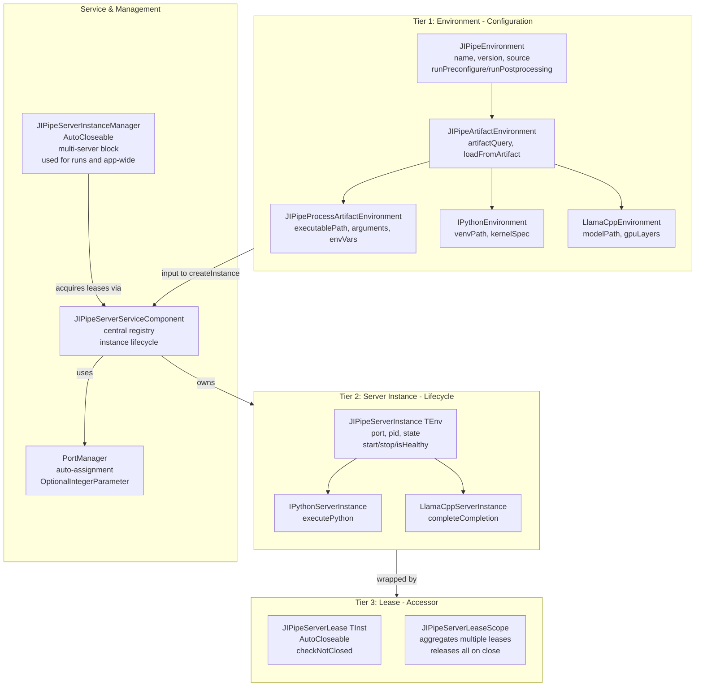
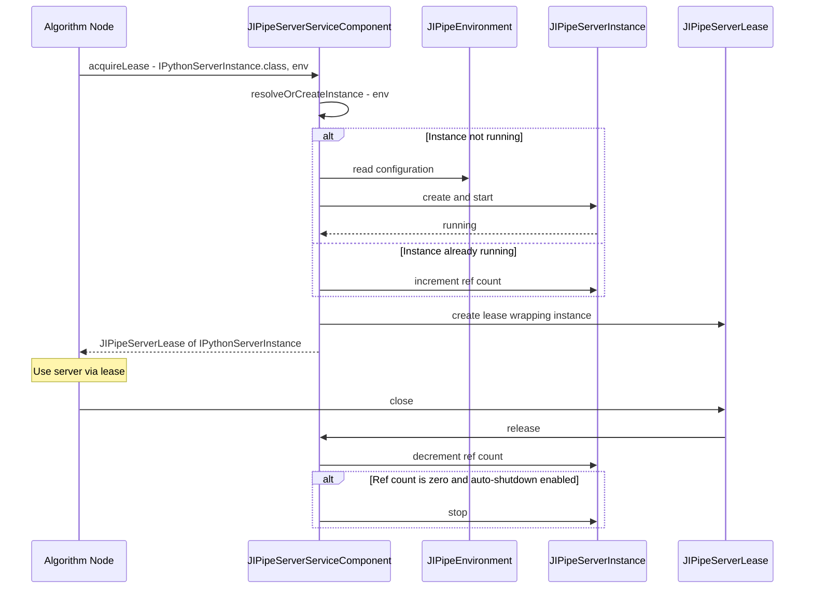
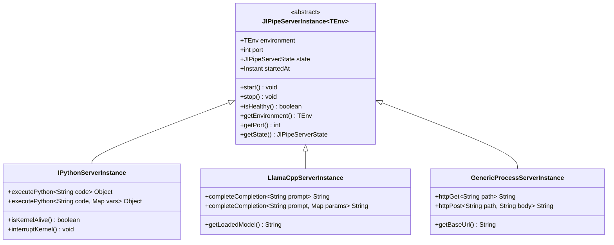
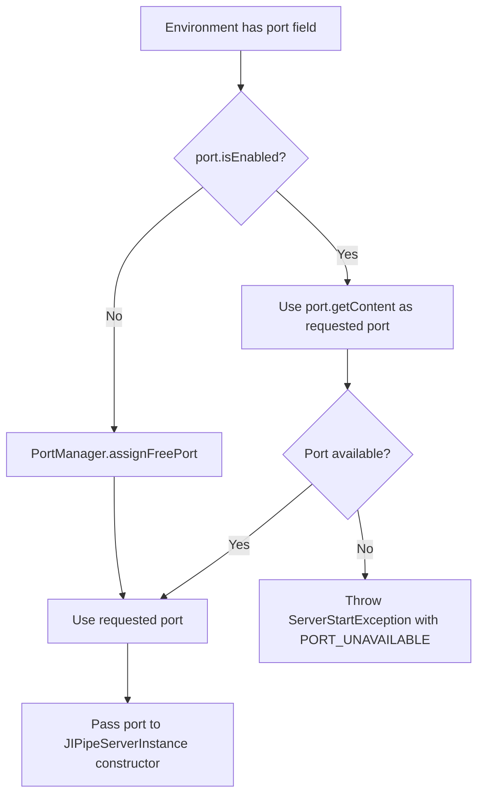
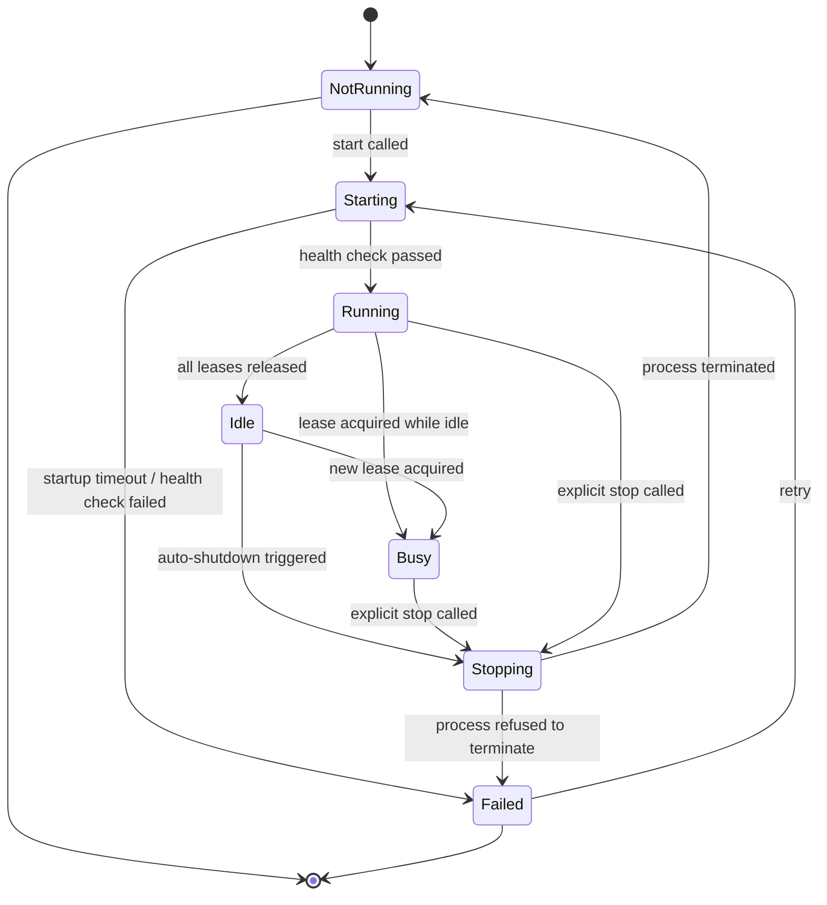
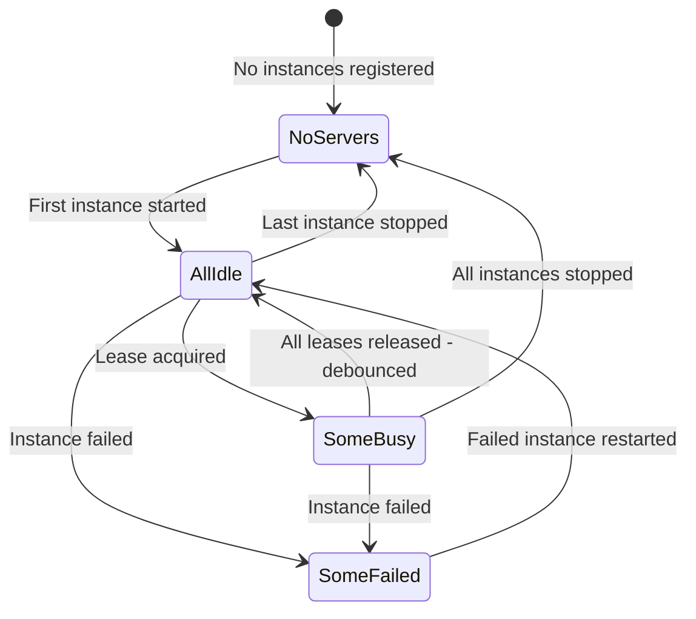

# Revised Design Document: External Server Process Management

**Date:** 2026-06-03  
**Status:** Revised Design Document  
**Supersedes:** `docs/plan-external-server-processes.md`  
**Extends:** `investigation-external-server-processes.md`, `investigation-external-server-processes-addendum-daemon.md`, `investigation-external-server-processes-addendum2-instantiation.md`

---

## 1. Overview & Design Philosophy

### 1.1 Problem Statement

JIPipe currently lacks infrastructure for managing persistent external server processes. All external tool invocations follow a fire-and-forget pattern: spawn a process, wait for completion, read output files. This is insufficient for scenarios where a server is expensive to start (e.g., LLM model loading at 30+ seconds) or needs to persist across multiple operations (e.g., an IPython kernel maintaining state between cell executions).

### 1.2 Core Design Principles

This revised design is built on five principles that emerged from reviewing the previous plan against the existing codebase:

**P1: Environments are configuration, instances are lifecycle.**  
An *environment* (e.g., [`JIPipeEnvironment`](jipipe-core/src/main/java/org/hkijena/jipipe/api/environments/JIPipeEnvironment.java:33)) defines *what* to run and *how to configure it* — the executable path, arguments, artifact queries, port preferences. A *server instance* is a *live connection* to a running process — it has a port, a PID, a state machine, and it can be closed. These are fundamentally different concerns and must not be conflated.

**P2: No special server environment base class.**  
Any existing environment can serve as the configuration input for a server. There is no `JIPipeServerEnvironment` base class. Developers implement whatever environment they want — a [`JIPipeProcessArtifactEnvironment`](jipipe-core/src/main/java/org/hkijena/jipipe/api/environments/JIPipeProcessArtifactEnvironment.java:52) for a native binary, a custom environment for a Python venv with IPython, or even a plain [`JIPipeEnvironment`](jipipe-core/src/main/java/org/hkijena/jipipe/api/environments/JIPipeEnvironment.java:33) subclass. The server instantiation code takes an environment as input, not a special subclass. This reuses the established environment system with its resolution chain, UI editors, and artifact integration.

**P3: Strongly typed server instances with high-level APIs.**  
Server instances are generic and typed: `JIPipeServerInstance<TEnv extends JIPipeEnvironment>`. Subclasses add domain-specific methods — `IPythonServerInstance.executePython(String code)`, `LlamaCppServerInstance.completeCompletion(String prompt)`. This makes the instance the primary developer-facing API, not a generic handle with just `getPort()`.

**P4: Lease-based access with use-after-free protection.**  
Inspired by the cache system's handle/pin/scope pattern, access to a running server is mediated through a lease object (`JIPipeServerLease<TInst>`). The lease is `AutoCloseable`, guards against use-after-free, and enables future auto-shutdown when all leases are released.

**P5: Flexible lifetime, not strictly bound to runs.**  
Servers can be instantiated in any code context using `try-with-resources`, not only within pipeline runs. A `JIPipeServerInstanceManager` safeguards the lifetime of a multi-server block — it can be used for run-scoped servers, app-wide servers, or ad-hoc usage in any code.

### 1.3 Three-Tier Model

The architecture is organized as three tiers:

```
Environment (definition/parameters/settings)
  → Internal Instance (true instance, handles lifecycle)
    → Lease (accessor, guards against use-after-free)
```

- **Tier 1 — Environment:** User-facing configuration. Resolves through the existing chain: Node → Project → Application → Fallback via [`JIPipeEnvironmentConfigurator`](jipipe-core/src/main/java/org/hkijena/jipipe/api/environments/JIPipeEnvironmentConfigurator.java:46).
- **Tier 2 — Internal Instance:** The actual running server. Manages process lifecycle, health checks, state transitions. Owned by the service component.
- **Tier 3 — Lease:** An `AutoCloseable` accessor that wraps the internal instance. Reference-counted. Throws `IllegalStateException` on use after close. Enables future auto-shutdown.

---

## 2. Architecture

### 2.1 Component Diagram



### 2.2 Data Flow: Algorithm Acquires Server



### 2.3 Package Structure

All server management APIs and implementation live in `jipipe-core`, following the linear hierarchy:

```
jipipe-core/src/main/java/org/hkijena/jipipe/
├── api/servers/                                    # Server manager API
│   ├── JIPipeServerInstance.java                   # Abstract base: generic server instance
│   ├── JIPipeServerLease.java                      # AutoCloseable accessor
│   ├── JIPipeServerLeaseScope.java                 # Aggregates multiple leases
│   ├── JIPipeServerInstanceManager.java            # Multi-server block manager
│   ├── JIPipeServerState.java                      # Enum: lifecycle states
│   ├── JIPipeServerHealthCheck.java                # Strategy interface
│   ├── JIPipeServerEvent.java                      # Lifecycle events
│   └── RegisterJIPipeServerUsage.java              # Annotation for algorithms
├── api/service/components/
│   └── JIPipeServerServiceComponent.java           # Central service component
├── servers/                                        # Implementation
│   ├── ProcessSupervisor.java                      # Spawns/monitors child processes
│   ├── PortManager.java                            # Auto port assignment
│   ├── HttpHealthCheck.java                        # HTTP health check
│   └── TcpHealthCheck.java                         # TCP port probe
└── desktop/commons/components/servers/             # UI
    ├── JIPipeDesktopServerStatusControl.java       # Status bar button
    └── JIPipeDesktopServerMonitorWindow.java       # Monitor window
```

---

## 3. Environment Integration

### 3.1 No Special Base Class

The previous plan introduced `JIPipeServerEnvironment` extending [`JIPipeArtifactEnvironment`](jipipe-core/src/main/java/org/hkijena/jipipe/api/environments/JIPipeArtifactEnvironment.java:39). This revised design **removes that class entirely**. Any environment can be used as input for server instantiation. The server instantiation logic is a function that takes a `JIPipeEnvironment` and produces a `JIPipeServerInstance`, not a method on a special environment subclass.

**Why this matters:**
- Reuses the existing environment resolution chain: Node → Project → Application → Fallback via [`JIPipeEnvironmentConfigurator`](jipipe-core/src/main/java/org/hkijena/jipipe/api/environments/JIPipeEnvironmentConfigurator.java:46)
- Reuses existing [`JIPipeOptionalParameter<T>`](jipipe-core/src/main/java/org/hkijena/jipipe/plugins/parameters/api/optional/JIPipeOptionalParameter.java) wrappers (e.g., `OptionalREnvironment`, `OptionalPythonEnvironment`)
- Reuses existing UI editors for environment configuration
- Allows developers to customize environments freely — e.g., a custom IPython environment that points to a specific venv rather than an artifact-provided one

### 3.2 How Environments Configure Servers

The [`JIPipeServerServiceComponent`](#11-service-component) maintains a registry of *server instance factories*. Each factory knows:
1. Which environment class it accepts
2. How to create a `JIPipeServerInstance` from that environment

```java
// Registration in plugin register() method
registerServerInstanceFactory(
    IPythonServerInstance.FACTORY_ID,
    IPythonEnvironment.class,
    IPythonServerInstance.class,
    (env, port) -> new IPythonServerInstance(env, port),
    icon
);
```

When an algorithm requests a server, the service component:
1. Resolves the environment via the existing configurator chain
2. Looks up the factory for that environment class
3. Creates or reuses a `JIPipeServerInstance` from the resolved environment

### 3.3 Example: IPython Environment

An `IPythonEnvironment` could extend [`JIPipeProcessArtifactEnvironment`](jipipe-core/src/main/java/org/hkijena/jipipe/api/environments/JIPipeProcessArtifactEnvironment.java:52) (for artifact-distributed Python) or be a completely custom environment (for a user's existing venv):

```java
// Option A: Artifact-based (standard distribution)
public class IPythonEnvironment extends JIPipeProcessArtifactEnvironment {
    private OptionalIntegerParameter port = new OptionalIntegerParameter();
    private Path kernelSpec = Paths.get("");
    // ... artifact query for IPython package
}

// Option B: Custom venv (user's existing setup)
public class IPythonVenvEnvironment extends JIPipeEnvironment {
    private Path venvPath = Paths.get("");
    private OptionalIntegerParameter port = new OptionalIntegerParameter();
    // No artifact — user points to their own venv
}
```

Both options work because the factory takes `JIPipeEnvironment` as input and the factory logic handles the specifics.

### 3.4 Example: llama.cpp Environment

```java
public class LlamaCppEnvironment extends JIPipeProcessArtifactEnvironment {
    private Path modelPath = Paths.get("");
    private int gpuLayers = 0;
    private int contextSize = 4096;
    private OptionalIntegerParameter port = new OptionalIntegerParameter();
    // ... artifact query for llama-server binary
}
```

### 3.5 Port as OptionalIntegerParameter

Port configuration uses the existing [`OptionalIntegerParameter`](jipipe-core/src/main/java/org/hkijena/jipipe/plugins/parameters/library/primitives/optional/OptionalIntegerParameter.java:21):

```java
@SetJIPipeDocumentation(name = "Port", description = "The server port. If not set, a free port is automatically assigned.")
@JIPipeParameter("port")
public OptionalIntegerParameter getPort() {
    return port;
}
```

When `port.isEnabled()` is false, the `PortManager` auto-assigns a free port. When enabled, the specified port is used. This follows the established optional parameter pattern used throughout JIPipe.

---

## 4. Server Instance Types

### 4.1 Class Hierarchy



### 4.2 `JIPipeServerInstance<TEnv extends JIPipeEnvironment>`

The abstract base class for all server instances. Generic on the environment type, enabling type-safe access to environment configuration:

```java
package org.hkijena.jipipe.api.servers;

public abstract class JIPipeServerInstance<TEnv extends JIPipeEnvironment> {
    private final TEnv environment;
    private final int port;
    private volatile JIPipeServerState state = JIPipeServerState.NotRunning;
    private Instant startedAt;
    private Process process; // for process-based instances

    protected JIPipeServerInstance(TEnv environment, int port) {
        this.environment = environment;
        this.port = port;
    }

    /** Starts the server. Blocks until healthy or timeout. */
    public abstract void start() throws ServerStartException;

    /** Stops the server gracefully. */
    public abstract void stop();

    /** Checks if the server is healthy and responsive. */
    public abstract boolean isHealthy();

    /** Returns the environment that configured this instance. */
    public TEnv getEnvironment() { return environment; }

    /** Returns the port the server is listening on. */
    public int getPort() { return port; }

    /** Returns the current lifecycle state. */
    public JIPipeServerState getState() { return state; }

    /** Returns the time the server was started. */
    public Instant getStartedAt() { return startedAt; }

    /** Returns the server type ID for registry lookup. */
    public abstract String getServerTypeId();

    /** Returns a human-readable name for UI display. */
    public String getDisplayName() {
        return environment.getName() + " (" + getServerTypeId() + ")";
    }

    protected void setState(JIPipeServerState state) {
        JIPipeServerState old = this.state;
        this.state = state;
        // Fire event via service component
    }
}
```

### 4.3 `IPythonServerInstance`

A concrete instance that adds IPython-specific APIs:

```java
public class IPythonServerInstance extends JIPipeServerInstance<IPythonEnvironment> {
    private KernelConnection kernel;

    public IPythonServerInstance(IPythonEnvironment environment, int port) {
        super(environment, port);
    }

    @Override
    public void start() throws ServerStartException {
        // Spawn: python -m IPython kernel --json
        // Parse connection file
        // Connect to kernel via ZeroMQ
    }

    @Override
    public void stop() {
        // Send shutdown message to kernel
        // Kill process if graceful shutdown fails
    }

    @Override
    public boolean isHealthy() {
        return kernel != null && kernel.isAlive();
    }

    /** Execute Python code and return the result. */
    public Object executePython(String code) { ... }

    /** Execute Python code with variables injected. */
    public Object executePython(String code, Map<String, Object> variables) { ... }

    /** Check if the kernel is still alive. */
    public boolean isKernelAlive() { ... }

    /** Interrupt the currently executing code. */
    public void interruptKernel() { ... }
}
```

### 4.4 `LlamaCppServerInstance`

```java
public class LlamaCppServerInstance extends JIPipeServerInstance<LlamaCppEnvironment> {
    public LlamaCppServerInstance(LlamaCppEnvironment environment, int port) {
        super(environment, port);
    }

    @Override
    public void start() throws ServerStartException {
        // Spawn: llama-server -m <model> --port <port> -ngl <layers> -c <context>
    }

    @Override
    public void stop() {
        // SIGTERM, then force-kill if needed
    }

    @Override
    public boolean isHealthy() {
        // HTTP GET /health → 200
    }

    /** Send a completion request and return the result. */
    public String completeCompletion(String prompt) { ... }

    /** Send a completion request with custom parameters. */
    public String completeCompletion(String prompt, Map<String, Object> params) { ... }

    /** Get the currently loaded model name. */
    public String getLoadedModel() { ... }
}
```

### 4.5 `GenericProcessServerInstance`

A generic instance for any HTTP-speaking process. Useful for custom servers that don't need a specialized API:

```java
public class GenericProcessServerInstance extends JIPipeServerInstance<JIPipeEnvironment> {
    private final String healthCheckPath;
    private final int expectedHealthStatus;

    public String getBaseUrl() { return "http://127.0.0.1:" + getPort(); }
    public String httpGet(String path) { ... }
    public String httpPost(String path, String body) { ... }
}
```

---

## 5. Server Instance Manager

### 5.1 Purpose

The `JIPipeServerInstanceManager` is an `AutoCloseable` class that manages a block of server instances. It serves two roles:

1. **Run-scoped manager:** Created at the start of a pipeline run, holds all servers needed by that run, released at the end.
2. **App-wide manager:** A long-lived manager that holds servers shared across multiple runs within a JIPipe instance.

This replaces the previous plan's rigid Temporary/AppWide/CrossInstance classification with a more flexible approach: the manager is just a scope, and its lifetime is determined by how it's used.

### 5.2 Class Definition

```java
package org.hkijena.jipipe.api.servers;

/**
 * Manages a block of server instances. AutoCloseable — closing releases all leases.
 * Can be used for run-scoped servers, app-wide servers, or ad-hoc multi-server blocks.
 */
public class JIPipeServerInstanceManager implements AutoCloseable {
    private final Map<String, JIPipeServerLease<?>> activeLeases = new LinkedHashMap<>();
    private final JIPipeServerServiceComponent serviceComponent;
    private volatile boolean closed = false;

    public JIPipeServerInstanceManager(JIPipeServerServiceComponent serviceComponent) {
        this.serviceComponent = serviceComponent;
    }

    /**
     * Acquires a lease on a server instance. The lease is managed by this manager
     * and will be released when the manager is closed.
     */
    public <TInst extends JIPipeServerInstance<?>> JIPipeServerLease<TInst> acquireLease(
            String factoryId, Class<TInst> instanceClass, JIPipeEnvironment environment) {
        ensureOpen();
        JIPipeServerLease<TInst> lease = serviceComponent.acquireLease(
            factoryId, instanceClass, environment);
        activeLeases.put(lease.getId(), lease);
        return lease;
    }

    /**
     * Releases a specific lease early (before manager close).
     */
    public void releaseLease(JIPipeServerLease<?> lease) {
        ensureOpen();
        activeLeases.remove(lease.getId());
        lease.close();
    }

    /**
     * Releases all managed leases. Called automatically by try-with-resources.
     */
    @Override
    public void close() {
        if (closed) return;
        closed = true;
        // Release in LIFO order
        List<JIPipeServerLease<?>> leases = new ArrayList<>(activeLeases.values());
        Collections.reverse(leases);
        for (JIPipeServerLease<?> lease : leases) {
            try {
                lease.close();
            } catch (Exception e) {
                // Log, don't throw — best-effort cleanup
            }
        }
        activeLeases.clear();
    }

    /** Returns all currently active leases. */
    public Collection<JIPipeServerLease<?>> getActiveLeases() {
        return Collections.unmodifiableCollection(activeLeases.values());
    }

    /** Check if this manager is still open. */
    public boolean isOpen() { return !closed; }

    private void ensureOpen() {
        if (closed) throw new IllegalStateException("Server instance manager is closed");
    }
}
```

### 5.3 Usage Patterns

**Run-scoped (within a pipeline run):**

```java
// In JIPipeGraphRun or similar
try (JIPipeServerInstanceManager runServers = new JIPipeServerInstanceManager(serviceComponent)) {
    // Store in run metadata
    run.setMetadata("serverManager", runServers);
    
    // Algorithms acquire servers through the manager
    // ...
    
    // All servers released automatically at end of try block
}
```

**App-wide (shared across runs):**

```java
// In JIPipeServerServiceComponent
private final JIPipeServerInstanceManager appWideManager = 
    new JIPipeServerInstanceManager(this);

// Algorithms acquire from the app-wide manager
// Servers persist until the application exits
```

**Ad-hoc (any code context):**

```java
try (JIPipeServerInstanceManager servers = new JIPipeServerInstanceManager(serviceComponent)) {
    JIPipeServerLease<IPythonServerInstance> lease = servers.acquireLease(
        IPythonServerInstance.FACTORY_ID, IPythonServerInstance.class, env);
    lease.getInstance().executePython("print('hello')");
}
// Server stopped if no other leases exist
```

---

## 6. Algorithm Binding

### 6.1 Annotation Pattern

Following the existing [`@RegisterJIPipeEnvironmentUsage`](jipipe-core/src/main/java/org/hkijena/jipipe/api/environments/RegisterJIPipeEnvironmentUsage.java:24) pattern, algorithms declare their server needs via `@RegisterJIPipeServerUsage`:

```java
@Retention(RetentionPolicy.RUNTIME)
@Target(ElementType.TYPE)
@Repeatable(RegisterJIPipeServerUsages.class)
public @interface RegisterJIPipeServerUsage {
    /** The server instance class this algorithm uses. */
    Class<? extends JIPipeServerInstance<?>> value();
}
```

**Example usage:**

```java
@RegisterJIPipeServerUsage(IPythonServerInstance.class)
@RegisterJIPipeEnvironmentUsage(IPythonEnvironment.class)
public class RunIPythonScriptAlgorithm extends JIPipeIteratingAlgorithm {
    // ...
}
```

### 6.2 `getServerInstance()` API

A high-level convenience method on [`JIPipeGraphNode`](jipipe-core/src/main/java/org/hkijena/jipipe/api/nodes/JIPipeGraphNode.java) that resolves the environment, acquires a lease, and returns it:

```java
/**
 * Acquires a server lease for the given instance type.
 * The environment is resolved through the standard configurator chain.
 * The caller is responsible for closing the lease (try-with-resources).
 */
public <TInst extends JIPipeServerInstance<?>> JIPipeServerLease<TInst> getServerInstance(
        Class<TInst> instanceClass) {
    // 1. Look up the factory for instanceClass
    // 2. Get the associated environment class
    // 3. Resolve environment via JIPipeEnvironmentConfigurator
    // 4. Acquire lease from JIPipeServerServiceComponent
    // 5. Return the lease
}
```

### 6.3 Algorithm Usage Example

```java
@RegisterJIPipeServerUsage(IPythonServerInstance.class)
@RegisterJIPipeEnvironmentUsage(IPythonEnvironment.class)
public class RunIPythonScriptAlgorithm extends JIPipeIteratingAlgorithm {

    @Override
    protected void runIteration(JIPipeDataBatch dataBatch, JIPipeProgressInfo progressInfo) {
        try (JIPipeServerLease<IPythonServerInstance> lease = 
                getServerInstance(IPythonServerInstance.class)) {
            IPythonServerInstance server = lease.getInstance();
            Object result = server.executePython(getScriptCode(), getVariables());
            // Process result...
        }
        // Lease automatically released — server may shut down if no other leases exist
    }
}
```

### 6.4 Integration with Run Lifecycle

When a pipeline run starts, the `JIPipeGraphRun` creates a `JIPipeServerInstanceManager`. Algorithms can acquire leases from this manager. The manager is closed when the run completes, releasing all run-scoped leases.

For app-wide servers, algorithms acquire leases from the application-level manager in `JIPipeServerServiceComponent`. These leases are released when the algorithm finishes its iteration, but the server continues running because the app-wide manager holds its own reference.

---

## 7. Port Management

### 7.1 Port Configuration

Port is configured in the environment using [`OptionalIntegerParameter`](jipipe-core/src/main/java/org/hkijena/jipipe/plugins/parameters/library/primitives/optional/OptionalIntegerParameter.java:21):

```java
public class LlamaCppEnvironment extends JIPipeProcessArtifactEnvironment {
    private OptionalIntegerParameter port = new OptionalIntegerParameter();

    @SetJIPipeDocumentation(name = "Port", description = "The server port. If not set, a free port is automatically assigned.")
    @JIPipeParameter("port")
    public OptionalIntegerParameter getPort() { return port; }
}
```

### 7.2 Auto-Assignment Strategy

When `port.isEnabled()` is false, the `PortManager` auto-assigns a free port:

```java
package org.hkijena.jipipe.servers;

public class PortManager {
    private static final int MIN_PORT = 49152;  // IANA ephemeral port range
    private static final int MAX_PORT = 65535;
    private final Set<Integer> assignedPorts = ConcurrentHashMap.newKeySet();

    /**
     * Finds and reserves a free port.
     * Uses bind-then-close to minimize race conditions.
     */
    public int assignFreePort() {
        try (ServerSocket socket = new ServerSocket(0)) {
            int port = socket.getLocalPort();
            assignedPorts.add(port);
            return port;
        } catch (IOException e) {
            throw new ServerStartException("No free port available", e);
        }
    }

    /** Releases a previously assigned port. */
    public void releasePort(int port) {
        assignedPorts.remove(port);
    }
}
```

### 7.3 Port Resolution Flow



---

## 8. Lifecycle Management

### 8.1 State Machine

Each `JIPipeServerInstance` follows this state machine:



**State definitions:**

| State | Description |
|-------|-------------|
| `NotRunning` | No process, no resources held |
| `Starting` | Process spawned, waiting for health check |
| `Running` | Process alive, health check passing. Sub-states: `Idle` (no leases) or `Busy` (leases held) |
| `Stopping` | Shutdown initiated, waiting for process to terminate |
| `Failed` | Unrecoverable error (startup timeout, crash, etc.) |

### 8.2 Auto-Start

Servers are started JIT when the first lease is acquired. The `JIPipeServerServiceComponent.acquireLease()` method:

1. Checks if an instance already exists for the given environment
2. If not, creates one and calls `start()`
3. Waits for the health check to pass (with configurable timeout)
4. Creates a lease wrapping the instance
5. Returns the lease

### 8.3 Use-After-Free Guards

The `JIPipeServerLease` class guards against use after the lease is closed:

```java
public class JIPipeServerLease<TInst extends JIPipeServerInstance<?>> implements AutoCloseable {
    private final TInst instance;
    private volatile boolean closed = false;
    private final String id = UUID.randomUUID().toString();

    /** Returns the server instance. Throws if lease is closed. */
    public TInst getInstance() {
        checkNotClosed();
        return instance;
    }

    /** Closes the lease. After this, getInstance() throws IllegalStateException. */
    @Override
    public void close() {
        if (closed) return;
        closed = true;
        // Notify service component to decrement ref count
    }

    private void checkNotClosed() {
        if (closed) {
            throw new IllegalStateException(
                "Server lease '" + id + "' is already closed. " +
                "The server instance cannot be accessed after the lease is released.");
        }
    }
}
```

### 8.4 Future Auto-Shutdown

The three-tier model enables future auto-shutdown: when all leases for an instance are released and the instance has been idle for a configurable timeout, the service component can automatically stop the instance. This is not implemented in the first phase but the architecture supports it:

```java
// Future: in JIPipeServerServiceComponent
private void onLeaseReleased(JIPipeServerInstance<?> instance) {
    if (instance.getLeaseCount() == 0 && instance.getState() == JIPipeServerState.Idle) {
        scheduleAutoShutdown(instance, getIdleTimeoutMs());
    }
}

private void scheduleAutoShutdown(JIPipeServerInstance<?> instance, long timeoutMs) {
    scheduler.schedule(() -> {
        if (instance.getLeaseCount() == 0 && instance.getState() == JIPipeServerState.Idle) {
            instance.stop();
        }
    }, timeoutMs, TimeUnit.MILLISECONDS);
}
```

### 8.5 Integration with `JIPipe.exitLater()`

JIPipe uses `Runtime.getRuntime().halt()` which bypasses shutdown hooks. Server cleanup must be explicitly invoked before `halt()`:

- Insert `JIPipeServerServiceComponent.releaseAll()` before `halt()` in `exitLater()`
- For Fiji mode: cleanup in `JIPipeDesktopProjectWindow.dispose()`
- The service component's `dispose()` method stops all instances

---

## 9. Lease/Accessor Pattern

### 9.1 Inspiration: Cache System

The lease pattern is inspired by the existing cache system's handle/pin/scope pattern:

| Cache System | Server System | Purpose |
|-------------|---------------|---------|
| `JIPipeDataChunkCacheHandle` | `JIPipeServerInstance` | The actual resource |
| `JIPipeDataChunkPin` | `JIPipeServerLease` | Prevents eviction/shutdown while active |
| `JIPipeDataPinScope` | `JIPipeServerLeaseScope` | Aggregates multiple pins/leases, releases all on close |
| `checkNotClosed()` / `ensureOpen()` | `checkNotClosed()` | Use-after-free protection |

### 9.2 `JIPipeServerLease<TInst>`

```java
package org.hkijena.jipipe.api.servers;

/**
 * AutoCloseable accessor for a server instance.
 * Guards against use-after-free. Reference-counted by the service component.
 */
public class JIPipeServerLease<TInst extends JIPipeServerInstance<?>> implements AutoCloseable {
    private final TInst instance;
    private final String id;
    private final JIPipeServerServiceComponent serviceComponent;
    private volatile boolean closed = false;

    JIPipeServerLease(TInst instance, JIPipeServerServiceComponent serviceComponent) {
        this.instance = instance;
        this.id = UUID.randomUUID().toString();
        this.serviceComponent = serviceComponent;
    }

    /** Returns the server instance. Throws IllegalStateException if lease is closed. */
    public TInst getInstance() {
        checkNotClosed();
        return instance;
    }

    /** Returns the lease ID. */
    public String getId() { return id; }

    /** Returns whether this lease is still open. */
    public boolean isOpen() { return !closed; }

    /** Closes the lease. After this, getInstance() throws. */
    @Override
    public void close() {
        if (closed) return;
        closed = true;
        serviceComponent.releaseLease(this);
    }

    private void checkNotClosed() {
        if (closed) {
            throw new IllegalStateException(
                "Server lease is closed. Cannot access server instance after lease release.");
        }
    }
}
```

### 9.3 `JIPipeServerLeaseScope`

Aggregates multiple leases and releases them all on `close()`, in LIFO order:

```java
package org.hkijena.jipipe.api.servers;

/**
 * Aggregates multiple server leases. Releases all on close in LIFO order.
 * Use with try-with-resources for clean multi-server blocks.
 */
public class JIPipeServerLeaseScope implements AutoCloseable {
    private final List<JIPipeServerLease<?>> leases = new ArrayList<>();
    private volatile boolean closed = false;

    /** Adds a lease to this scope. */
    public <TInst extends JIPipeServerInstance<?>> 
    JIPipeServerLease<TInst> add(JIPipeServerLease<TInst> lease) {
        ensureOpen();
        leases.add(lease);
        return lease;
    }

    /** Releases all leases in LIFO order. */
    @Override
    public void close() {
        if (closed) return;
        closed = true;
        List<JIPipeServerLease<?>> reversed = new ArrayList<>(leases);
        Collections.reverse(reversed);
        for (JIPipeServerLease<?> lease : reversed) {
            try { lease.close(); } catch (Exception e) { /* log */ }
        }
        leases.clear();
    }

    private void ensureOpen() {
        if (closed) throw new IllegalStateException("Lease scope is closed");
    }
}
```

### 9.4 Usage Example

```java
// Single server
try (JIPipeServerLease<IPythonServerInstance> lease = 
        getServerInstance(IPythonServerInstance.class)) {
    lease.getInstance().executePython("import numpy as np");
    lease.getInstance().executePython("result = np.array([1,2,3]).sum()");
}

// Multiple servers in one scope
try (JIPipeServerLeaseScope scope = new JIPipeServerLeaseScope()) {
    JIPipeServerLease<IPythonServerInstance> ipyLease = scope.add(
        getServerInstance(IPythonServerInstance.class));
    JIPipeServerLease<LlamaCppServerInstance> llamaLease = scope.add(
        getServerInstance(LlamaCppServerInstance.class));
    
    String prompt = ipyLease.getInstance().executePython("generate_prompt()");
    String completion = llamaLease.getInstance().completeCompletion(prompt);
    ipyLease.getInstance().executePython("process_result('" + completion + "')");
}
// Both leases released in LIFO order
```

---

## 10. Service Component

### 10.1 `JIPipeServerServiceComponent`

The central service component that manages all server instances. Extends [`JIPipeServiceComponent`](jipipe-core/src/main/java/org/hkijena/jipipe/api/service/JIPipeServiceComponent.java), following the pattern of [`JIPipeAIServiceComponent`](jipipe-core/src/main/java/org/hkijena/jipipe/api/service/components/JIPipeAIServiceComponent.java:34):

```java
package org.hkijena.jipipe.api.service.components;

public class JIPipeServerServiceComponent extends JIPipeServiceComponent {
    // Registry: factory ID → factory
    private final Map<String, ServerInstanceFactory<?, ?>> factories = new ConcurrentHashMap<>();
    
    // Active instances: key = composite of factory ID + environment identity
    private final Map<String, ManagedInstanceEntry> activeInstances = new ConcurrentHashMap<>();
    
    // App-wide manager for servers that persist across runs
    private final JIPipeServerInstanceManager appWideManager;
    
    // Port manager for auto-assignment
    private final PortManager portManager = new PortManager();
    
    // Serialized lifecycle operations (following AIServiceComponent pattern)
    private final JIPipeRunnableQueue lifecycleQueue = new JIPipeRunnableQueue("Server Lifecycle");
    
    // Event emitter for UI updates
    private final ServerStateChangedEventEmitter stateChangedEventEmitter = 
        new ServerStateChangedEventEmitter();

    public JIPipeServerServiceComponent(JIPipeService service) {
        super(service);
        this.appWideManager = new JIPipeServerInstanceManager(this);
        lifecycleQueue.setSilent(true);
    }

    // ===== Factory Registration =====

    public <TEnv extends JIPipeEnvironment, TInst extends JIPipeServerInstance<TEnv>>
    void registerServerInstanceFactory(String factoryId, Class<TEnv> envClass, 
            Class<TInst> instClass, ServerInstanceFactory<TEnv, TInst> factory, Icon icon) {
        factories.put(factoryId, new FactoryEntry<>(factoryId, envClass, instClass, factory, icon));
    }

    // ===== Lease Acquisition =====

    public <TEnv extends JIPipeEnvironment, TInst extends JIPipeServerInstance<TEnv>>
    JIPipeServerLease<TInst> acquireLease(String factoryId, Class<TInst> instClass, 
            TEnv environment) {
        String instanceKey = createInstanceKey(factoryId, environment);
        ManagedInstanceEntry entry = activeInstances.computeIfAbsent(instanceKey, k -> {
            TInst instance = createInstance(factoryId, environment);
            return new ManagedInstanceEntry(instance);
        });
        
        TInst instance = (TInst) entry.getInstance();
        if (instance.getState() == JIPipeServerState.NotRunning) {
            startInstance(instance);
        }
        
        entry.acquire();
        return new JIPipeServerLease<>(instance, this);
    }

    void releaseLease(JIPipeServerLease<?> lease) {
        // Decrement ref count
        // If zero and auto-shutdown enabled, schedule shutdown
    }

    // ===== Lifecycle =====

    public void releaseAll() {
        // Stop all instances
        // Release all ports
    }

    // ===== Queries =====

    public List<JIPipeServerInstance<?>> getActiveInstances() { ... }
    public JIPipeServerState getState(String instanceKey) { ... }
    public PortManager getPortManager() { return portManager; }
    public JIPipeServerInstanceManager getAppWideManager() { return appWideManager; }
}
```

### 10.2 `ManagedInstanceEntry`

Reference-counted entry for an active server instance:

```java
package org.hkijena.jipipe.servers;

class ManagedInstanceEntry {
    private final JIPipeServerInstance<?> instance;
    private final AtomicInteger leaseCount = new AtomicInteger(0);

    ManagedInstanceEntry(JIPipeServerInstance<?> instance) {
        this.instance = instance;
    }

    void acquire() { leaseCount.incrementAndGet(); }
    
    int release() { return leaseCount.decrementAndGet(); }
    
    int getLeaseCount() { return leaseCount.get(); }
    
    JIPipeServerInstance<?> getInstance() { return instance; }
}
```

### 10.3 `ServerInstanceFactory`

Functional interface for creating server instances from environments:

```java
@FunctionalInterface
public interface ServerInstanceFactory<TEnv extends JIPipeEnvironment, 
                                        TInst extends JIPipeServerInstance<TEnv>> {
    TInst create(TEnv environment, int port);
}
```

### 10.4 Instance Key Strategy

Multiple environments of the same type may coexist (e.g., two different IPython environments). The instance key distinguishes them:

```java
private String createInstanceKey(String factoryId, JIPipeEnvironment environment) {
    // Uses environment identity: class + name + relevant configuration
    // Two environments with different configurations → different instances
    return factoryId + ":" + environment.getClass().getName() + ":" + environment.getName();
}
```

### 10.5 Registration in Plugin

Following the existing `registerArtifactEnvironment()` pattern:

```java
// In plugin register() method
registerServerInstanceFactory(
    "ipython-server",
    IPythonEnvironment.class,
    IPythonServerInstance.class,
    (env, port) -> new IPythonServerInstance(env, port),
    ResourceUtils.getPluginResource("ipython-icon.png")
);
```

---

## 11. UI Design

### 11.1 Status Bar Component

Following the [`JIPipeDesktopAIStatusControl`](jipipe-core/src/main/java/org/hkijena/jipipe/desktop/commons/components/ai/JIPipeDesktopAIStatusControl.java:27) pattern:

```java
package org.hkijena.jipipe.desktop.commons.components.servers;

/**
 * Status bar button that displays server status and provides controls.
 * Subscribes to JIPipeServerServiceComponent.ServerStateChangedEventEmitter
 * for event-driven updates.
 */
public class JIPipeDesktopServerStatusControl extends JButton 
        implements JIPipeServerServiceComponent.ServerStateChangedEventListener {
    
    private static final long IDLE_DEBOUNCE_MS = 500;
    
    private final JIPipeDesktopProjectWorkbench workbench;
    private final JPopupMenu popupMenu = new JPopupMenu();
    private final ImageIcon defaultIcon;
    private final SpinnerIcon busyIcon;
    private final StaticDebouncer idleDebouncer;

    public JIPipeDesktopServerStatusControl(JIPipeDesktopProjectWorkbench workbench) {
        this.workbench = workbench;
        this.defaultIcon = JIPipe.RESOURCES.getIcon16("actions/server.png");
        this.busyIcon = new SpinnerIcon(this);
        this.idleDebouncer = new StaticDebouncer(IDLE_DEBOUNCE_MS, 
            TimeUnit.MILLISECONDS, this::applyIdleStatus);
        initialize();
        updateStatus();
        
        // Subscribe to server state change events
        JIPipe.getInstance().getServerService()
            .getStateChangedEventEmitter().subscribeWeak(this);
    }
}
```

### 11.2 State Machine for UI



### 11.3 Popup Menu

Right-click on the status bar button shows:

- **Active Servers** section: list of running servers with name, type, port, state
  - Click to open monitor window for that server
  - Start/Stop/Restart actions per server
- **Configure Servers** → opens application settings for server environments
- **Server Monitor** → opens the full monitor window

### 11.4 Monitor Window

Following the [`JIPipeDesktopAIMonitorWindow`](jipipe-core/src/main/java/org/hkijena/jipipe/desktop/commons/components/ai/monitor/JIPipeDesktopAIMonitorWindow.java) pattern:

```java
public class JIPipeDesktopServerMonitorWindow extends JDialog 
        implements JIPipeServerServiceComponent.ServerStateChangedEventListener,
                   JIPipeDesktopWorkbenchAccess {
    
    private final JTabbedPane tabbedPane;
    // Tab pages:
    // - Overview: table of all servers (name, type, port, state, lease count, uptime)
    // - Per-server detail tabs (added dynamically)
    //   - Log: stdout/stderr from the server process
    //   - Configuration: the environment parameters
}
```

### 11.5 Visual Indicators

| State | Icon | Text | Animation |
|-------|------|------|-----------|
| No servers | Gray server icon | "No servers" | None |
| All idle | Green server icon | "N servers idle" | None |
| Some busy | Green server icon | "N servers busy" | Spinner |
| Some failed | Red server icon | "N servers failed" | None |
| Starting | Yellow server icon | "Starting..." | Spinner |

---

## 12. Implementation Phases

### Phase 1: Core API + Embedded Servers

**Goal:** Create the three-tier API and implement embedded (in-process) server management.

**Deliverables:**
- `JIPipeServerInstance<TEnv>` abstract class
- `JIPipeServerLease<TInst>` and `JIPipeServerLeaseScope`
- `JIPipeServerInstanceManager`
- `JIPipeServerServiceComponent` registered in `JIPipeService`
- `PortManager` with auto-assignment
- `ProcessSupervisor` for spawning/monitoring child processes
- `HttpHealthCheck` and `TcpHealthCheck`
- `@RegisterJIPipeServerUsage` annotation
- `getServerInstance()` method on `JIPipeGraphNode`
- `GenericProcessServerInstance` for any HTTP-speaking process
- Integration with `JIPipe.exitLater()` and `JIPipeService.dispose()`
- Unit tests

**Tasks:**

1. Create `org.hkijena.jipipe.api.servers` package with all API interfaces and classes
2. Implement `JIPipeServerInstance<TEnv>` with state machine and lifecycle methods
3. Implement `JIPipeServerLease<TInst>` with use-after-free guards
4. Implement `JIPipeServerLeaseScope` with LIFO release
5. Implement `JIPipeServerInstanceManager` as `AutoCloseable` multi-server block
6. Implement `PortManager` with `OptionalIntegerParameter` integration
7. Implement `ProcessSupervisor` for spawning and monitoring child processes
8. Implement `HttpHealthCheck` and `TcpHealthCheck`
9. Create `JIPipeServerServiceComponent` extending `JIPipeServiceComponent`
10. Register `JIPipeServerServiceComponent` in `JIPipeService` constructor
11. Create `@RegisterJIPipeServerUsage` annotation
12. Add `getServerInstance()` convenience method to `JIPipeGraphNode`
13. Implement `GenericProcessServerInstance`
14. Modify `JIPipe.exitLater()` to call `releaseAll()` before `halt()`
15. Modify `JIPipeService.dispose()` to call `releaseAll()`
16. Write unit tests using JDK `HttpServer` as test server

**Acceptance Criteria:**
- `JIPipeServerServiceComponent` is created and registered during JIPipe startup
- Servers can be started, health-checked, and stopped
- Leases provide use-after-free protection
- `JIPipeServerInstanceManager` works with `try-with-resources`
- Port auto-assignment works correctly
- `releaseAll()` is called before `halt()` in all exit paths

---

### Phase 2: Concrete Server Implementations

**Goal:** Implement specific server types as plugin contributions.

**Deliverables:**
- `IPythonServerInstance` and `IPythonEnvironment`
- `LlamaCppServerInstance` and `LlamaCppEnvironment`
- Algorithm nodes that use these servers
- Optional environment wrappers (e.g., `OptionalIPythonEnvironment`)

**Tasks:**

1. Implement `IPythonEnvironment` extending `JIPipeProcessArtifactEnvironment`
2. Implement `IPythonServerInstance` with `executePython()` API
3. Implement `LlamaCppEnvironment` extending `JIPipeProcessArtifactEnvironment`
4. Implement `LlamaCppServerInstance` with `completeCompletion()` API
5. Create `OptionalIPythonEnvironment` and `OptionalLlamaCppEnvironment`
6. Register server instance factories in plugin `register()` methods
7. Create algorithm nodes: `RunIPythonScriptAlgorithm`, `LlamaCppInferenceAlgorithm`
8. Write per-plugin tests

**Acceptance Criteria:**
- IPython kernel starts, accepts commands, and shuts down correctly
- llama.cpp server starts, responds to completion requests, and shuts down correctly
- Algorithm nodes can acquire and use servers during pipeline execution
- Environments resolve through the existing configurator chain

---

### Phase 3: UI and Polish

**Goal:** Add desktop UI for server monitoring and management.

**Deliverables:**
- `JIPipeDesktopServerStatusControl` in status bar
- `JIPipeDesktopServerMonitorWindow` with tabbed pages
- Server environment editor in application settings
- Progress indicator during server startup

**Tasks:**

1. Create `JIPipeDesktopServerStatusControl` following the AI status bar pattern
2. Create `JIPipeDesktopServerMonitorWindow` with overview and per-server tabs
3. Add server status bar component to `JIPipeDesktopProjectWorkbench`
4. Add server environment editor in application settings
5. Add progress indicator during server startup in algorithm nodes
6. Write user documentation

**Acceptance Criteria:**
- Status bar shows server state with correct icons and animations
- Monitor window lists all active servers with details
- Users can start/stop/restart servers from the UI
- Progress indicator provides feedback during server startup

---

### Phase 4: Cross-Instance Servers (Future)

**Goal:** Implement cross-instance server management using the JIPipe launcher and file-based coordination.

This phase is deferred from the first implementation. The architecture supports it through the three-tier model — the lease and instance abstractions are independent of whether the server runs in-process or externally. Key future work:

- `ExternalServerManager` for cross-instance lifecycle
- `ServerStateDirectory` for file-based coordination
- `ServerCommand` launcher subcommand (`jipipe server <id>`)
- Debug/production mode detection with auto-downgrade
- File-based reference counting with PID monitoring
- Crash detection and orphan cleanup

---

## 13. Comparison with Previous Plan

### 13.1 What Changed

| Aspect | Previous Plan | Revised Plan | Rationale |
|--------|--------------|--------------|-----------|
| **Server environment** | `JIPipeServerEnvironment` extending `JIPipeArtifactEnvironment` | No special base class — any `JIPipeEnvironment` works | Reuse existing environment system; developers have freedom to implement whatever environment they want |
| **Server handle** | `JIPipeManagedServer` interface with `getPort()`, `getPid()` | `JIPipeServerInstance<TEnv>` abstract class with high-level APIs | Strongly typed instances enable domain-specific methods like `executePython()` |
| **Access pattern** | `acquire()`/`release()` on manager | `JIPipeServerLease<TInst>` AutoCloseable accessor | Lease pattern provides use-after-free protection and enables future auto-shutdown |
| **Server types** | Temporary / App-Wide / Cross-Instance as first-class concepts | `JIPipeServerInstanceManager` as flexible scope — used for runs, app-wide, or ad-hoc | Lifetime is not strictly bound to runs; servers can be instantiated in any code context |
| **Port config** | `int port = 0` with magic value | `OptionalIntegerParameter` | Follows existing JIPipe parameter patterns; explicit enable/disable semantics |
| **Algorithm binding** | Manual `acquire()`/`release()` calls | `@RegisterJIPipeServerUsage` + `getServerInstance()` returning lease | Consistent with `@RegisterJIPipeEnvironmentUsage` pattern; lease is AutoCloseable |
| **Cross-instance** | Full launcher/daemon infrastructure in Phase 2 | Deferred to Phase 4 | First implementation focuses on embedded only; JIT spin-up or explicit wake-up |
| **Reference counting** | `AtomicInteger` in `ManagedServerEntry` | `AtomicInteger` in `ManagedInstanceEntry` + lease-based access | Same mechanism, but lease adds use-after-free protection layer |
| **UI** | Server status panel | Status bar button + monitor window following AI pattern | Consistent with existing `JIPipeDesktopAIStatusControl` pattern |

### 13.2 What Stayed the Same

- Core feature in `jipipe-core`, not a separate module
- Plugins define server types via registration
- `JIPipeRunnableQueue` for serialized lifecycle operations
- `ConcurrentHashMap` for thread-safe registry
- Health check strategy pattern (HTTP, TCP)
- `ProcessSupervisor` for process lifecycle
- Integration with `JIPipe.exitLater()` and `halt()` problem mitigation
- Event-driven UI updates via event emitters

### 13.3 Key Design Decision Changes

**1. No `JIPipeServerEnvironment` base class**  
The previous plan created a dedicated `JIPipeServerEnvironment` that consolidated server-specific configuration (ownership, scope, timeouts, restart policy). This revised design removes it because:
- Any environment can configure a server — the factory pattern handles the mapping
- Developers should have the freedom to implement custom environments (e.g., a venv-based IPython environment that doesn't use artifacts)
- The existing environment system already provides resolution, validation, and UI — no need to duplicate

**2. `JIPipeServerInstance<TEnv>` instead of `JIPipeManagedServer`**  
The previous plan's `JIPipeManagedServer` was a generic interface with just `getPort()`, `getPid()`, `getState()`. This revised design makes instances strongly typed and adds high-level APIs because:
- `IPythonServerInstance.executePython("code")` is more ergonomic than `HTTP POST localhost:port`
- Type safety catches errors at compile time
- The instance is the primary developer-facing API

**3. `JIPipeServerLease<TInst>` instead of raw `acquire()`/`release()`**  
The previous plan used manual `acquire()`/`release()` calls. This revised design uses a lease pattern because:
- `AutoCloseable` + `try-with-resources` prevents resource leaks
- Use-after-free protection catches bugs early
- Reference counting is implicit — closing the lease decrements the count
- Enables future auto-shutdown when all leases are released

**4. `JIPipeServerInstanceManager` instead of Temporary/AppWide/CrossInstance**  
The previous plan had three server types as first-class concepts. This revised design uses a flexible manager because:
- Lifetime should not be strictly bound to runs — servers can be used in any code context
- A manager is just a scope — its lifetime is determined by how it's used
- The same manager class works for run-scoped, app-wide, and ad-hoc usage

---

## 14. Open Questions

### 14.1 Instance Identity and Reuse

**Question:** When should two environments result in the same server instance vs. different instances? For example, if two algorithm nodes use `IPythonEnvironment` but with different artifact queries, should they share a server or get separate ones?

**Current thinking:** The instance key is based on `factoryId + environmentClass + environmentName`. Two environments with the same class and name share an instance. Different names get different instances. This is simple but may need refinement — for example, two environments with the same artifact but different arguments should probably share the server.

**Resolution needed:** Define the instance key strategy more precisely, possibly with an `equals()`/`hashCode()` contract on environments for server identity purposes.

### 14.2 Environment Mutability

**Question:** Environments are mutable parameter collections. If an environment is modified after a server instance is created from it, what happens?

**Current thinking:** The instance captures the environment state at creation time. Subsequent environment changes do not affect running instances. The instance must be stopped and recreated to pick up changes. This should be documented clearly.

### 14.3 Concurrent Access to Server Instances

**Question:** Multiple algorithm nodes may hold leases on the same server instance simultaneously. How is concurrent access handled?

**Current thinking:** The server instance itself is responsible for thread safety. For HTTP-based servers, this is natural (HTTP handles concurrent requests). For stateful servers like IPython kernels, the instance may need internal serialization. This is a concern for specific instance implementations, not the framework.

### 14.4 Graceful Degradation on Server Failure

**Question:** If a server crashes mid-run, what happens to the algorithm nodes that hold leases on it?

**Current thinking:** The lease's `getInstance().isHealthy()` returns false. The algorithm can check this and decide whether to retry, fail, or fall back. The service component can optionally auto-restart the server and re-link the lease. This needs more detailed design.

### 14.5 Run-Scoped vs App-Wide Decision

**Question:** Who decides whether a server is run-scoped or app-wide? The algorithm? The environment? The user?

**Current thinking:** The environment could include a `JIPipeServerLifetime` parameter (with values like `RunScoped`, `AppWide`) that the user can configure. The default depends on the server type — e.g., IPython defaults to `RunScoped` (clean namespace per run), llama.cpp defaults to `AppWide` (expensive to start). The `getServerInstance()` method on algorithm nodes would respect this setting when choosing which manager to acquire from.

### 14.6 Cross-Instance Server Identity

**Question:** For the future cross-instance phase, how do we identify a server across JVM boundaries? The instance key strategy needs to work for both embedded and external servers.

**Current thinking:** The instance key can be extended with a "scope" component: `embedded:factoryId:envClass:envName` vs `shared:factoryId:envClass:envName`. The service component would route to the appropriate manager based on the scope. This is deferred to Phase 4.
