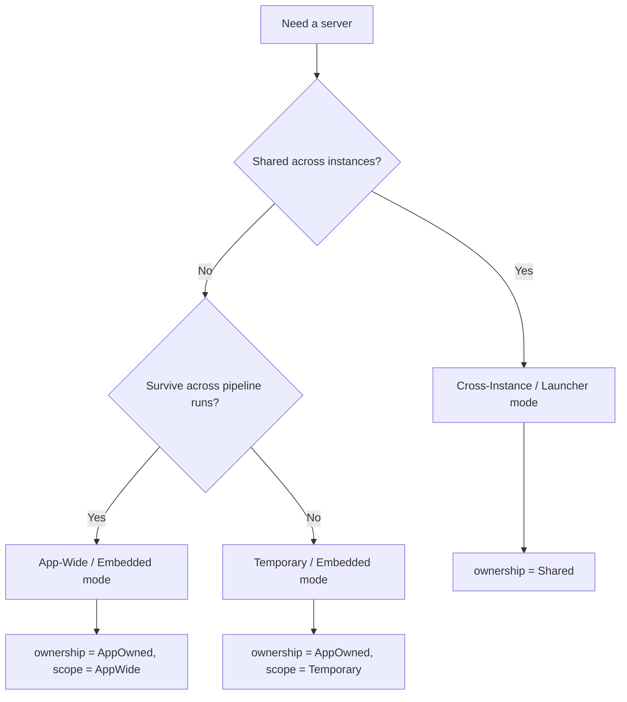
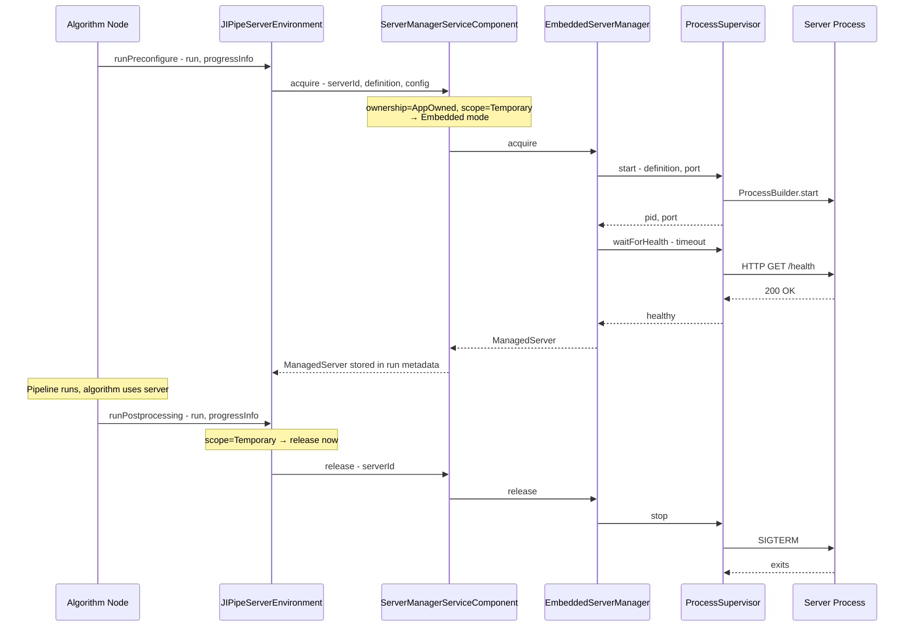
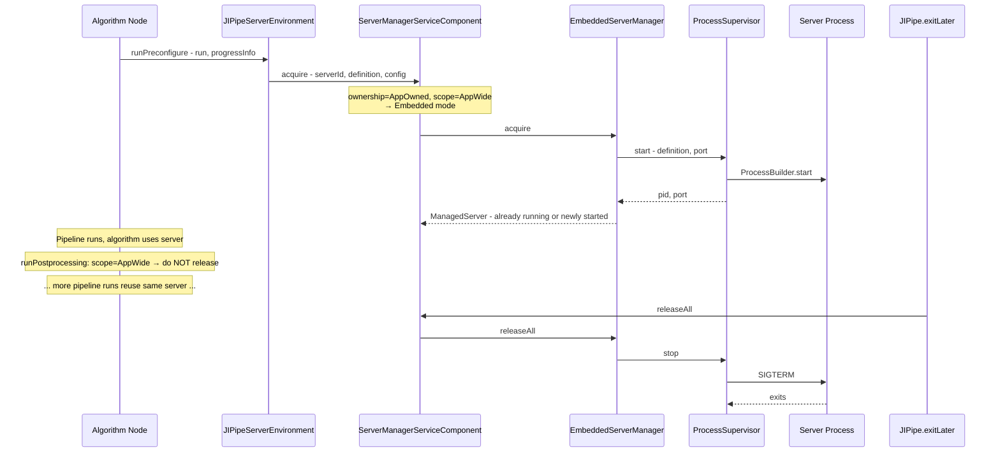
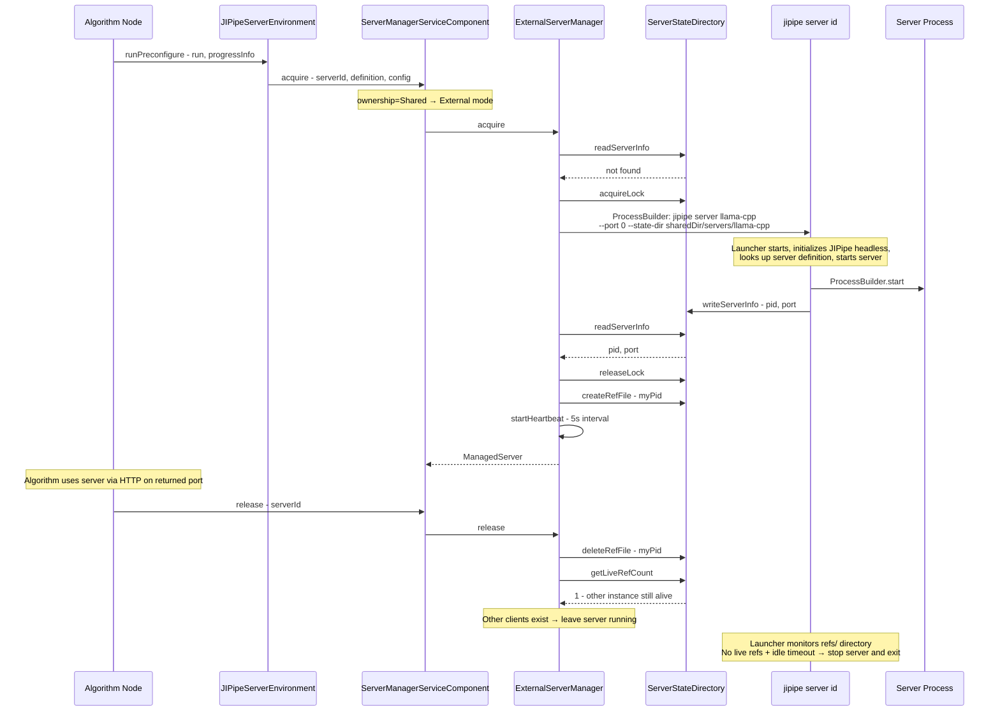
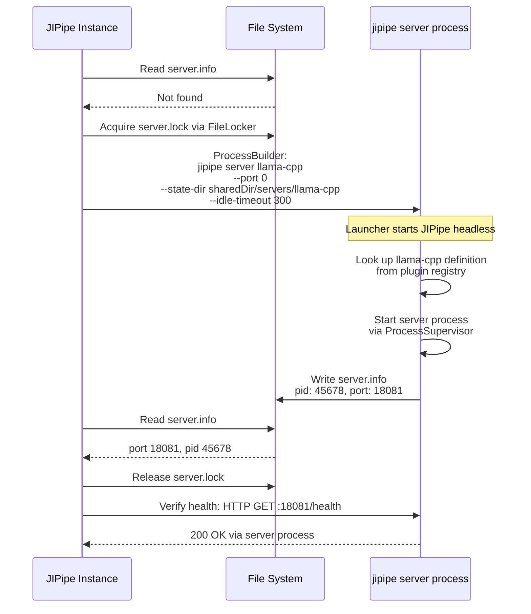
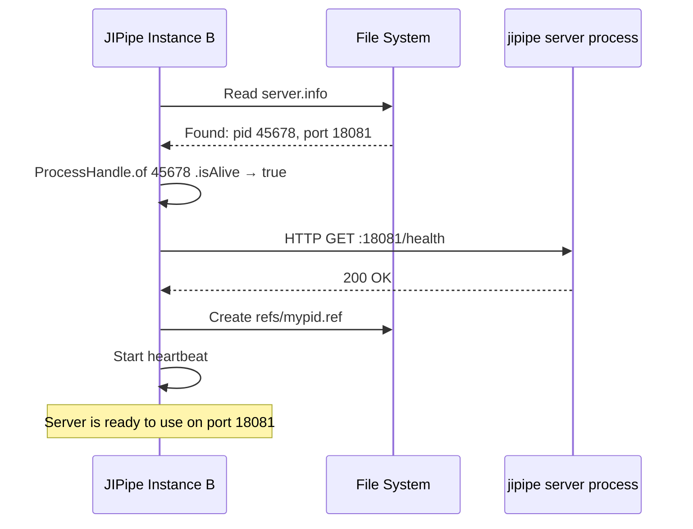
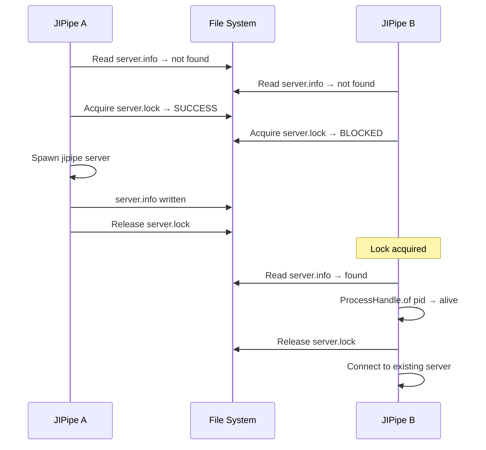

# Implementation Plan: External Server Process Management

**Date:** 2026-06-02  
**Status:** Implementation Plan  
**Extends:** `investigation-external-server-processes.md`, `investigation-external-server-processes-addendum-daemon.md`, `investigation-external-server-processes-addendum2-instantiation.md`

---

## 1. Executive Summary

JIPipe currently lacks infrastructure for managing persistent external server processes. All external tool invocations follow a fire-and-forget pattern: spawn a process, wait for completion, read output files. This plan introduces a **server manager** that supports three types of long-running server processes:

1. **Temporary servers** — scoped to a single pipeline run (e.g., per-run IPython kernel)
2. **Application-wide servers** — scoped to a single JIPipe instance (e.g., session IPython kernel)
3. **Cross-instance servers** — shared across all JIPipe instances on the same machine (e.g., llama.cpp LLM server with GPU resources)

The architecture follows JIPipe's linear hierarchy: server management is a **core feature** with all APIs in `jipipe-core`. Plugins define concrete server types through the service component, just like they define algorithms, data types, and environments. Cross-instance servers are spawned via the **JIPipe launcher** with a new `server` CLI subcommand, leveraging the existing launcher infrastructure for classpath and JRE management.

**Key value:** Enables reuse of expensive-to-start servers (LLM model loading can take 30+ seconds), eliminates Python startup overhead via persistent kernels, and provides crash-resilient coordination across multiple JIPipe instances.

---

## 2. Server Types Overview

### 2.1 Decision Matrix

| Aspect | Temporary | App-Wide | Cross-Instance |
|--------|-----------|----------|----------------|
| **Ownership** | `AppOwned` | `AppOwned` | `Shared` |
| **Process location** | In JIPipe JVM | In JIPipe JVM | Separate JVM via launcher |
| **Reference counting** | No | No | Yes (file-based) |
| **State directory** | `UserDir` + UUID | `UserDir` + UUID | `SharedDir` |
| **Crash resilience** | Not needed | Nice-to-have | Critical |
| **Cleanup trigger** | `runPostprocess` | `exitLater`/`dispose` | File-based ref counting + PID monitoring |
| **Example** | Per-run IPython kernel | Session IPython kernel | Shared LLM server |

### 2.2 Temporary Servers

A temporary server exists for the duration of a single pipeline run. It is started during `runPreconfigure()` and released during `runPostprocessing()`. No coordination with other JIPipe instances is needed.

**When to use:**
- The server is cheap to start (sub-second)
- State must not leak between pipeline runs
- No benefit from keeping the server alive between runs

**Example:** An IPython kernel started per-pipeline-run, where each run needs a clean Python namespace.

### 2.3 Application-Wide Servers

An application-wide server exists for the lifetime of a single JIPipe instance. It is started on first use and released when the JIPipe instance exits. Other JIPipe instances cannot share it.

**When to use:**
- The server is expensive to start but only needed within one JIPipe instance
- Sharing across instances is not required or not desirable
- The server holds instance-specific state

**Example:** A session IPython kernel that persists across multiple pipeline runs within the same JIPipe window, avoiding Python startup overhead.

### 2.4 Cross-Instance Servers

A cross-instance server is shared across all JIPipe instances on the same machine. It runs as a separate process spawned via the JIPipe launcher (`jipipe server <id>`). File-based reference counting determines when to shut down.

**When to use:**
- The server is expensive to start and consumes significant resources (GPU memory, model loading time)
- Multiple JIPipe instances benefit from sharing the same server
- Crash resilience is critical — the server must survive individual JIPipe crashes

**Example:** A llama.cpp LLM server that loads a large model into GPU memory. Starting a second instance would exhaust GPU resources; sharing is essential.

### 2.5 Selection Flow



---

## 3. Architecture Overview

### 3.1 Component Diagram

```mermaid
flowchart TB
    subgraph JIPipeCore [jipipe-core]
        direction TB
        API [api/servers/ - Interfaces]
        IMPL [servers/ - Implementation]
        SC [JIPipeServerManagerServiceComponent]
        ENV [JIPipeServerEnvironment]
        API --> IMPL
        SC --> IMPL
        ENV --> SC
    end

    subgraph PluginA [Plugin: AI]
        LlamaDef [LlamaCppServerDefinition]
        LlamaEnv [LlamaCppServerEnvironment]
    end

    subgraph PluginB [Plugin: Python]
        IPyDef [IPythonServerDefinition]
        IPyEnv [IPythonServerEnvironment]
    end

    PluginA -->|registers server types| SC
    PluginB -->|registers server types| SC

    subgraph Launcher [jipipe-launcher]
        SrvCmd [ServerCommand - jipipe server id]
    end

    Launcher -->|depends on| JIPipeCore

    subgraph EmbeddedMode [Embedded Mode - Temporary + App-Wide]
        ESM [EmbeddedServerManager]
        PS [ProcessSupervisor]
        ESM --> PS
    end

    subgraph ExternalMode [External Mode - Cross-Instance]
        EXM [ExternalServerManager]
        SSD [ServerStateDirectory]
        EXM --> SSD
        EXM -->|spawns via| SrvCmd
    end

    IMPL --> EmbeddedMode
    IMPL --> ExternalMode
```

### 3.2 Mode Selection Logic

The `JIPipeServerManagerServiceComponent` selects the mode based on the `ownership` field:

| `ownership` | `scope` | Mode | Implementation |
|-------------|---------|------|----------------|
| `AppOwned` | `Temporary` | Embedded | `EmbeddedServerManager` — in-process |
| `AppOwned` | `AppWide` | Embedded | `EmbeddedServerManager` — in-process |
| `Shared` | — | External | `ExternalServerManager` — via launcher |

Calling code always uses the same `acquire()` / `release()` API regardless of mode.

### 3.3 Key Architectural Decisions

1. **Core feature, not a separate module** — All server management APIs and implementation live in `jipipe-core`, following the linear hierarchy `[contrib] → core → [plugins] → launcher`.

2. **Plugins define server types** — Just like plugins register algorithms, data types, and environments, they register server definitions via `JIPipeServerManagerServiceComponent.registerServerType()`.

3. **Launcher spawns cross-instance servers** — The `jipipe server <id>` CLI subcommand starts a server as a separate process. This leverages the existing launcher infrastructure for classpath, JRE, and ImageJ context management. No manual classpath construction or `ManifestJarBuilder` needed.

4. **File-based inter-JVM coordination** — Uses existing `FileLocker` for mutual exclusion. State directories with `refs/` for reference counting. PID monitoring via `ProcessHandle` for crash detection.

5. **The `halt()` problem** — JIPipe uses `Runtime.getRuntime().halt()` which bypasses shutdown hooks. For embedded servers, cleanup is explicitly invoked before `halt()` in `exitLater()`. For cross-instance servers, the launcher-spawned process uses `System.exit()` (not `halt()`), so its shutdown hooks always execute — the server process survives JIPipe crashes.

---

## 4. Maven Module Structure

### 4.1 No New Modules

Server management is a core feature. All code lives in existing modules:

```
jipipe-core/src/main/java/org/hkijena/jipipe/
├── api/servers/                                    # Server manager API (interfaces)
│   ├── JIPipeServerDefinition.java                # How to start a server
│   ├── JIPipeProcessServerDefinition.java          # External process definition
│   ├── JIPipeJavaServerDefinition.java             # In-process Java server
│   ├── JIPipeManagedServer.java                    # Handle to running server
│   ├── JIPipeServerHealthCheck.java                # Health check strategy interface
│   ├── JIPipeServerOwnership.java                  # Enum: AppOwned, Shared
│   ├── JIPipeServerScope.java                      # Enum: Temporary, AppWide
│   ├── JIPipeServerState.java                      # Enum: lifecycle states
│   ├── JIPipeServerEvent.java                      # Lifecycle events
│   └── JIPipeServerConfiguration.java              # Serializable configuration
├── api/environments/
│   └── JIPipeServerEnvironment.java                # Server environment base class
├── api/service/components/
│   └── JIPipeServerManagerServiceComponent.java    # Service component
├── servers/                                        # Server manager implementation
│   ├── EmbeddedServerManager.java                  # In-process server management
│   ├── ExternalServerManager.java                  # Cross-instance via launcher
│   ├── ProcessSupervisor.java                      # Spawns/monitors child processes
│   ├── ServerStateDirectory.java                   # File-based state management
│   ├── HttpHealthCheck.java                        # HTTP health check impl
│   └── TcpHealthCheck.java                         # TCP port probe impl
└── ...

jipipe-launcher/src/main/java/org/hkijena/jipipe/launcher/commands/
└── ServerCommand.java                              # New `jipipe server` subcommand
```

### 4.2 Dependency Flow


This follows JIPipe's existing linear hierarchy. No new Maven modules are introduced.

### 4.3 Test Location

Tests go in `jipipe-core/src/test/java/org/hkijena/jipipe/servers/` following the standard pattern. A new test scope dependency on JUnit 5 will be added to `jipipe-core/pom.xml` if not already present.

---

## 5. Phase-by-Phase Implementation Plan

### Phase 1: Core API + Embedded Mode

**Goal:** Create the server manager API interfaces and implement embedded mode (temporary + app-wide servers) within `jipipe-core`.

**Deliverables:**
- All API interfaces in `org.hkijena.jipipe.api.servers`
- `JIPipeServerManagerServiceComponent` registered in `JIPipeService`
- `EmbeddedServerManager` for in-process server management
- `ProcessSupervisor` for spawning and monitoring child processes
- `HttpHealthCheck` and `TcpHealthCheck` implementations
- `JIPipeServerEnvironment` base class
- Integration with `JIPipe.exitLater()` and `JIPipeService.dispose()`
- Unit tests

**Tasks:**

1. Create `org.hkijena.jipipe.api.servers` package with all interfaces (Section 6)
2. Create `org.hkijena.jipipe.servers` package with implementation classes
3. Implement `ProcessSupervisor`:
   - Spawn process via `ProcessBuilder` with environment variables and working directory
   - Track PID via `ProcessHandle`
   - Health check polling with configurable timeout
   - Graceful shutdown via SIGTERM, force-kill via process tree termination
   - Restart on failure with configurable policy
4. Implement `HttpHealthCheck` — HTTP GET to endpoint, expect status code
5. Implement `TcpHealthCheck` — connect to port, expect success
6. Implement `JIPipeProcessServerDefinition` — command line, env vars, working dir, port argument placeholder
7. Implement `JIPipeJavaServerDefinition` — in-process Java server start/stop
8. Implement `EmbeddedServerManager`:
   - `acquire()` — spawn process, wait for health check, return `JIPipeManagedServer`
   - `release()` — stop process if no other references
   - `status()` — check process alive + health check
   - Track managed servers by ID in a `ConcurrentHashMap`
9. Create `JIPipeServerManagerServiceComponent`:
   - Extends `JIPipeServiceComponent`
   - Holds `EmbeddedServerManager` (and later `ExternalServerManager`)
   - `registerServerType()` — plugins call this to register server definitions
   - `acquire(serverId, environment)` — delegates to correct manager based on ownership
   - `release(serverId)` — releases reference
   - `releaseAll()` — releases all servers for this JIPipe instance
   - Uses `JIPipeRunnableQueue` for serialized lifecycle operations (following `JIPipeAIServiceComponent` pattern)
10. Register `JIPipeServerManagerServiceComponent` in `JIPipeService` constructor:
    - Add field: `private final JIPipeServerManagerServiceComponent serverManager;`
    - Add to `components` array
    - Add getter `getServerManager()`
11. Create `JIPipeServerEnvironment` extending `JIPipeArtifactEnvironment`:
    - Fields: `ownership`, `scope`, `port`, `startupTimeoutMs`, `idleTimeoutMs`, `autoStart`
    - Abstract method `toServerDefinition()` — converts to `JIPipeServerDefinition`
    - Abstract method `getServerId()` — unique server type identifier
    - Override `runPreconfigure()` — auto-starts server if `autoStart = true`
    - Override `runPostprocessing()` — releases temporary servers
12. Create `ServerOwnership` enum: `AppOwned`, `Shared`
13. Create `ServerScope` enum: `Temporary`, `AppWide`
14. Modify `JIPipe.exitLater()`:
    - Add `instance.getServerManager().releaseAll()` before `dispose()` and `halt()`
15. Modify `JIPipeService.dispose()`:
    - Add `getServerManager().releaseAll()` before plugin disposal
16. Modify `JIPipeDesktopProjectWindow.dispose()`:
    - Add server cleanup for Fiji mode
17. Add `NetworkUtils.findFreePort()` utility
18. Write unit tests:
    - Start/stop a simple HTTP server (use JDK `HttpServer` as test server)
    - Health check timeout behavior
    - Process crash detection
    - Multiple acquire/release cycles

**Acceptance Criteria:**
- `EmbeddedServerManager` can start, health-check, and stop an external process
- `JIPipeServerManagerServiceComponent` is created and registered during JIPipe startup
- `releaseAll()` is called before `halt()` in all exit paths
- Server environments resolve through the existing environment configurator chain
- Unit tests pass

---

### Phase 2: External Mode (Cross-Instance Servers)

**Goal:** Implement cross-instance server management using the JIPipe launcher and file-based coordination.

**Deliverables:**
- `ExternalServerManager` for cross-instance server lifecycle
- `ServerStateDirectory` for file-based state and reference counting
- `ServerCommand` launcher subcommand (`jipipe server <id>`)
- File-based reference counting with PID monitoring
- Crash detection and orphan cleanup
- Integration tests

**Tasks:**

1. Implement `ServerStateDirectory`:
   - Manage `<JIPipeSharedDir>/servers/<id>/` directory structure:
     ```
     <JIPipeSharedDir>/servers/<id>/
     ├── server.lock      # FileLocker for mutual exclusion
     ├── server.info      # PID:port:startedAt
     └── refs/            # One file per consuming JVM
         ├── 12345.ref    # Contains heartbeat timestamp
         └── 67890.ref
     ```
   - Read/write `server.info` (JSON: pid, port, startedAt, serverId)
   - Create/delete ref files
   - Scan `refs/` for live consumers via `ProcessHandle`
   - Orphan detection: verify PID alive + port reachable
2. Implement `ExternalServerManager`:
   - `acquire()`:
     1. Read `server.info` — check if server already running
     2. Validate: check PID via `ProcessHandle.of(pid).isAlive()` AND probe port
     3. If orphaned — kill orphaned process, clean up state directory
     4. If not running — acquire `server.lock`, spawn via launcher, wait for health check, write `server.info`, release lock
     5. Register as consumer — create `refs/<mypid>.ref` with timestamp
     6. Start heartbeat — periodically update `refs/<mypid>.ref` timestamp
   - `release()`:
     1. Delete `refs/<mypid>.ref`
     2. Scan `refs/` — check each PID via `ProcessHandle`
     3. If no live consumers — send SIGTERM to server process
     4. If other consumers exist — leave running
   - `status()` — read `server.info`, verify PID and port
3. Implement `ServerCommand` in `jipipe-launcher`:
   - New subcommand: `jipipe server <id>`
   - Parse arguments: `--port`, `--state-dir`, `--idle-timeout`
   - Initialize JIPipe in headless mode with `--fast-init`
   - Look up server definition by ID from `JIPipeServerManagerServiceComponent`
   - Start the server process via `ProcessSupervisor`
   - Write `server.info` to state directory
   - Enter main loop:
     - Periodic health checks
     - Periodic ref count scanning (check `refs/` directory)
     - If no live consumers + idle timeout expired → stop server and exit
   - Register shutdown hook (uses `System.exit()`, NOT `halt()`)
   - Handle SIGTERM for graceful shutdown
4. Integrate `ExternalServerManager` into `JIPipeServerManagerServiceComponent`:
   - Mode selection: `AppOwned` → `EmbeddedServerManager`, `Shared` → `ExternalServerManager`
   - `acquire()` delegates based on ownership
5. Add `JIPipeLauncher.main()` routing for `server` subcommand:
   - Add `else if (argsList.contains("server"))` branch
   - Call `ServerCommand.doStartServer(argsList)`
6. Implement heartbeat mechanism:
   - `ScheduledExecutorService` daemon thread updates `refs/<pid>.ref` every 5 seconds
   - Ref file contains JSON: `{"pid": 12345, "lastHeartbeat": "2026-06-01T10:30:00Z"}`
7. Implement orphan cleanup:
   - On every `acquire()` call, verify existing `server.info` PID and port
   - On JIPipe startup (`JIPipeServerManagerServiceComponent.postprocess()`), scan for orphaned servers
8. Write integration tests:
   - Start server via launcher, acquire, release, verify shutdown
   - Two simulated clients, one crashes, other continues
   - Orphan detection and cleanup
   - Concurrent acquire (two threads, same server ID)

**Acceptance Criteria:**
- Cross-instance servers start via `jipipe server <id>` command
- File-based reference counting works correctly
- Server survives JIPipe crash (detected via PID monitoring)
- Orphaned servers are detected and cleaned up
- Idle timeout shuts down server when no consumers remain

---

### Phase 3: JIPipe Integration

**Goal:** Deep integration with JIPipe's environment system, algorithm nodes, and lifecycle management.

**Deliverables:**
- Full `JIPipeServerEnvironment` integration with environment configurator chain
- Environment pre/post hooks for automatic server lifecycle
- Algorithm node pattern for using servers
- Daemon state directory initialization
- Fiji mode cleanup

**Tasks:**

1. Complete `JIPipeServerEnvironment` integration:
   - Register as environment type via `JIPipeEnvironmentsServiceComponent.registerEnvironment()`
   - Support environment resolution chain: Node override → Project override → Application setting → Fallback
   - Implement `runPreconfigure()`: auto-start server, store `JIPipeManagedServer` in run metadata
   - Implement `runPostprocessing()`: release temporary servers
2. Create environment configurator support for server environments:
   - `JIPipeEnvironmentConfigurator` already handles the resolution chain
   - Server environments just plug into the existing system
3. Create algorithm node usage pattern:
   ```java
   public class LlamaCppInferenceAlgorithm extends JIPipeIteratingAlgorithm {
       @Override
       protected void runIteration(JIPipeDataBatch dataBatch, JIPipeProgressInfo progressInfo) {
           LlamaCppServerEnvironment env = getEnvironmentOrDefault(LlamaCppServerEnvironment.class);
           JIPipeManagedServer server = JIPipe.getInstance().getServerManager()
               .acquire(env.getServerId(), env.toServerDefinition(), env.getServerConfiguration());
           int port = server.getPort();
           // Make HTTP request to localhost:port
       }
   }
   ```
4. Add server state directory initialization in `JIPipeServerManagerServiceComponent.postprocess()`:
   - Create `<JIPipeSharedDir>/servers/` if not exists
   - Scan for orphaned servers from previous crashes
5. Complete Fiji mode integration:
   - `JIPipeDesktopProjectWindow.dispose()` calls `releaseAll()`
   - Server manager is lifecycle-aware
6. Add `JIPipeServerEnvironment` registration in plugin `register()` methods:
   - Follow the pattern from `ArtifactsPlugin` and other plugins
   - `registerEnvironment("llama-cpp-server", ...)` with icon, description, etc.
7. Write integration tests:
   - Full lifecycle: environment resolution → server acquire → use → release
   - Cleanup on exit in all modes

**Acceptance Criteria:**
- Server environments resolve through the existing environment configurator chain
- `runPreconfigure()` auto-starts servers before pipeline execution
- `runPostprocessing()` releases temporary servers after pipeline execution
- Fiji mode cleanup works via `dispose()` without `halt()`
- Algorithm nodes can acquire and use servers during pipeline execution

---

### Phase 4: Concrete Server Implementations

**Goal:** Implement specific server types as plugin contributions.

**Deliverables:**
- `LlamaCppServerDefinition` and `LlamaCppServerEnvironment`
- `IPythonServerDefinition` and `IPythonServerEnvironment`
- `GenericServerDefinition` and `GenericServerEnvironment`
- Algorithm nodes that use these environments

**Tasks:**

1. Implement `LlamaCppServerDefinition`:
   - `JIPipeProcessServerDefinition` subclass
   - Command line: `llama-server -m <model> --port <port> -ngl <layers> -c <context>`
   - Health check: `GET /health` → 200
   - Fields: `executablePath`, `modelPath`, `gpuLayers`, `contextSize`
2. Implement `LlamaCppServerEnvironment`:
   - `JIPipeServerEnvironment` subclass
   - `ownership = Shared` (default, configurable)
   - `toServerDefinition()` returns configured `LlamaCppServerDefinition`
   - Artifact integration: download llama.cpp binary as JIPipe artifact
3. Implement `IPythonServerDefinition`:
   - `JIPipeProcessServerDefinition` subclass
   - Command line: `python -m IPython kernel --json`
   - Health check: kernel info request
   - Integration with existing `PythonEnvironment`
4. Implement `IPythonServerEnvironment`:
   - `JIPipeServerEnvironment` subclass
   - `ownership = AppOwned`, `scope = AppWide` (default, configurable to Temporary)
5. Implement `GenericServerDefinition` and `GenericServerEnvironment`:
   - Fully configurable: executable path, arguments, port argument pattern, health check URL
   - For users who want to manage custom server processes
6. Create algorithm nodes:
   - `LlamaCppInferenceAlgorithm` — uses `LlamaCppServerEnvironment`
   - `IPythonExecuteAlgorithm` — uses `IPythonServerEnvironment`
7. Register environments and nodes in the respective plugin `register()` methods
8. Write per-plugin tests

**Acceptance Criteria:**
- llama.cpp server starts, responds to health check, and shuts down correctly
- IPython kernel starts, accepts commands, and shuts down correctly
- Generic server can be configured via UI and works with any HTTP-speaking process
- Algorithm nodes can acquire and use servers during pipeline execution

---

### Phase 5: UI and Polish

**Goal:** Add desktop UI for server monitoring and management.

**Deliverables:**
- Server status panel in JIPipe desktop
- Server management in application settings
- Progress indicator during server startup
- Documentation

**Tasks:**

1. Create `JIPipeDesktopServerStatusPanel`:
   - Shows list of active servers (temporary, app-wide, cross-instance)
   - For each server: name, type, status, port, PID, client count, uptime
   - Actions: start, stop, restart
   - Auto-refresh via periodic polling
2. Create server environment editor in application settings:
   - Configure server definitions (executable, arguments, health check)
   - Set ownership and scope
   - Set timeouts
3. Add progress indicator during server startup:
   - Show in algorithm node progress bar
   - Show in splash screen for auto-start servers
4. Add server status to the JIPipe system information dialog
5. Write user documentation:
   - How to configure server environments
   - How to use the server status panel
   - Troubleshooting guide (server not starting, port conflicts, etc.)

**Acceptance Criteria:**
- Server status panel shows all active servers with correct state
- Users can start/stop/restart servers from the UI
- Progress indicator provides feedback during server startup

---

## 6. Detailed Class/Interface Specifications

### 6.1 API — `org.hkijena.jipipe.api.servers`

#### `JIPipeServerDefinition`

Defines how to start a server. Abstract base class.

```java
package org.hkijena.jipipe.api.servers;

public abstract class JIPipeServerDefinition {
    private JIPipeServerHealthCheck healthCheck;
    private long startupTimeoutMs = 30000;
    private String portArgumentPlaceholder = "{port}";

    public abstract List<String> getCommandLine(int port);
    public abstract Map<String, String> getEnvironmentVariables();
    public abstract Path getWorkingDirectory();

    public JIPipeServerHealthCheck getHealthCheck() { return healthCheck; }
    public long getStartupTimeoutMs() { return startupTimeoutMs; }
    public String getPortArgumentPlaceholder() { return portArgumentPlaceholder; }
}
```

**Package:** `org.hkijena.jipipe.api.servers`  
**Responsibilities:** Define how to construct the command line for spawning a server process.  
**Dependencies:** None beyond JDK.

#### `JIPipeProcessServerDefinition`

Defines an external process server. Concrete subclass of `JIPipeServerDefinition`.

```java
package org.hkijena.jipipe.api.servers;

public class JIPipeProcessServerDefinition extends JIPipeServerDefinition {
    private List<String> commandLineTemplate;
    private Path workingDirectory;
    private Map<String, String> environmentVariables;

    public static Builder builder() { return new Builder(); }

    @Override
    public List<String> getCommandLine(int port);
    @Override
    public Map<String, String> getEnvironmentVariables();
    @Override
    public Path getWorkingDirectory();

    public static class Builder {
        public Builder commandLine(String... args);
        public Builder workingDirectory(Path dir);
        public Builder environmentVariable(String key, String value);
        public Builder healthCheck(JIPipeServerHealthCheck check);
        public Builder startupTimeoutMs(long ms);
        public JIPipeProcessServerDefinition build();
    }
}
```

**Package:** `org.hkijena.jipipe.api.servers`  
**Responsibilities:** Construct the command line for spawning an external server process.  
**Dependencies:** `JIPipeServerDefinition`.

#### `JIPipeJavaServerDefinition`

Defines an in-process Java server (runs within the JIPipe JVM or the launcher server process).

```java
package org.hkijena.jipipe.api.servers;

public interface JIPipeJavaServerDefinition extends JIPipeServerDefinition {
    void start(JavaServerContext context) throws Exception;
    void stop() throws Exception;
    boolean isHealthy();
}
```

**Package:** `org.hkijena.jipipe.api.servers`  
**Responsibilities:** Start/stop a Java-based service in-process.  
**Dependencies:** `JIPipeServerDefinition`.

#### `JIPipeManagedServer`

A handle to a running server instance. Returned by `acquire()`.

```java
package org.hkijena.jipipe.api.servers;

public interface JIPipeManagedServer {
    String getServerId();
    JIPipeServerState getState();
    int getPort();
    long getPid();
    JIPipeServerDefinition getDefinition();
    Instant getStartedAt();
    boolean isHealthy();
    void restart();
}
```

**Package:** `org.hkijena.jipipe.api.servers`  
**Responsibilities:** Provide server metadata and lifecycle operations.  
**Dependencies:** None.

#### `JIPipeServerHealthCheck`

Strategy interface for verifying a server is alive.

```java
package org.hkijena.jipipe.api.servers;

public interface JIPipeServerHealthCheck {
    boolean isHealthy(String host, int port, long timeoutMs);
    String getDescription();
}
```

**Package:** `org.hkijena.jipipe.api.servers`  
**Responsibilities:** Verify server liveness via HTTP, TCP, or custom protocol.  
**Dependencies:** None.

#### `JIPipeServerOwnership`

```java
package org.hkijena.jipipe.api.servers;

public enum JIPipeServerOwnership {
    AppOwned,  // Embedded mode
    Shared     // External mode via launcher
}
```

#### `JIPipeServerScope`

```java
package org.hkijena.jipipe.api.servers;

public enum JIPipeServerScope {
    Temporary,  // Released in runPostprocessing()
    AppWide     // Released in exitLater()/dispose()
}
```

#### `JIPipeServerState`

```java
package org.hkijena.jipipe.api.servers;

public enum JIPipeServerState {
    NotRunning, Starting, Running, Stopping, Failed
}
```

#### `JIPipeServerEvent`

Lifecycle event dispatched by the server manager.

```java
package org.hkijena.jipipe.api.servers;

public class JIPipeServerEvent {
    public enum Type {
        SERVER_STARTING, SERVER_RUNNING, SERVER_STOPPING,
        SERVER_STOPPED, SERVER_FAILED, HEALTH_DEGRADED,
        HEALTH_RECOVERED, CLIENT_CONNECTED, CLIENT_DISCONNECTED
    }
    private final Type type;
    private final String serverId;
    private final Instant timestamp;
    private final String message;
}
```

#### `JIPipeServerConfiguration`

Serializable configuration for a server.

```java
package org.hkijena.jipipe.api.servers;

public class JIPipeServerConfiguration {
    private JIPipeServerOwnership ownership = JIPipeServerOwnership.AppOwned;
    private JIPipeServerScope scope = JIPipeServerScope.AppWide;
    private int port = 0; // 0 = auto
    private long startupTimeoutMs = 30000;
    private long idleTimeoutMs = 300000; // 5 minutes
    private boolean autoStart = false;
    private RestartPolicy restartPolicy = RestartPolicy.ON_FAILURE;

    public enum RestartPolicy { ON_FAILURE, ALWAYS, NEVER }
}
```

### 6.2 Implementation — `org.hkijena.jipipe.servers`

#### `EmbeddedServerManager`

In-process server manager for temporary and app-wide servers.

```java
package org.hkijena.jipipe.servers;

public class EmbeddedServerManager {
    private final Map<String, ManagedServerEntry> servers = new ConcurrentHashMap<>();
    private final ScheduledExecutorService healthChecker;

    public JIPipeManagedServer acquire(String serverId, JIPipeServerDefinition definition,
                                        JIPipeServerConfiguration config);
    public void release(String serverId);
    public void releaseAll();
    public JIPipeServerState status(String serverId);
    public List<String> getManagedServerIds();
}
```

**Package:** `org.hkijena.jipipe.servers`  
**Responsibilities:** Manage servers within the JIPipe JVM. No inter-JVM coordination needed.  
**Dependencies:** `ProcessSupervisor`, `JIPipeServerDefinition` (API).

#### `ExternalServerManager`

Cross-instance server manager using the launcher and file-based coordination.

```java
package org.hkijena.jipipe.servers;

public class ExternalServerManager {
    private final Map<String, ManagedServerEntry> servers = new ConcurrentHashMap<>();
    private final ScheduledExecutorService heartbeatScheduler;

    public JIPipeManagedServer acquire(String serverId, JIPipeServerDefinition definition,
                                        JIPipeServerConfiguration config);
    public void release(String serverId);
    public void releaseAll();
    public JIPipeServerState status(String serverId);

    private void spawnServerProcess(String serverId, JIPipeServerDefinition definition,
                                     JIPipeServerConfiguration config);
    private void startHeartbeat(String serverId);
    private void stopHeartbeat(String serverId);
}
```

**Package:** `org.hkijena.jipipe.servers`  
**Responsibilities:** Manage cross-instance servers via launcher and file-based coordination.  
**Dependencies:** `ServerStateDirectory`, JDK `ProcessBuilder` (to spawn launcher).

#### `ProcessSupervisor`

Manages a single server process lifecycle.

```java
package org.hkijena.jipipe.servers;

public class ProcessSupervisor {
    private Process process;
    private long pid;
    private JIPipeServerState state;
    private final JIPipeServerHealthCheck healthCheck;

    public void start(JIPipeProcessServerDefinition definition, int port);
    public void stop();    // SIGTERM
    public void forceKill(); // kill process tree
    public boolean isAlive();
    public boolean isHealthy();
    public JIPipeServerState getState();
    public int getPort();
    public long getPid();
}
```

**Package:** `org.hkijena.jipipe.servers`  
**Responsibilities:** Spawn, monitor, and terminate a single server process.  
**Dependencies:** `JIPipeProcessServerDefinition`, `JIPipeServerHealthCheck`.

#### `ServerStateDirectory`

Manages the file-based state directory for cross-instance coordination.

```java
package org.hkijena.jipipe.servers;

public class ServerStateDirectory {
    private final Path baseDir; // <JIPipeSharedDir>/servers/<id>/

    public void writeServerInfo(long pid, int port, String serverId);
    public ServerInfo readServerInfo();
    public void deleteServerInfo();

    public void createRefFile(long clientPid);
    public void deleteRefFile(long clientPid);
    public void updateRefHeartbeat(long clientPid);
    public int getLiveRefCount();
    public List<Long> getLiveClientPids();

    public void acquireLock();
    public void releaseLock();

    public boolean isServerProcessAlive();
    public boolean isServerPortReachable();

    public static void cleanupOrphanedServers(Path sharedDir);
}
```

**Package:** `org.hkijena.jipipe.servers`  
**Responsibilities:** Read/write state files, detect orphans, manage reference counting.  
**Dependencies:** `FileLocker`, Jackson.

#### `HttpHealthCheck`

```java
package org.hkijena.jipipe.servers;

public class HttpHealthCheck implements JIPipeServerHealthCheck {
    private final String path;
    private final int expectedStatus;

    public static HttpHealthCheck of(String path, int expectedStatus);

    @Override
    public boolean isHealthy(String host, int port, long timeoutMs);
}
```

#### `TcpHealthCheck`

```java
package org.hkijena.jipipe.servers;

public class TcpHealthCheck implements JIPipeServerHealthCheck {
    @Override
    public boolean isHealthy(String host, int port, long timeoutMs);
}
```

### 6.3 Service Component — `org.hkijena.jipipe.api.service.components`

#### `JIPipeServerManagerServiceComponent`

```java
package org.hkijena.jipipe.api.service.components;

public class JIPipeServerManagerServiceComponent extends JIPipeServiceComponent {
    private final EmbeddedServerManager embeddedManager;
    private final ExternalServerManager externalManager;
    private final Map<String, JIPipeServerDefinition> registeredDefinitions = new HashMap<>();

    public void registerServerType(String id, JIPipeServerDefinition definition);
    public JIPipeServerDefinition getServerDefinition(String id);

    public JIPipeManagedServer acquire(String serverId, JIPipeServerDefinition definition,
                                        JIPipeServerConfiguration config);
    public void release(String serverId);
    public void releaseAll();

    public JIPipeServerState status(String serverId);
    public List<String> getActiveServerIds();

    @Override
    public void postprocess(JIPipeProgressInfo progressInfo);
    // - Scan for orphaned cross-instance servers
    // - Initialize state directories
}
```

**Package:** `org.hkijena.jipipe.api.service.components`  
**Responsibilities:** Central server lifecycle management within JIPipe. Mode selection. Plugin registry for server types.  
**Dependencies:** `EmbeddedServerManager`, `ExternalServerManager`, `JIPipeServiceComponent`.

### 6.4 Environment — `org.hkijena.jipipe.api.environments`

#### `JIPipeServerEnvironment`

```java
package org.hkijena.jipipe.api.environments;

public abstract class JIPipeServerEnvironment extends JIPipeArtifactEnvironment {
    private JIPipeServerOwnership ownership = JIPipeServerOwnership.Shared;
    private JIPipeServerScope scope = JIPipeServerScope.AppWide;
    private int port = 0;
    private long startupTimeoutMs = 30000;
    private long idleTimeoutMs = 300000;
    private boolean autoStart = false;

    public abstract JIPipeServerDefinition toServerDefinition();
    public abstract String getServerId();

    public JIPipeServerConfiguration toServerConfiguration();

    @Override
    public void runPreconfigure(JIPipeGraphRun run, JIPipeProgressInfo progressInfo);
    @Override
    public void runPostprocessing(JIPipeGraphRun run, JIPipeProgressInfo progressInfo);
}
```

**Package:** `org.hkijena.jipipe.api.environments`  
**Responsibilities:** Bridge between JIPipe's environment system and the server manager.  
**Dependencies:** `JIPipeArtifactEnvironment`, `org.hkijena.jipipe.api.servers.*`.

### 6.5 Launcher — `org.hkijena.jipipe.launcher.commands`

#### `ServerCommand`

```java
package org.hkijena.jipipe.launcher.commands;

public class ServerCommand {
    public static void doStartServer(List<String> argsList);
    // - Parse --id, --port, --state-dir, --idle-timeout
    // - Initialize JIPipeService in headless mode with --fast-init
    // - Look up server definition by ID
    // - Start server process via ProcessSupervisor
    // - Write server.info to state directory
    // - Enter main loop:
    //   - Periodic health checks
    //   - Periodic ref count scanning
    //   - Idle timeout → stop and exit
    // - Register shutdown hook (System.exit, not halt)
    // - Handle SIGTERM
}
```

**Package:** `org.hkijena.jipipe.launcher.commands`  
**Responsibilities:** Start and manage a single server as a background process.  
**Dependencies:** `jipipe-core` (via launcher dependency), `ProcessSupervisor`, `ServerStateDirectory`.

---

## 7. Server Type Lifecycle Flows

### 7.1 Temporary Server — Acquire, Use, Release



### 7.2 App-Wide Server — Acquire, Use, Release



### 7.3 Cross-Instance Server — Acquire, Use, Release



---

## 8. Launcher Server Command and Lifecycle

### 8.1 Spawning a Cross-Instance Server

When a JIPipe instance needs a cross-instance server, the `ExternalServerManager` spawns a new process using the JIPipe launcher:



### 8.2 Launcher Server Command Main Loop

The `ServerCommand` process runs the following loop:

```
1. Initialize JIPipe in headless mode (--fast-init)
2. Look up server definition by ID from plugin registry
3. Start server process via ProcessSupervisor
4. Write server.info to state directory
5. Register shutdown hook (System.exit, not halt)
6. Loop:
   a. Health check server process (every 10s)
   b. Scan refs/ directory for live clients (every 5s)
   c. If no live clients:
      - Start idle timer
      - If idle timer expires → stop server, clean up, System.exit(0)
   d. If live clients found:
      - Reset idle timer
7. On SIGTERM:
   - Stop server process
   - Clean up server.info
   - System.exit(0) — triggers shutdown hook
```

### 8.3 Second JIPipe Instance — Server Already Running



### 8.4 Concurrent Spawn — Two Instances Start Simultaneously



### 8.5 Server State Directory Structure

```
<JIPipeSharedDir>/servers/<id>/
├── server.lock      # FileLocker for mutual exclusion during start/stop
├── server.info      # JSON: {pid, port, startedAt, serverId}
└── refs/            # One file per consuming JVM
    ├── 12345.ref    # JSON: {pid, lastHeartbeat}
    └── 67890.ref
```

---

## 9. Crash Recovery Scenarios

### 9.1 Scenario Matrix

| Crash Scenario | Temporary Server | App-Wide Server | Cross-Instance Server |
|----------------|-----------------|-----------------|----------------------|
| **JIPipe graceful exit** | Released in `runPostprocessing()` | Released in `exitLater()` before `halt()` | Ref file deleted in `exitLater()`, launcher detects no clients |
| **JIPipe `halt()` called** | Process orphaned | Process orphaned | Ref file remains, launcher detects stale ref via PID check |
| **JIPipe JVM crash** | Process orphaned | Process orphaned | Ref file remains, launcher detects stale ref via PID check |
| **JIPipe `kill -9`** | Process orphaned | Process orphaned | Ref file remains, launcher detects stale ref via PID check |
| **Server process crash** | Algorithm fails with error | Next acquire restarts | Launcher detects via health check, restarts per policy |
| **Launcher server process crash** | N/A | N/A | JIPipe detects on next acquire, re-spawns via launcher |
| **Both JIPipe + launcher crash** | Server process orphaned | Server process orphaned | Next JIPipe startup discovers orphans via state directory |
| **OS shutdown** | OS kills all processes | OS kills all processes | OS kills all processes; state files cleaned on next start |

### 9.2 Temporary/App-Wide Server Crash Recovery

Temporary and app-wide servers run in embedded mode. If the JIPipe JVM crashes:

1. The server process is orphaned (its parent PID is gone)
2. On next JIPipe startup, `JIPipeServerManagerServiceComponent.postprocess()` scans for orphaned processes:
   - Check `<JIPipeUserDir>/servers/<uuid>/` directories for PID records
   - Verify PID liveness via `ProcessHandle`
   - Kill orphaned processes
3. If no JIPipe instance ever restarts, the orphaned process runs until manually killed or OS shutdown

**Mitigation for `halt()` problem:** The `releaseAll()` call is inserted before `halt()` in `exitLater()`. This handles graceful shutdown. For crashes, orphan detection on next startup handles cleanup.

### 9.3 Cross-Instance Server Crash Recovery

#### JIPipe Instance Crashes

1. The JIPipe process is gone — its `refs/<pid>.ref` file remains but heartbeat stops
2. The launcher's periodic ref scan (every 5 seconds) checks each ref file:
   - `ProcessHandle.of(pid).isAlive()` → false
   - Heartbeat timestamp is stale
3. The launcher removes the dead client's ref file
4. If no live refs remain, the idle timer starts
5. If the idle timer expires, the launcher stops the server and exits

**No special code is needed in JIPipe for this case.** The launcher handles it independently.

#### Launcher Process Crashes

1. JIPipe instances detect the launcher is gone on next `acquire()` or status check:
   - `server.info` PID is dead (`ProcessHandle.of(pid).isAlive()` → false)
   - Server port is unreachable
2. The next JIPipe instance to need the server triggers a re-spawn:
   - Acquire `server.lock`
   - Clean up stale `server.info`
   - Spawn new launcher process: `jipipe server <id>`
3. The new launcher discovers the server process:
   - If the server process is still alive and healthy → adopt it (write new `server.info`)
   - If the server process is dead → start a new one

#### Both Crash Simultaneously

1. On next JIPipe startup, the new instance discovers orphaned server processes
2. The state directory contains `server.info` from the previous launcher
3. The new instance checks the recorded PID:
   - If alive and healthy → adopt (spawn new launcher to manage it)
   - If dead → clean up state directory, start fresh on next acquire
4. If no JIPipe instance ever starts again, server processes continue until manually killed or OS shutdown

### 9.4 Server Process Crash (Any Type)

1. Health check fails (HTTP timeout or connection refused)
2. **Embedded mode:** Next `acquire()` call or health check detects the failure, restarts the server
3. **External mode:** Launcher detects failure via health check, applies restart policy:
   - `ON_FAILURE`: Restart up to N times, then mark as `Failed`
   - `ALWAYS`: Always restart regardless of exit code
   - `NEVER`: Mark as `Failed`, do not restart
4. Algorithm nodes receive a `JIPipeServerEvent.SERVER_FAILED` event and can handle it

---

## 10. Testing Strategy

### 10.1 Unit Tests — `jipipe-core/src/test/java/org/hkijena/jipipe/servers/`

| Test Class | What It Tests |
|------------|---------------|
| `EmbeddedServerManagerTest` | Acquire/release lifecycle, health check, process crash detection |
| `ProcessSupervisorTest` | Start/stop/force-kill, PID tracking, health check polling |
| `HttpHealthCheckTest` | HTTP health check against a real JDK `HttpServer` |
| `TcpHealthCheckTest` | TCP port probe |
| `ServerStateDirectoryTest` | Read/write state files, ref counting, orphan detection |
| `ProcessServerDefinitionTest` | Command line construction with port substitution |

**Test infrastructure:** Use JDK `com.sun.net.httpserver.HttpServer` as a lightweight test server that can be started/stopped within tests.

### 10.2 Integration Tests

| Test Class | What It Tests |
|------------|---------------|
| `ExternalServerManagerTest` | Full lifecycle: spawn via launcher, acquire, release, shutdown |
| `ConcurrentAcquireTest` | Two threads acquire same server ID simultaneously |
| `CrashRecoveryTest` | Simulate client crash (delete ref file), verify launcher detects it |
| `OrphanCleanupTest` | Leave stale `server.info`, verify cleanup on next acquire |
| `ServerCommandTest` | Run `jipipe server <id>` as a subprocess, verify behavior |

**Crash simulation:** Use `ProcessHandle.current().destroyForcibly()` on forked test processes to simulate crashes. Do NOT crash the test JVM itself.

### 10.3 Manual Test Scenarios

| Scenario | Steps | Expected Result |
|----------|-------|-----------------|
| **First use — server auto-start** | 1. Start JIPipe 2. Open pipeline with LlamaCppServerEnvironment 3. Run pipeline | Launcher spawns server, pipeline runs successfully |
| **Second instance reuses server** | 1. Start JIPipe A with LLM pipeline 2. Start JIPipe B with same LLM environment 3. Run pipeline in B | B discovers running server, reuses it, refCount = 2 |
| **Instance crash — server survives** | 1. Start JIPipe A with LLM server 2. `kill -9` JIPipe A 3. Start JIPipe B | Launcher detects A's death via stale ref, keeps server running for B |
| **Launcher crash — recovery** | 1. Start JIPipe with LLM server 2. Kill launcher process 3. Trigger server acquire from JIPipe | JIPipe detects launcher failure, re-spawns via launcher |
| **Graceful exit — all cleaned up** | 1. Start JIPipe with servers 2. Close JIPipe window | `releaseAll()` called before `halt()`, ref files deleted |
| **Fiji mode — no halt** | 1. Start JIPipe from Fiji 2. Close JIPipe window 3. Fiji keeps running | `dispose()` triggers `releaseAll()`, servers released, Fiji continues |
| **Idle timeout** | 1. Start JIPipe, acquire server 2. Release server 3. Wait 5 minutes | Launcher stops server and exits |

### 10.4 Platform-Specific Testing

| Platform | Key Concerns | Test Focus |
|----------|-------------|------------|
| **Linux** | `ProcessHandle` reliability, SIGTERM handling | Standard path |
| **Windows** | `javaw.exe`, classpath length via launcher | Launcher command works on Windows |
| **macOS** | Similar to Linux, `FileLock` advisory behavior | Standard path |

---

## 11. Risk Assessment and Mitigations

### 11.1 The `halt()` Problem

**Risk:** `JIPipe.exitLater()` uses `Runtime.getRuntime().halt()` which bypasses shutdown hooks. Server cleanup code may not execute.

**Mitigation:**
- Insert `releaseAll()` call **before** `halt()` in `exitLater()` — handles graceful shutdown
- For cross-instance servers: the launcher process uses `System.exit()` (not `halt()`), so its shutdown hooks always execute — the launcher survives JIPipe crashes
- For temporary/app-wide servers: orphan detection on next JIPipe startup — handles crash
- For Fiji mode: cleanup in `JIPipeDesktopProjectWindow.dispose()` — handles window close without `halt()`

**Residual risk:** If `releaseAll()` is never called (code bug), app-owned servers are orphaned until next startup cleanup.

### 11.2 Launcher Spawn Failure

**Risk:** The `jipipe server <id>` command fails to start (JRE not found, classpath issue, server definition not registered).

**Mitigation:**
- The launcher already handles JRE and classpath — no manual construction needed
- `ExternalServerManager` verifies the launcher process started successfully (check `server.info` appears within timeout)
- If spawn fails, fall back to embedded mode with a warning logged
- Retry up to 3 times with exponential backoff

### 11.3 Port Conflicts

**Risk:** A dynamically allocated port is taken by another application between allocation and server startup.

**Mitigation:**
- Use the server's own port allocation (let the server bind to port 0 and report back)
- If the server cannot bind, retry with a new port
- For fixed-port servers, check availability before starting

### 11.4 Security

**Risk:** Unauthorized process connects to a shared server.

**Mitigation:**
- Bind servers to `127.0.0.1` only (loopback, not externally accessible)
- Verify client PIDs via `ProcessHandle` (reject connections from non-existent PIDs)
- The `server.info` file is in `JIPipeSharedDir` which is user-specific

### 11.5 Stale State Files

**Risk:** Stale `server.info` or ref files after a JVM crash.

**Mitigation:**
- Orphan detection on every `acquire()` call verifies the PID is alive AND the port is reachable
- Stale files are cleaned up automatically
- The launcher's periodic ref scan removes dead client refs

### 11.6 Version Compatibility

**Risk:** JIPipe instances with different versions share the same `JIPipeSharedDir`.

**Mitigation:**
- `server.info` includes the JIPipe version
- On acquire, check version compatibility
- If incompatible, stop the old server and start a new one

### 11.7 Race Conditions in File-Based Coordination

**Risk:** Two JIPipe instances try to start the same server simultaneously.

**Mitigation:**
- `FileLocker` on `server.lock` provides mutual exclusion during the start operation
- The lock is held only during the start sequence (not while the server runs)
- Double-check after acquiring lock (another instance may have started the server while we waited)

---

## 12. Open Questions

### 12.1 Launcher Headless Init Performance

**Question:** How long does `JIPipeService` initialization take in headless mode with `--fast-init`? The launcher server command needs to initialize JIPipe to look up server definitions.

**Investigation needed:** Measure startup time. If too slow (>5 seconds), consider a lightweight mode that only loads the plugin registry without full initialization.

**Resolution target:** Phase 2 (during `ServerCommand` implementation).

### 12.2 Server Configuration Mismatch

**Question:** What happens when two JIPipe instances request the same server ID with different configurations (e.g., different model paths)?

**Options:**
1. **Reject** the second request with a configuration mismatch error
2. **Stop and restart** the server with the new configuration (disrupts existing clients)
3. **Start a second instance** of the server with a different internal ID

**Recommendation:** Option 1 for MVP (reject with clear error message). Option 3 for future enhancement.

**Resolution target:** Phase 2.

### 12.3 Temporary Server State Directory Location

**Question:** Should temporary servers use `<JIPipeUserDir>/servers/<uuid>/` or `java.io.tmpdir`?

**Arguments for `UserDir`:** Consistent with app-wide server pattern, survives temp directory cleanup.  
**Arguments for `tmpdir`:** Automatically cleaned by OS, no accumulation of stale directories.

**Recommendation:** Use `UserDir` for consistency. Clean up the state directory in `runPostprocessing()` after the server is stopped.

**Resolution target:** Phase 1.

### 12.4 Launcher Server Command — Full Init vs Minimal Init

**Question:** Should the `jipipe server <id>` command initialize the full JIPipe stack or a minimal subset?

**Arguments for full init:** Can look up any registered server definition, consistent with other launcher commands.  
**Arguments for minimal init:** Faster startup, lower memory footprint.

**Recommendation:** Full init with `--fast-init` for MVP. The server startup time (e.g., 30s for LLM model loading) dominates over JIPipe init time.

**Resolution target:** Phase 2.

### 12.5 Integration with Existing `JIPipeAIServiceComponent`

**Question:** Should `JIPipeAIServiceComponent` be refactored to use the new server manager for its external API connections?

**Recommendation:** Not in the initial implementation. The AI service component manages API clients (not server processes). Future integration could allow the AI service to auto-start a llama.cpp server via the server manager if no external API is configured.

**Resolution target:** Post-Phase 5.

### 12.6 Multiple JIPipe Versions Sharing Servers

**Question:** If two JIPipe versions run simultaneously, should they share cross-instance servers?

**Current design:** They share `JIPipeSharedDir`, so they would share server state directories. Version compatibility is checked via `server.info`.

**Recommendation:** For MVP, share servers with version checking. If incompatible, stop the old server and start a new one.

**Resolution target:** Phase 2.

### 12.7 Heartbeat Interval Tuning

**Question:** What is the optimal heartbeat interval for ref files? 5 seconds? 10 seconds?

**Tradeoff:** Shorter interval = faster crash detection but more I/O. Longer interval = less I/O but slower crash detection.

**Recommendation:** 5 seconds for ref file heartbeat, 5 seconds for launcher ref scan. The I/O is negligible (< 100 bytes per write).

**Resolution target:** Phase 2 (make configurable, tune based on testing).
