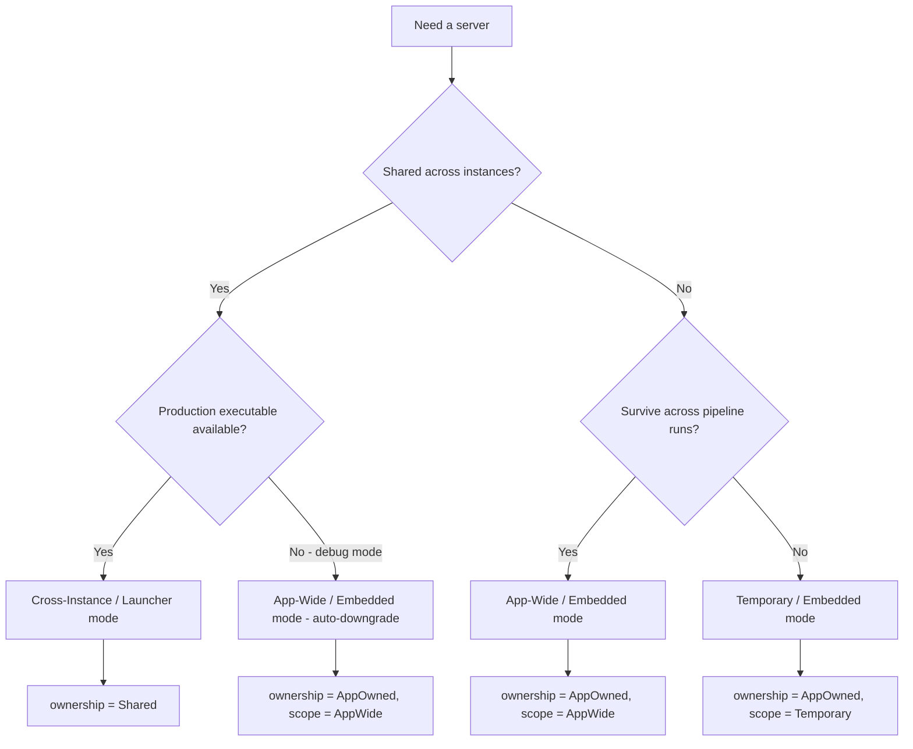
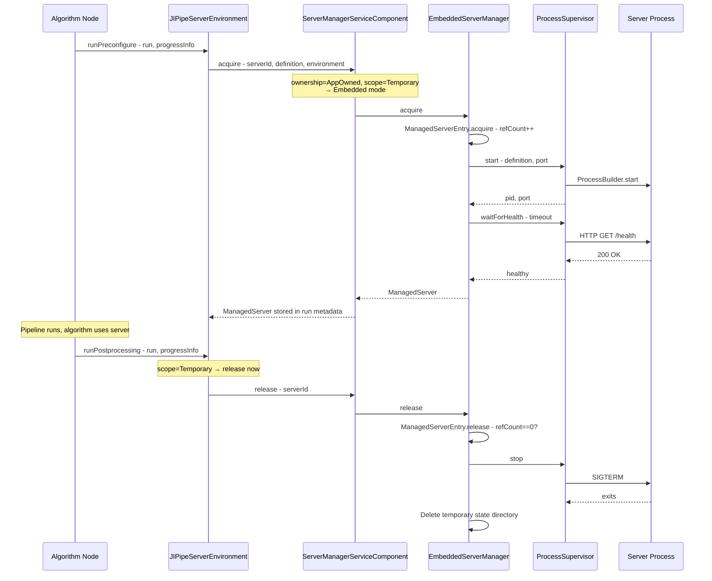
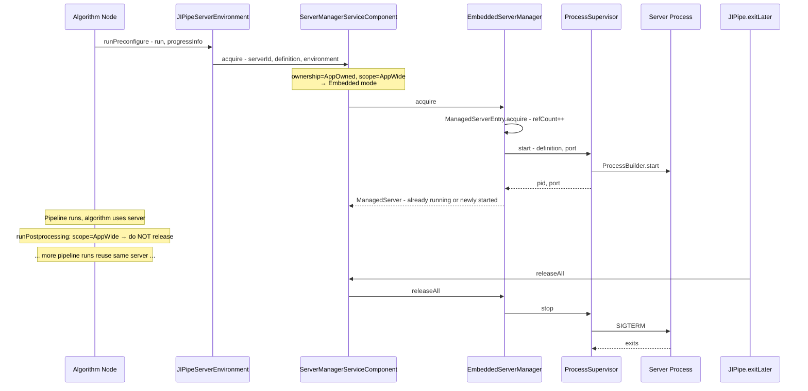
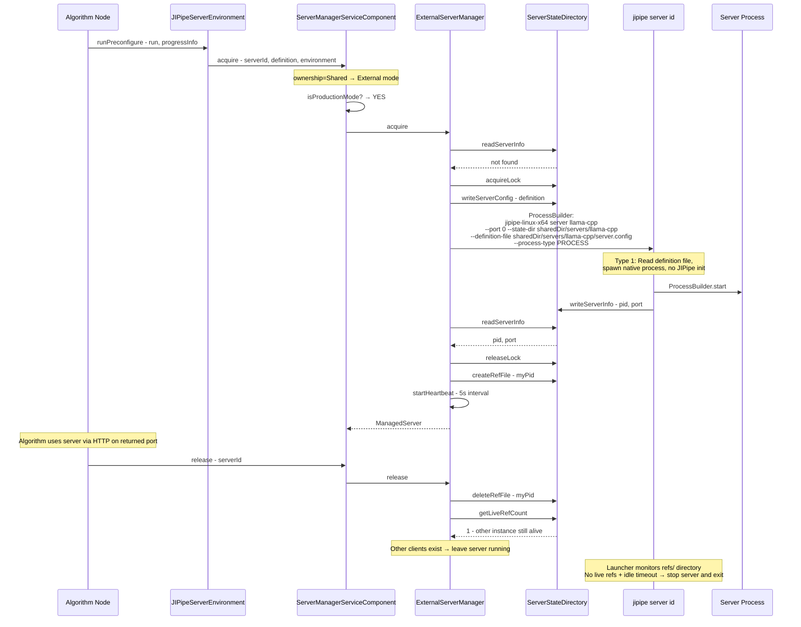
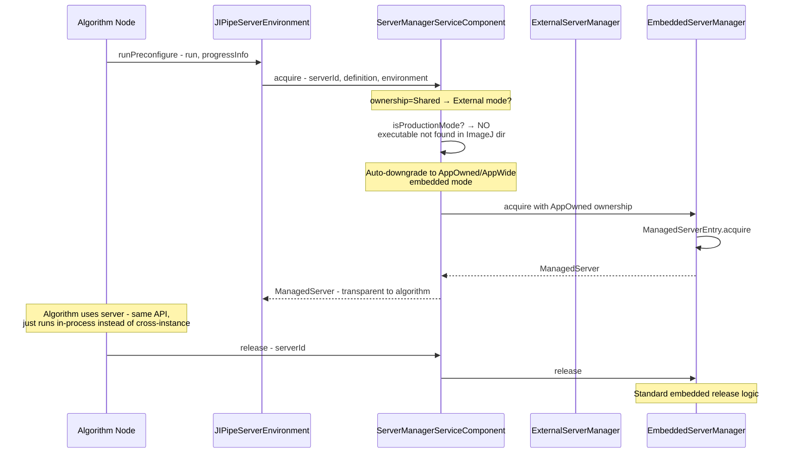
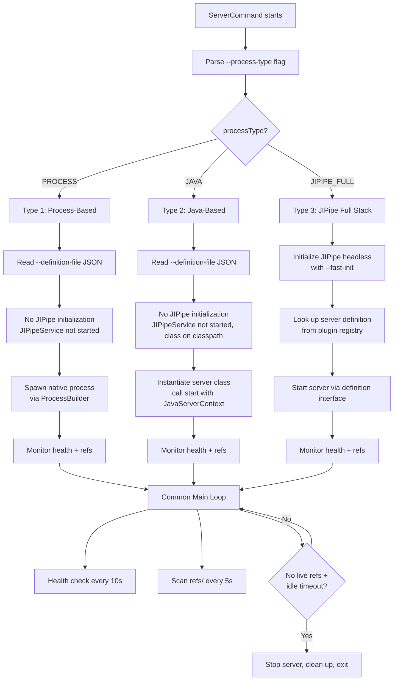
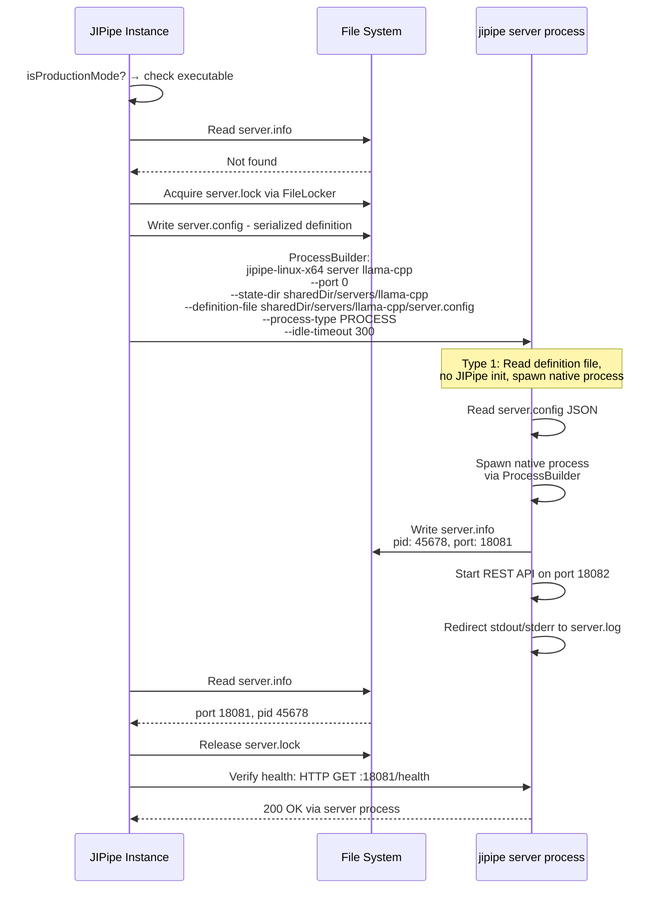
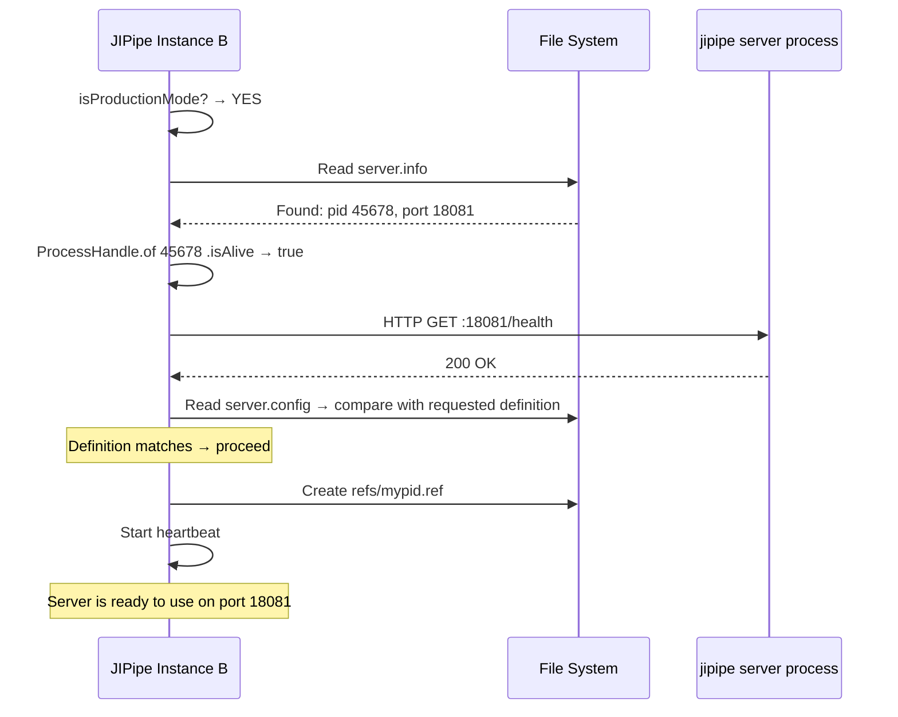
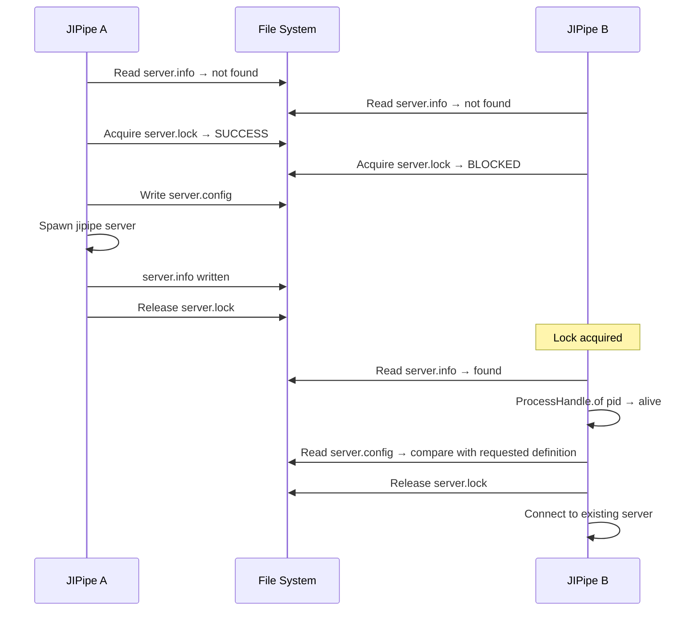
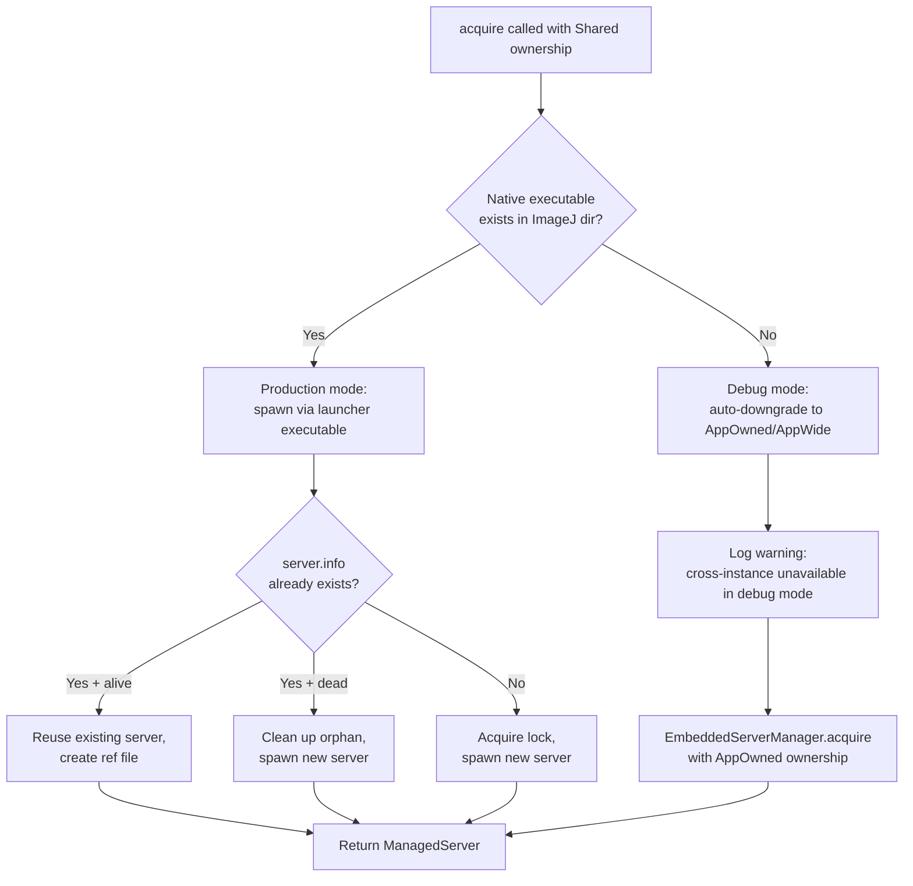

# Implementation Plan: External Server Process Management

**Date:** 2026-06-02  
**Status:** Implementation Plan (Revised)  
**Extends:** `investigation-external-server-processes.md`, `investigation-external-server-processes-addendum-daemon.md`, `investigation-external-server-processes-addendum2-instantiation.md`

---

## 1. Executive Summary

JIPipe currently lacks infrastructure for managing persistent external server processes. All external tool invocations follow a fire-and-forget pattern: spawn a process, wait for completion, read output files. This plan introduces a **server manager** that supports three types of long-running server processes:

1. **Temporary servers** — scoped to a single pipeline run (e.g., per-run IPython kernel)
2. **Application-wide servers** — scoped to a single JIPipe instance (e.g., session IPython kernel)
3. **Cross-instance servers** — shared across all JIPipe instances on the same machine (e.g., llama.cpp LLM server with GPU resources)

The architecture follows JIPipe's linear hierarchy: server management is a **core feature** with all APIs in `jipipe-core`. Plugins define concrete server types through the service component, just like they define algorithms, data types, and environments. Cross-instance servers are spawned via the **JIPipe launcher** with a new `server` CLI subcommand, leveraging the existing launcher infrastructure for classpath and JRE management.

Cross-instance servers support **three distinct process types** in the launcher: process-based (native process management), Java-based (in-JVM server without full JIPipe), and JIPipe full stack (headless JIPipe instance). The launcher's `ServerCommand` handles all three modes with different initialization requirements (all types share the same classpath since the launcher depends on `jipipe-core`; the distinction is whether `JIPipeService` is started).

A **debug vs production mode** distinction governs cross-instance server behavior: in production mode, the dedicated native executable spawns cross-instance server processes; in debug mode (running from IDE), the system auto-downgrades to application-wide embedded mode unless a production executable is available. This is transparent to algorithm nodes.

**Key value:** Enables reuse of expensive-to-start servers (LLM model loading can take 30+ seconds), eliminates Python startup overhead via persistent kernels, and provides crash-resilient coordination across multiple JIPipe instances.

---

## 2. Server Types Overview

### 2.1 Decision Matrix

| Aspect | Temporary | App-Wide | Cross-Instance |
|--------|-----------|----------|----------------|
| **Ownership** | `AppOwned` | `AppOwned` | `Shared` |
| **Process location** | In JIPipe JVM | In JIPipe JVM | Separate JVM via launcher |
| **Reference counting** | In-memory | In-memory | File-based |
| **State directory** | `UserDir` + UUID | `UserDir` + UUID | `SharedDir` |
| **Crash resilience** | Not needed | Nice-to-have | Critical |
| **Cleanup trigger** | `runPostprocess` | `exitLater`/`dispose` | File-based ref counting + PID monitoring |
| **Example** | Per-run IPython kernel | Session IPython kernel | Shared LLM server |

### 2.2 Temporary Servers

A temporary server exists for the duration of a single pipeline run. It is started during `runPreconfigure()` and released during `runPostprocessing()`. No coordination with other JIPipe instances is needed.

**When to use:**
- The server is cheap to start (sub-second)
- State must not leak between pipeline runs
- No benefit from keeping the server alive between runs

**Example:** An IPython kernel started per-pipeline-run, where each run needs a clean Python namespace.

### 2.3 Application-Wide Servers

An application-wide server exists for the lifetime of a single JIPipe instance. It is started on first use and released when the JIPipe instance exits. Other JIPipe instances cannot share it.

**When to use:**
- The server is expensive to start but only needed within one JIPipe instance
- Sharing across instances is not required or not desirable
- The server holds instance-specific state

**Example:** A session IPython kernel that persists across multiple pipeline runs within the same JIPipe window, avoiding Python startup overhead.

### 2.4 Cross-Instance Servers

A cross-instance server is shared across all JIPipe instances on the same machine. It runs as a separate process spawned via the JIPipe launcher (`jipipe server <id>`). File-based reference counting determines when to shut down.

**When to use:**
- The server is expensive to start and consumes significant resources (GPU memory, model loading time)
- Multiple JIPipe instances benefit from sharing the same server
- Crash resilience is critical — the server must survive individual JIPipe crashes

**Example:** A llama.cpp LLM server that loads a large model into GPU memory. Starting a second instance would exhaust GPU resources; sharing is essential.

### 2.5 Selection Flow



### 2.6 External Server Process Types

Cross-instance servers are spawned via the JIPipe launcher, but the launcher supports **three distinct process types** with different initialization requirements (all types have the full `jipipe-core` classpath available; the distinction is whether `JIPipeService` is initialized):

#### 2.6.1 Process-Based (Type 1)

The launcher reads the server definition to know what **native process** to manage. It does NOT initialize JIPipe at all. It only uses SciJava libraries (leaner than full JIPipe, but not as compact as pure JDK).

- **Classpath:** Full `jipipe-core` classpath available (launcher depends on `jipipe-core`)
- **Initialization:** No `JIPipeService` initialization — parse definition file, spawn native process, monitor it
- **Examples:** llama.cpp server, IPython kernel, any native executable server
- **Launcher behavior:** Read `server.config` → construct `ProcessBuilder` → start process → monitor health → manage lifecycle

This is the most common type. The launcher acts as a thin process supervisor.

#### 2.6.2 Java-Based but Not JIPipe (Type 2)

The launcher runs a **Java-based server** that doesn't need the full JIPipe stack. The server runs inside the launcher's JVM. The server class is already on the classpath — SciJava initialization ensures it in production, and the IDE ensures it in development. No additional classpath construction or artifact downloads are needed.

- **Classpath:** Full `jipipe-core` classpath available (launcher depends on `jipipe-core`)
- **Initialization:** No `JIPipeService` initialization — instantiate the Java server class by name, call `start(JavaServerContext)`
- **Examples:** DJL/ONNX Runtime inference server, a custom Java HTTP server
- **Launcher behavior:** Load server class by name from classpath → instantiate → call `start()` with context → monitor health → call `stop()` on shutdown

The server runs as a thread within the launcher JVM, avoiding the overhead of a separate process.

#### 2.6.3 JIPipe Full Stack (Type 3)

The launcher initializes a **full headless JIPipe instance**. This is a future opportunity for more complex server scenarios where the server needs access to JIPipe's plugin registry, data types, etc. Not needed for MVP but the architecture must accommodate it.

- **Classpath:** Full JIPipe classpath (core + all plugins)
- **Initialization:** Full `JIPipeService` headless init with `--fast-init`
- **Examples:** A server that exposes JIPipe data type conversion as a service, a server that runs JIPipe algorithms on demand
- **Launcher behavior:** Initialize JIPipe headless → look up server definition from plugin registry → start server → manage lifecycle

**Key implication:** The `ServerCommand` in the launcher must support all three modes. For type (1), it reads the definition, spawns the native process, and monitors it. For type (2), it instantiates the Java server class and runs it in-process. For type (3), it initializes full JIPipe headless and then runs the server. The initialization logic differs for each type (classpath is the same for all types since the launcher depends on `jipipe-core`).

---

## 3. Architecture Overview

### 3.1 Component Diagram

```mermaid
flowchart TB
    subgraph JIPipeCore [jipipe-core]
        direction TB
        API [api/servers/ - Interfaces]
        IMPL [servers/ - Implementation]
        SC [JIPipeServerManagerServiceComponent]
        ENV [JIPipeServerEnvironment]
        API --> IMPL
        SC --> IMPL
        ENV --> SC
    end

    subgraph PluginA [Plugin: AI]
        LlamaDef [LlamaCppServerDefinition]
        LlamaEnv [LlamaCppServerEnvironment]
    end

    subgraph PluginB [Plugin: Python]
        IPyDef [IPythonServerDefinition]
        IPyEnv [IPythonServerEnvironment]
    end

    PluginA -->|registers server types| SC
    PluginB -->|registers server types| SC

    subgraph Launcher [jipipe-launcher]
        SrvCmd [ServerCommand - jipipe server id]
        subgraph ProcessTypes [Three Process Types]
            PT1 [Type 1: Process-Based\nNo JIPipeService initialization]
            PT2 [Type 2: Java Server\nNo JIPipeService initialization, class on classpath]
            PT3 [Type 3: JIPipe Full Stack\nFull headless JIPipe]
        end
        SrvCmd --> ProcessTypes
    end

    Launcher -->|depends on| JIPipeCore

    subgraph EmbeddedMode [Embedded Mode - Temporary + App-Wide]
        ESM [EmbeddedServerManager]
        PS [ProcessSupervisor]
        ESM --> PS
    end

    subgraph ExternalMode [External Mode - Cross-Instance]
        EXM [ExternalServerManager]
        SSD [ServerStateDirectory]
        EXM --> SSD
        EXM -->|spawns via| SrvCmd
    end

    IMPL --> EmbeddedMode
    IMPL --> ExternalMode
```

### 3.2 Mode Selection Logic

The `JIPipeServerManagerServiceComponent` selects the mode based on the `ownership` field and the runtime environment:

| `ownership` | `scope` | Executable Available? | Mode | Implementation |
|-------------|---------|----------------------|------|----------------|
| `AppOwned` | `Temporary` | — | Embedded | `EmbeddedServerManager` — in-process |
| `AppOwned` | `AppWide` | — | Embedded | `EmbeddedServerManager` — in-process |
| `Shared` | — | Yes (production) | External | `ExternalServerManager` — via launcher |
| `Shared` | — | No (debug mode) | Embedded (auto-downgrade) | `EmbeddedServerManager` — in-process, `AppOwned`/`AppWide` |

Calling code always uses the same `acquire()` / `release()` API regardless of mode. The auto-downgrade from cross-instance to app-wide is transparent to algorithm nodes.

### 3.3 Debug vs Production Mode

The system detects whether it is running in **debug mode** (from IDE) or **production mode** (from dedicated executable) by checking for the existence of the native launcher executable in the ImageJ directory.

**Production mode executables:**
- Linux: `jipipe-linux-x64`
- Windows: `jipipe-windows-x64.exe` / `jipipe-windows-x64-console.exe` / `jipipe-windows-x64-gui.exe` (any of the three variants)
- macOS: `jipipe-macos` (universal binary supporting both Intel and Apple Silicon; hence no architecture suffix unlike Linux and Windows)

**Detection logic:**
```java
public static boolean isProductionMode() {
    Path imageJDir = JIPipe.getImageJDirectory();
    String os = System.getProperty("os.name").toLowerCase();
    if (executableName != null) {
        return Files.exists(imageJDir.resolve(executableName));
    }
    // Windows has three variants — check all of them
    if (os.contains("windows")) {
        String[] windowsVariants = {
            "jipipe-windows-x64.exe",
            "jipipe-windows-x64-console.exe",
            "jipipe-windows-x64-gui.exe"
        };
        for (String variant : windowsVariants) {
            if (Files.exists(imageJDir.resolve(variant))) return true;
        }
        return false;
    }
    String executableName = switch (os) {
        case "linux" -> "jipipe-linux-x64";
        case "mac os x" -> "jipipe-macos";
        default -> null;
    };
    if (executableName == null) return false;
    return Files.exists(imageJDir.resolve(executableName));
}
```

**Behavior for cross-instance servers:**
- **Production mode:** Spawn the server process using the dedicated executable (e.g., `jipipe-linux-x64 server llama-cpp`)
- **Debug mode:** Auto-downgrade to application-wide (embedded mode) UNLESS another instance is already running from a production application. The check is simple: verify if the necessary executable exists within the ImageJ directory. If it doesn't exist, we're in debug mode and can't spawn cross-instance servers.

**Key implication:** The `ExternalServerManager` must detect whether it's running in debug or production mode, and gracefully degrade when the executable isn't available. This should be transparent to algorithm nodes — they just call `acquire()` and get a working server, whether it's embedded or external.

### 3.4 Key Architectural Decisions

1. **Core feature, not a separate module** — All server management APIs and implementation live in `jipipe-core`, following the linear hierarchy `[contrib] → core → [plugins] → launcher`.

2. **Plugins define server types** — Just like plugins register algorithms, data types, and environments, they register server definitions via `JIPipeServerManagerServiceComponent.registerServerType()`.

3. **Launcher spawns cross-instance servers** — The `jipipe server <id>` CLI subcommand starts a server as a separate process. This leverages the existing launcher infrastructure for classpath, JRE, and ImageJ context management. No manual classpath construction or `ManifestJarBuilder` needed.

4. **File-based inter-JVM coordination** — Uses existing `FileLocker` for mutual exclusion. State directories with `refs/` for reference counting. PID monitoring via `ProcessHandle` for crash detection.

5. **The `halt()` problem** — JIPipe uses `Runtime.getRuntime().halt()` which bypasses shutdown hooks. For embedded servers, cleanup is explicitly invoked before `halt()` in `exitLater()`. For cross-instance servers, the launcher-spawned process uses `System.exit()` (not `halt()`), so its shutdown hooks always execute — the server process survives JIPipe crashes.

6. **Three process types in the launcher** — The `ServerCommand` supports process-based, Java-based, and JIPipe full stack modes. The initialization differs per type (classpath is the same for all), enabling lean resource usage for the common case (process-based) while supporting richer scenarios.

7. **Debug mode auto-downgrade** — When running from IDE (no dedicated executable), cross-instance servers automatically downgrade to app-wide embedded mode. This ensures the development experience is seamless while preserving the production cross-instance behavior.

### 3.5 Backward Compatibility

The server management system is **purely additive** and does not affect any existing functionality:

- **Existing `ProcessUtils.runProcess()`** — Unaffected. The per-invocation process pattern (spawn, wait, read output) continues to work as-is. Server-managed processes are a separate concept for long-running services.
- **Python plugin per-invocation pattern** — Coexists with the new server manager. The Python plugin's existing `runProcess()` calls are not changed. Future versions may optionally use an IPython server for persistent kernel support.
- **All new API is additive** — New interfaces, classes, and service components are added without modifying existing APIs. The `JIPipeServerManagerServiceComponent` is a new service component that doesn't replace any existing component.
- **No changes to algorithm node base classes** — Algorithm nodes opt into server usage by calling `acquire()`/`release()` explicitly. Existing algorithms are unaffected.

### 3.6 Thread Safety Model

All server manager operations are designed for concurrent access from multiple algorithm nodes and pipeline threads:

- **`acquire()`/`release()` are thread-safe** — Both `EmbeddedServerManager` and `ExternalServerManager` use internal synchronization to prevent race conditions during server startup/shutdown.
- **`JIPipeRunnableQueue` for lifecycle serialization** — Following the `JIPipeAIServiceComponent` pattern, all lifecycle operations (start, stop, restart) are serialized through a `JIPipeRunnableQueue` to prevent concurrent state mutations.
- **`ConcurrentHashMap` for registry** — The managed server registry in both managers uses `ConcurrentHashMap<String, ManagedServerEntry>` for thread-safe lookup and insertion.
- **`AtomicInteger` for reference counting** — `ManagedServerEntry.refCount` uses `AtomicInteger` for lock-free reference counting. The `acquire()` and `release()` methods are atomic.
- **File-based locking for cross-instance coordination** — `FileLocker` on `server.lock` provides mutual exclusion across JVM boundaries. The lock is held only during the start/stop sequence, not while the server runs.
- **Heartbeat scheduler is a daemon `ScheduledExecutorService`** — Does not prevent JVM shutdown. Thread-safe by design.

---

## 4. Maven Module Structure

### 4.1 No New Modules

Server management is a core feature. All code lives in existing modules:

```
jipipe-core/src/main/java/org/hkijena/jipipe/
├── api/servers/                                    # Server manager API (interfaces)
│   ├── JIPipeServerDefinition.java                # Interface: how to start a server
│   ├── JIPipeProcessServerDefinition.java          # Abstract class: external process definition
│   ├── JIPipeJavaServerDefinition.java             # Interface: in-process Java server
│   ├── JIPipeServerProcessType.java                # Enum: PROCESS, JAVA, JIPIPE_FULL
│   ├── JIPipeManagedServer.java                    # Handle to running server
│   ├── JIPipeServerHealthCheck.java                # Health check strategy interface
│   ├── JIPipeServerOwnership.java                  # Enum: AppOwned, Shared
│   ├── JIPipeServerScope.java                      # Enum: Temporary, AppWide
│   ├── JIPipeServerState.java                      # Enum: lifecycle states
│   └── JIPipeServerEvent.java                      # Lifecycle events
├── api/environments/
│   └── JIPipeServerEnvironment.java                # Server environment base class (consolidated config)
├── api/service/components/
│   └── JIPipeServerManagerServiceComponent.java    # Service component
├── servers/                                        # Server manager implementation
│   ├── EmbeddedServerManager.java                  # In-process server management
│   ├── ExternalServerManager.java                  # Cross-instance via launcher
│   ├── ManagedServerEntry.java                     # Reference-counted server entry
│   ├── ProcessSupervisor.java                      # Spawns/monitors child processes
│   ├── ServerStateDirectory.java                   # File-based state management
│   ├── JavaServerContext.java                       # Context for Java-based servers
│   ├── HttpHealthCheck.java                        # HTTP health check impl
│   └── TcpHealthCheck.java                         # TCP port probe impl
└── ...

jipipe-launcher/src/main/java/org/hkijena/jipipe/launcher/commands/
└── ServerCommand.java                              # New `jipipe server` subcommand
```

### 4.2 Dependency Flow


This follows JIPipe's existing linear hierarchy. No new Maven modules are introduced.

### 4.3 Test Location

Tests go in `jipipe-core/src/test/java/org/hkijena/jipipe/servers/` following the standard pattern. A new test scope dependency on JUnit 5 will be added to `jipipe-core/pom.xml` if not already present.

---

## 5. Phase-by-Phase Implementation Plan

### Phase 0: Launcher Performance Spike

**Goal:** Validate that the launcher can start a server process quickly enough for the three process types, and measure the initialization overhead for each.

**Deliverables:**
- Performance measurements for each process type
- Decision on whether process-based servers need a lighter launcher classpath
- Validated `--definition-file` approach for process-based servers (no JIPipe init needed)

**Tasks:**

1. Measure launcher startup time with current full classpath
2. Create a minimal launcher entry point that only loads SciJava dependencies
3. Measure startup time for the minimal entry point
4. Test `--definition-file` approach: pass server definition as JSON file, launcher reads it and spawns process without any JIPipe initialization
5. Test Java-based server instantiation without JIPipeService initialization
6. Test full JIPipe headless init with `--fast-init`
7. Document findings and update Phase 2 plan accordingly

**Acceptance Criteria:**
- Startup time measurements for all three process types
- Clear decision on initialization strategy per process type
- `--definition-file` approach validated for process-based servers

---

### Phase 1: Core API + Embedded Mode

**Goal:** Create the server manager API interfaces and implement embedded mode (temporary + app-wide servers) within `jipipe-core`.

**Deliverables:**
- All API interfaces in `org.hkijena.jipipe.api.servers`
- `JIPipeServerManagerServiceComponent` registered in `JIPipeService`
- `EmbeddedServerManager` for in-process server management
- `ManagedServerEntry` with `AtomicInteger` reference counting
- `ProcessSupervisor` for spawning and monitoring child processes
- `HttpHealthCheck` and `TcpHealthCheck` implementations
- `JIPipeServerEnvironment` base class (consolidated configuration)
- `JavaServerContext` for Java-based server initialization
- Integration with `JIPipe.exitLater()` and `JIPipeService.dispose()`
- Unit tests

**Tasks:**

1. Create `org.hkijena.jipipe.api.servers` package with all interfaces (Section 6)
2. Create `JIPipeServerDefinition` as an **interface** (not abstract class) with `getProcessType()` method
3. Create `JIPipeProcessServerDefinition` as an **abstract class** implementing `JIPipeServerDefinition`
4. Create `JIPipeJavaServerDefinition` as an **interface** extending `JIPipeServerDefinition`
5. Create `JIPipeServerProcessType` enum: `PROCESS`, `JAVA`, `JIPIPE_FULL`
6. Create `org.hkijena.jipipe.servers` package with implementation classes
7. Implement `ProcessSupervisor`:
   - Spawn process via `ProcessBuilder` with environment variables and working directory
   - Track PID via `ProcessHandle`
   - Health check polling with configurable timeout
   - Graceful shutdown via SIGTERM, force-kill via process tree termination
   - Restart on failure with configurable policy
8. Implement `HttpHealthCheck` — HTTP GET to endpoint, expect status code
9. Implement `TcpHealthCheck` — connect to port, expect success
10. Implement `JIPipeProcessServerDefinition` — command line, env vars, working dir, port argument placeholder
11. Implement `JIPipeJavaServerDefinition` — in-process Java server start/stop
12. Implement `JavaServerContext`:
    - Fields: `port`, `stateDirectory`, `definition`
    - Passed to `JIPipeJavaServerDefinition.start()`
13. Implement `ManagedServerEntry`:
    - `AtomicInteger refCount` for thread-safe reference counting
    - `JIPipeManagedServer server` handle
    - `void acquire()` — increment ref count
    - `boolean release()` — decrement, return true if count reaches zero
14. Implement `EmbeddedServerManager`:
    - `acquire()` — spawn process, wait for health check, return `JIPipeManagedServer`
    - `release()` — decrement ref count, stop process if no other references
    - `status()` — check process alive + health check
    - Track managed servers by ID in a `ConcurrentHashMap<String, ManagedServerEntry>`
15. Create `JIPipeServerManagerServiceComponent`:
    - Extends `JIPipeServiceComponent`
    - Holds `EmbeddedServerManager` (and later `ExternalServerManager`)
    - `registerServerType()` — plugins call this to register server definitions
    - `acquire(serverId, environment)` — delegates to correct manager based on ownership
    - `release(serverId)` — releases reference
    - `releaseAll()` — releases all servers for this JIPipe instance
    - Uses `JIPipeRunnableQueue` for serialized lifecycle operations (following `JIPipeAIServiceComponent` pattern)
16. Register `JIPipeServerManagerServiceComponent` in `JIPipeService` constructor:
    - Add field: `private final JIPipeServerManagerServiceComponent serverManager;`
    - Add to `components` array
    - Add getter `getServerManager()`
17. Create `JIPipeServerEnvironment` extending `JIPipeArtifactEnvironment`:
    - Consolidated configuration (no separate `JIPipeServerConfiguration` class)
    - Fields: `ownership` (default `AppOwned`), `scope`, `port`, `startupTimeoutMs`, `idleTimeoutMs`, `autoStart`, `restartPolicy`
    - Abstract method `toServerDefinition()` — converts to `JIPipeServerDefinition`
    - Abstract method `getServerId()` — unique server type identifier
    - Override `runPreconfigure()` — auto-starts server if `autoStart = true`
    - Override `runPostprocessing()` — releases temporary servers, deletes temporary state directory
18. Create `JIPipeServerOwnership` enum: `AppOwned`, `Shared`
19. Create `JIPipeServerScope` enum: `Temporary`, `AppWide`
20. Modify `JIPipe.exitLater()`:
    - Add `instance.getServerManager().releaseAll()` before `dispose()` and `halt()`
21. Modify `JIPipeService.dispose()`:
    - Add `getServerManager().releaseAll()` before plugin disposal
22. Modify `JIPipeDesktopProjectWindow.dispose()`:
    - Add server cleanup for Fiji mode
23. Add `NetworkUtils.findFreePort()` utility
24. Implement `JIPipeServerEvent` dispatching via listener pattern in `JIPipeServerManagerServiceComponent`
25. Create exception classes: `ServerAcquireException`, `ServerConfigurationException`, `ServerReleaseException` with `Cause` enum
26. Write unit tests:
    - Start/stop a simple HTTP server (use JDK `HttpServer` as test server)
    - Health check timeout behavior
    - Process crash detection
    - Multiple acquire/release cycles
    - `ManagedServerEntry` reference counting under concurrent access

**Acceptance Criteria:**
- `EmbeddedServerManager` can start, health-check, and stop an external process
- `JIPipeServerManagerServiceComponent` is created and registered during JIPipe startup
- `releaseAll()` is called before `halt()` in all exit paths
- Server environments resolve through the existing environment configurator chain
- `ManagedServerEntry` reference counting is thread-safe
- Unit tests pass

---

### Phase 2: External Mode (Cross-Instance Servers)

**Goal:** Implement cross-instance server management using the JIPipe launcher and file-based coordination, supporting all three process types and debug/production mode detection.

**Deliverables:**
- `ExternalServerManager` for cross-instance server lifecycle
- `ServerStateDirectory` for file-based state and reference counting
- `ServerCommand` launcher subcommand (`jipipe server <id>`) supporting three process types
- Debug/production mode detection with auto-downgrade
- File-based reference counting with PID monitoring
- Crash detection and orphan cleanup
- Minimal REST API in `ServerCommand`
- Server definition serialization format
- Server process output handling (log rotation)
- Integration tests

**Tasks:**

1. Implement `ServerStateDirectory`:
   - Manage `<JIPipeSharedDir>/servers/<id>/` directory structure:
     ```
     <JIPipeSharedDir>/servers/<id>/
     ├── server.lock      # FileLocker for mutual exclusion
     ├── server.info      # JSON: {pid, port, startedAt, serverId}
     ├── server.config    # Serialized server definition for mismatch detection
     └── refs/            # One file per consuming JVM
         ├── 12345.ref    # JSON: {pid, lastHeartbeat}
         └── 67890.ref
     ```
   - Read/write `server.info` (JSON: pid, port, startedAt, serverId)
   - Read/write `server.config` (serialized server definition for mismatch detection)
   - Create/delete ref files
   - Scan `refs/` for live consumers via `ProcessHandle`
   - Orphan detection: verify PID alive + port reachable
2. Implement debug/production mode detection:
   - Add `JIPipeServerManagerServiceComponent.isProductionMode()` method
   - Check for native executable in ImageJ directory
   - Log mode detection result at startup
3. Implement `ExternalServerManager`:
   - `acquire()`:
     1. Check production mode — if debug mode, auto-downgrade to `EmbeddedServerManager.acquire()` with `AppOwned`/`AppWide`
     2. Read `server.info` — check if server already running
     3. Validate: check PID via `ProcessHandle.of(pid).isAlive()` AND probe port
     4. If orphaned — kill orphaned process, clean up state directory
     5. If not running — acquire `server.lock`, spawn via launcher, wait for health check, write `server.info`, release lock
     6. Register as consumer — create `refs/<mypid>.ref` with timestamp
     7. Start heartbeat — periodically update `refs/<mypid>.ref` timestamp
   - `release()`:
     1. Delete `refs/<mypid>.ref`
     2. Scan `refs/` — check each PID via `ProcessHandle`
     3. If no live consumers — send SIGTERM to server process
     4. If other consumers exist — leave running
   - `status()` — read `server.info`, verify PID and port
4. Implement `ServerCommand` in `jipipe-launcher` with three process type modes:
   - New subcommand: `jipipe server <id>`
   - Parse arguments: `--port`, `--state-dir`, `--idle-timeout`, `--definition-file`, `--process-type`
   - **Process-based mode (Type 1):**
     - Read server definition from `--definition-file` (JSON)
     - No JIPipe initialization — `JIPipeService` not started
     - Spawn native process via `ProcessBuilder`
     - Monitor health and lifecycle
   - **Java-based mode (Type 2):**
     - Read server definition from `--definition-file` (JSON)
     - No JIPipe initialization — `JIPipeService` not started; server class is on classpath
     - Instantiate Java server class, call `start(JavaServerContext)`
     - Monitor health and lifecycle
   - **JIPipe full stack mode (Type 3):**
     - Initialize JIPipe in headless mode with `--fast-init`
     - Look up server definition by ID from `JIPipeServerManagerServiceComponent`
     - Start the server via definition interface
     - Monitor health and lifecycle
   - Write `server.info` and `server.config` to state directory
   - Enter main loop:
     - Periodic health checks
     - Periodic ref count scanning (check `refs/` directory)
     - If no live consumers + idle timeout expired → stop server and exit
   - Register shutdown hook (uses `System.exit()`, NOT `halt()`)
   - Handle SIGTERM for graceful shutdown
5. Implement minimal REST API in `ServerCommand`:
   - `GET /api/v1/health` — process alive?
   - `GET /api/v1/server/status` — PID, port, ref count, uptime
   - `POST /api/v1/server/restart` — restart managed server
   - Bind to `127.0.0.1` on the server port + 1 (or a dedicated management port)
6. Implement server process output handling:
   - stdout/stderr → `<stateDir>/server.log`
   - Log rotation: max 10 MB per file, max 3 files
   - Use `ProcessBuilder.redirectOutput()` with custom stream handler
7. Implement server definition serialization:
   - JSON format for `--definition-file` and `server.config` (see Section 6.7)
   - Jackson-based serialization/deserialization
   - Mismatch detection: compare `server.config` with requested definition on acquire
8. Integrate `ExternalServerManager` into `JIPipeServerManagerServiceComponent`:
   - Mode selection: `AppOwned` → `EmbeddedServerManager`, `Shared` + production → `ExternalServerManager`, `Shared` + debug → auto-downgrade to `EmbeddedServerManager`
   - `acquire()` delegates based on ownership and mode
9. Add `JIPipeLauncher.main()` routing for `server` subcommand:
   - Add `else if (argsList.contains("server"))` branch
   - Call `ServerCommand.doStartServer(argsList)`
10. Implement heartbeat mechanism:
    - `ScheduledExecutorService` daemon thread updates `refs/<pid>.ref` every 5 seconds
    - Ref file contains JSON: `{"pid": 12345, "lastHeartbeat": "2026-06-01T10:30:00Z"}`
11. Implement orphan cleanup:
    - On every `acquire()` call, verify existing `server.info` PID and port
    - On JIPipe startup (`JIPipeServerManagerServiceComponent.postprocess()`), scan for orphaned servers
12. Implement temporary server state directory cleanup:
    - Delete state dir in `runPostprocessing()` for temporary servers
    - Stale dir cleanup on startup via PID scan
13. Write integration tests:
    - Start server via launcher, acquire, release, verify shutdown
    - Two simulated clients, one crashes, other continues
    - Orphan detection and cleanup
    - Concurrent acquire (two threads, same server ID)
    - Debug mode auto-downgrade behavior
    - Server definition mismatch detection
    - REST API endpoints

**Acceptance Criteria:**
- Cross-instance servers start via `jipipe server <id>` command
- All three process types work correctly in the launcher
- File-based reference counting works correctly
- Server survives JIPipe crash (detected via PID monitoring)
- Orphaned servers are detected and cleaned up
- Idle timeout shuts down server when no consumers remain
- Debug mode auto-downgrades to embedded mode transparently
- REST API endpoints respond correctly
- Server logs are written with rotation

---

### Phase 3: JIPipe Integration

**Goal:** Deep integration with JIPipe's environment system, algorithm nodes, and lifecycle management.

**Deliverables:**
- Full `JIPipeServerEnvironment` integration with environment configurator chain
- Environment pre/post hooks for automatic server lifecycle
- Algorithm node pattern for using servers
- Daemon state directory initialization
- Fiji mode cleanup

**Tasks:**

1. Complete `JIPipeServerEnvironment` integration:
   - Register as environment type via `JIPipeEnvironmentsServiceComponent.registerEnvironment()`
   - Support environment resolution chain: Node override → Project override → Application setting → Fallback
   - Implement `runPreconfigure()`: auto-start server, store `JIPipeManagedServer` in run metadata
   - Implement `runPostprocessing()`: release temporary servers, delete temporary state directories
2. Create environment configurator support for server environments:
   - `JIPipeEnvironmentConfigurator` already handles the resolution chain
   - Server environments just plug into the existing system
3. Create algorithm node usage pattern:
   ```java
   public class LlamaCppInferenceAlgorithm extends JIPipeIteratingAlgorithm {
       @Override
       protected void runIteration(JIPipeDataBatch dataBatch, JIPipeProgressInfo progressInfo) {
           LlamaCppServerEnvironment env = getEnvironmentOrDefault(LlamaCppServerEnvironment.class);
           JIPipeManagedServer server = JIPipe.getInstance().getServerManager()
               .acquire(env.getServerId(), env.toServerDefinition(), env);
           try {
               int port = server.getPort();
               // Make HTTP request to localhost:port
           } finally {
               JIPipe.getInstance().getServerManager().release(env.getServerId());
           }
       }
   }
   ```
4. Add server state directory initialization in `JIPipeServerManagerServiceComponent.postprocess()`:
   - Create `<JIPipeSharedDir>/servers/` if not exists
   - Scan for orphaned servers from previous crashes
   - Clean up stale temporary server state directories via PID scan
5. Complete Fiji mode integration:
   - `JIPipeDesktopProjectWindow.dispose()` calls `releaseAll()`
   - Server manager is lifecycle-aware
6. Add `JIPipeServerEnvironment` registration in plugin `register()` methods:
   - Follow the pattern from `ArtifactsPlugin` and other plugins
   - `registerEnvironment("llama-cpp-server", ...)` with icon, description, etc.
7. Write integration tests:
   - Full lifecycle: environment resolution → server acquire → use → release
   - Cleanup on exit in all modes
   - Debug mode auto-downgrade with environment resolution

**Acceptance Criteria:**
- Server environments resolve through the existing environment configurator chain
- `runPreconfigure()` auto-starts servers before pipeline execution
- `runPostprocessing()` releases temporary servers and cleans up state directories after pipeline execution
- Fiji mode cleanup works via `dispose()` without `halt()`
- Algorithm nodes can acquire and use servers during pipeline execution

---

### Phase 4: Concrete Server Implementations

**Goal:** Implement specific server types as plugin contributions.

**Deliverables:**
- `LlamaCppServerDefinition` and `LlamaCppServerEnvironment`
- `IPythonServerDefinition` and `IPythonServerEnvironment`
- `GenericServerDefinition` and `GenericServerEnvironment`
- Algorithm nodes that use these environments

**Tasks:**

1. Implement `LlamaCppServerDefinition`:
   - `JIPipeProcessServerDefinition` subclass
   - `getProcessType()` returns `JIPipeServerProcessType.PROCESS`
   - Command line: `llama-server -m <model> --port <port> -ngl <layers> -c <context>`
   - Health check: `GET /health` → 200
   - Fields: `executablePath`, `modelPath`, `gpuLayers`, `contextSize`
2. Implement `LlamaCppServerEnvironment`:
   - `JIPipeServerEnvironment` subclass
   - `ownership = AppOwned` (default, configurable to `Shared`)
   - `toServerDefinition()` returns configured `LlamaCppServerDefinition`
   - Artifact integration: download llama.cpp binary as JIPipe artifact
3. Implement `IPythonServerDefinition`:
   - `JIPipeProcessServerDefinition` subclass
   - `getProcessType()` returns `JIPipeServerProcessType.PROCESS`
   - Command line: `python -m IPython kernel --json`
   - Health check: kernel info request
   - Integration with existing `PythonEnvironment`
4. Implement `IPythonServerEnvironment`:
   - `JIPipeServerEnvironment` subclass
   - `ownership = AppOwned`, `scope = AppWide` (default, configurable to Temporary)
5. Implement `GenericServerDefinition` and `GenericServerEnvironment`:
   - `GenericServerDefinition` implements `JIPipeServerDefinition` directly (not extends `JIPipeProcessServerDefinition`), holding a `JIPipeServerProcessType` field and delegating internally to either a `JIPipeProcessServerDefinition` or `JIPipeJavaServerDefinition` based on the configured type
   - Fully configurable: executable path, arguments, port argument pattern, health check URL
   - `getProcessType()` returns configured type (default `PROCESS`)
   - **MVP note:** For the initial implementation, `GenericServerDefinition` only supports `PROCESS` type; `JAVA` and `JIPIPE_FULL` support is deferred to a later phase
   - For users who want to manage custom server processes
6. Create algorithm nodes:
   - `LlamaCppInferenceAlgorithm` — uses `LlamaCppServerEnvironment`
   - `IPythonExecuteAlgorithm` — uses `IPythonServerEnvironment`
7. Register environments and nodes in the respective plugin `register()` methods
8. Write per-plugin tests

**Acceptance Criteria:**
- llama.cpp server starts, responds to health check, and shuts down correctly
- IPython kernel starts, accepts commands, and shuts down correctly
- Generic server can be configured via UI and works with any HTTP-speaking process
- Algorithm nodes can acquire and use servers during pipeline execution

---

### Phase 5: UI and Polish

**Goal:** Add desktop UI for server monitoring and management.

**Deliverables:**
- Server status panel in JIPipe desktop
- Server management in application settings
- Progress indicator during server startup
- Documentation

**Tasks:**

1. Create `JIPipeDesktopServerStatusPanel`:
   - Shows list of active servers (temporary, app-wide, cross-instance)
   - For each server: name, type, process type, status, port, PID, client count, uptime
   - Actions: start, stop, restart
   - Auto-refresh via periodic polling
   - Show debug/production mode indicator
2. Create server environment editor in application settings:
   - Configure server definitions (executable, arguments, health check)
   - Set ownership and scope
   - Set timeouts
   - Set process type
3. Add progress indicator during server startup:
   - Show in algorithm node progress bar
   - Show in splash screen for auto-start servers
4. Add server status to the JIPipe system information dialog
5. Write user documentation:
   - How to configure server environments
   - How to use the server status panel
   - Debug vs production mode explanation
   - Troubleshooting guide (server not starting, port conflicts, debug mode limitations, etc.)

**Acceptance Criteria:**
- Server status panel shows all active servers with correct state
- Users can start/stop/restart servers from the UI
- Progress indicator provides feedback during server startup
- Debug/production mode is clearly indicated in the UI

---

## 6. Detailed Class/Interface Specifications

### 6.1 API — `org.hkijena.jipipe.api.servers`

#### `JIPipeServerDefinition` (Interface)

Defines how to start a server. Refactored from abstract class to interface to support both process-based and Java-based server definitions cleanly.

```java
package org.hkijena.jipipe.api.servers;

public interface JIPipeServerDefinition {
    JIPipeServerHealthCheck getHealthCheck();
    long getStartupTimeoutMs();
    String getServerId();
    JIPipeServerProcessType getProcessType();
}
```

**Package:** `org.hkijena.jipipe.api.servers`  
**Responsibilities:** Define the contract for server definitions. All server definitions must specify their process type.  
**Dependencies:** None beyond JDK.

#### `JIPipeProcessServerDefinition` (Abstract Class)

Abstract class for process-based server definitions. Implements `JIPipeServerDefinition` and adds process-specific methods.

```java
package org.hkijena.jipipe.api.servers;

public abstract class JIPipeProcessServerDefinition implements JIPipeServerDefinition {
    private JIPipeServerHealthCheck healthCheck;
    private long startupTimeoutMs = 30000;
    private String portArgumentPlaceholder = "{port}";

    @Override
    public JIPipeServerProcessType getProcessType() {
        return JIPipeServerProcessType.PROCESS;
    }

    @Override
    public JIPipeServerHealthCheck getHealthCheck() { return healthCheck; }
    @Override
    public long getStartupTimeoutMs() { return startupTimeoutMs; }

    public abstract List<String> getCommandLine(int port);
    public abstract Map<String, String> getEnvironmentVariables();
    public abstract Path getWorkingDirectory();

    public String getPortArgumentPlaceholder() { return portArgumentPlaceholder; }
}
```

**Package:** `org.hkijena.jipipe.api.servers`  
**Responsibilities:** Define how to construct the command line for spawning a server process.  
**Dependencies:** `JIPipeServerDefinition`.

#### `JIPipeJavaServerDefinition` (Interface)

Interface for Java-based server definitions. Extends `JIPipeServerDefinition` with in-process start/stop methods.

```java
package org.hkijena.jipipe.api.servers;

public interface JIPipeJavaServerDefinition extends JIPipeServerDefinition {
    void start(JavaServerContext context) throws Exception;
    void stop() throws Exception;
    boolean isHealthy();

    @Override
    default JIPipeServerProcessType getProcessType() {
        return JIPipeServerProcessType.JAVA;
    }
}
```

**Package:** `org.hkijena.jipipe.api.servers`  
**Responsibilities:** Start/stop a Java-based service in-process.  
**Dependencies:** `JIPipeServerDefinition`, `JavaServerContext`.

#### `JIPipeServerProcessType`

Enum identifying the three process types for the launcher.

```java
package org.hkijena.jipipe.api.servers;

public enum JIPipeServerProcessType {
    PROCESS,       // Type 1: Native process management (no JIPipeService initialization)
    JAVA,          // Type 2: Java server in launcher JVM (no JIPipeService initialization, class on classpath)
    JIPIPE_FULL    // Type 3: Full headless JIPipe instance (reserved for future use; no corresponding definition interface in current implementation — a JIPipeFullStackServerDefinition interface may be added when needed)
}
```

**Package:** `org.hkijena.jipipe.api.servers`
**Responsibilities:** Identify the process type for launcher initialization.
**Dependencies:** None.

#### `JIPipeManagedServer`

A handle to a running server instance. Returned by `acquire()`.

```java
package org.hkijena.jipipe.api.servers;

public interface JIPipeManagedServer {
    String getServerId();
    JIPipeServerState getState();
    int getPort();
    long getPid();
    JIPipeServerDefinition getDefinition();
    Instant getStartedAt();
    boolean isHealthy();
    void restart();
}
```

**Package:** `org.hkijena.jipipe.api.servers`  
**Responsibilities:** Provide server metadata and lifecycle operations.  
**Dependencies:** None.

#### `JIPipeServerHealthCheck`

Strategy interface for verifying a server is alive.

```java
package org.hkijena.jipipe.api.servers;

public interface JIPipeServerHealthCheck {
    boolean isHealthy(String host, int port, long timeoutMs);
    String getDescription();
}
```

**Package:** `org.hkijena.jipipe.api.servers`  
**Responsibilities:** Verify server liveness via HTTP, TCP, or custom protocol.  
**Dependencies:** None.

#### `JIPipeServerOwnership`

```java
package org.hkijena.jipipe.api.servers;

public enum JIPipeServerOwnership {
    AppOwned,  // Embedded mode (default)
    Shared     // External mode via launcher
}
```

#### `JIPipeServerScope`

```java
package org.hkijena.jipipe.api.servers;

public enum JIPipeServerScope {
    Temporary,  // Released in runPostprocessing()
    AppWide     // Released in exitLater()/dispose()
}
```

#### `JIPipeServerState`

```java
package org.hkijena.jipipe.api.servers;

public enum JIPipeServerState {
    NotRunning, Starting, Running, Stopping, Failed
}
```

#### `JIPipeServerEvent`

Lifecycle event dispatched by the server manager.

```java
package org.hkijena.jipipe.api.servers;

public class JIPipeServerEvent {
    public enum Type {
        SERVER_STARTING, SERVER_RUNNING, SERVER_STOPPING,
        SERVER_STOPPED, SERVER_FAILED, HEALTH_DEGRADED,
        HEALTH_RECOVERED, CLIENT_CONNECTED, CLIENT_DISCONNECTED
    }
    private final Type type;
    private final String serverId;
    private final Instant timestamp;
    private final String message;
}
```

### 6.2 Implementation — `org.hkijena.jipipe.servers`

#### `ManagedServerEntry`

Reference-counted entry for a managed server. Used by both `EmbeddedServerManager` and `ExternalServerManager`.

```java
package org.hkijena.jipipe.servers;

public class ManagedServerEntry {
    private final AtomicInteger refCount = new AtomicInteger(0);
    private final JIPipeManagedServer server;

    public ManagedServerEntry(JIPipeManagedServer server) {
        this.server = server;
    }

    public void acquire() {
        refCount.incrementAndGet();
    }

    public boolean release() {
        return refCount.decrementAndGet() == 0;
    }

    public int getRefCount() {
        return refCount.get();
    }

    public JIPipeManagedServer getServer() {
        return server;
    }
}
```

**Package:** `org.hkijena.jipipe.servers`  
**Responsibilities:** Thread-safe reference counting for managed servers.  
**Dependencies:** `JIPipeManagedServer`, `AtomicInteger`.

#### `JavaServerContext`

Context object passed to `JIPipeJavaServerDefinition.start()` providing the server's runtime environment.

```java
package org.hkijena.jipipe.servers;

public class JavaServerContext {
    private final int port;
    private final Path stateDirectory;
    private final JIPipeServerDefinition definition;

    public JavaServerContext(int port, Path stateDirectory, JIPipeServerDefinition definition) {
        this.port = port;
        this.stateDirectory = stateDirectory;
        this.definition = definition;
    }

    public int getPort() { return port; }
    public Path getStateDirectory() { return stateDirectory; }
    public JIPipeServerDefinition getDefinition() { return definition; }
}
```

**Package:** `org.hkijena.jipipe.servers`  
**Responsibilities:** Provide runtime context to Java-based servers during initialization.  
**Dependencies:** `JIPipeServerDefinition`.

#### `EmbeddedServerManager`

In-process server manager for temporary and app-wide servers.

```java
package org.hkijena.jipipe.servers;

public class EmbeddedServerManager {
    private final Map<String, ManagedServerEntry> servers = new ConcurrentHashMap<>();
    private final ScheduledExecutorService healthChecker;

    public JIPipeManagedServer acquire(String serverId, JIPipeServerDefinition definition,
                                        JIPipeServerEnvironment environment);
    public void release(String serverId);
    public void releaseAll();
    public JIPipeServerState status(String serverId);
    public List<String> getManagedServerIds();
}
```

**Package:** `org.hkijena.jipipe.servers`  
**Responsibilities:** Manage servers within the JIPipe JVM. No inter-JVM coordination needed.  
**Dependencies:** `ProcessSupervisor`, `JIPipeServerDefinition` (API), `ManagedServerEntry`.

#### `ExternalServerManager`

Cross-instance server manager using the launcher and file-based coordination.

```java
package org.hkijena.jipipe.servers;

public class ExternalServerManager {
    private final Map<String, ManagedServerEntry> servers = new ConcurrentHashMap<>();
    private final ScheduledExecutorService heartbeatScheduler;

    public JIPipeManagedServer acquire(String serverId, JIPipeServerDefinition definition,
                                        JIPipeServerEnvironment environment);
    public void release(String serverId);
    public void releaseAll();
    public JIPipeServerState status(String serverId);

    private void spawnServerProcess(String serverId, JIPipeServerDefinition definition,
                                     JIPipeServerEnvironment environment);
    private void startHeartbeat(String serverId);
    private void stopHeartbeat(String serverId);
}
```

**Package:** `org.hkijena.jipipe.servers`  
**Responsibilities:** Manage cross-instance servers via launcher and file-based coordination. Handles debug/production mode detection and auto-downgrade.  
**Dependencies:** `ServerStateDirectory`, JDK `ProcessBuilder` (to spawn launcher), `ManagedServerEntry`.

#### `ProcessSupervisor`

Manages a single server process lifecycle.

```java
package org.hkijena.jipipe.servers;

public class ProcessSupervisor {
    private Process process;
    private long pid;
    private JIPipeServerState state;
    private final JIPipeServerHealthCheck healthCheck;

    public void start(JIPipeProcessServerDefinition definition, int port);
    public void stop();    // SIGTERM
    public void forceKill(); // kill process tree
    public boolean isAlive();
    public boolean isHealthy();
    public JIPipeServerState getState();
    public int getPort();
    public long getPid();
}
```

**Package:** `org.hkijena.jipipe.servers`  
**Responsibilities:** Spawn, monitor, and terminate a single server process.  
**Dependencies:** `JIPipeProcessServerDefinition`, `JIPipeServerHealthCheck`.

#### `ServerStateDirectory`

Manages the file-based state directory for cross-instance coordination.

```java
package org.hkijena.jipipe.servers;

public class ServerStateDirectory {
    private final Path baseDir; // <JIPipeSharedDir>/servers/<id>/

    public void writeServerInfo(long pid, int port, String serverId);
    public ServerInfo readServerInfo();
    public void deleteServerInfo();

    public void writeServerConfig(JIPipeServerDefinition definition);
    public JIPipeServerDefinition readServerConfig();

    public void createRefFile(long clientPid);
    public void deleteRefFile(long clientPid);
    public void updateRefHeartbeat(long clientPid);
    public int getLiveRefCount();
    public List<Long> getLiveClientPids();

    public void acquireLock();
    public void releaseLock();

    public boolean isServerProcessAlive();
    public boolean isServerPortReachable();

    public static void cleanupOrphanedServers(Path sharedDir);
    public static void cleanupStaleTempDirectories(Path userDir);
}
```

**Package:** `org.hkijena.jipipe.servers`  
**Responsibilities:** Read/write state files, detect orphans, manage reference counting, serialize/deserialize server config for mismatch detection.  
**Dependencies:** `FileLocker`, Jackson.

#### `HttpHealthCheck`

```java
package org.hkijena.jipipe.servers;

public class HttpHealthCheck implements JIPipeServerHealthCheck {
    private final String path;
    private final int expectedStatus;

    public static HttpHealthCheck of(String path, int expectedStatus);

    @Override
    public boolean isHealthy(String host, int port, long timeoutMs);
}
```

#### `TcpHealthCheck`

```java
package org.hkijena.jipipe.servers;

public class TcpHealthCheck implements JIPipeServerHealthCheck {
    @Override
    public boolean isHealthy(String host, int port, long timeoutMs);
}
```

### 6.3 Service Component — `org.hkijena.jipipe.api.service.components`

#### `JIPipeServerManagerServiceComponent`

```java
package org.hkijena.jipipe.api.service.components;

public class JIPipeServerManagerServiceComponent extends JIPipeServiceComponent {
    private final EmbeddedServerManager embeddedManager;
    private final ExternalServerManager externalManager;
    private final ConcurrentHashMap<String, JIPipeServerDefinition> registeredDefinitions = new ConcurrentHashMap<>();

    public void registerServerType(String id, JIPipeServerDefinition definition);
    public JIPipeServerDefinition getServerDefinition(String id);

    public JIPipeManagedServer acquire(String serverId, JIPipeServerDefinition definition,
                                        JIPipeServerEnvironment environment);
    public void release(String serverId);
    public void releaseAll();

    public JIPipeServerState status(String serverId);
    public List<String> getActiveServerIds();

    public boolean isProductionMode();

    @Override
    public void postprocess(JIPipeProgressInfo progressInfo);
    // - Scan for orphaned cross-instance servers
    // - Initialize state directories
    // - Clean up stale temporary server state directories
}
```

**Package:** `org.hkijena.jipipe.api.service.components`  
**Responsibilities:** Central server lifecycle management within JIPipe. Mode selection (embedded/external/debug-downgrade). Plugin registry for server types.  
**Dependencies:** `EmbeddedServerManager`, `ExternalServerManager`, `JIPipeServiceComponent`.

### 6.4 Environment — `org.hkijena.jipipe.api.environments`

#### `JIPipeServerEnvironment`

Server environment with consolidated configuration (no separate `JIPipeServerConfiguration` class). All configuration fields that were previously in `JIPipeServerConfiguration` are now directly in `JIPipeServerEnvironment`.

```java
package org.hkijena.jipipe.api.environments;

public abstract class JIPipeServerEnvironment extends JIPipeArtifactEnvironment {
    // Consolidated configuration (previously in JIPipeServerConfiguration)
    private JIPipeServerOwnership ownership = JIPipeServerOwnership.AppOwned;  // Default: AppOwned (safer)
    private JIPipeServerScope scope = JIPipeServerScope.AppWide;
    private int port = 0; // 0 = auto
    private long startupTimeoutMs = 30000;
    private long idleTimeoutMs = 300000; // 5 minutes
    private boolean autoStart = false;
    private RestartPolicy restartPolicy = RestartPolicy.ON_FAILURE;

    public enum RestartPolicy { ON_FAILURE, ALWAYS, NEVER }

    public abstract JIPipeServerDefinition toServerDefinition();
    public abstract String getServerId();

    @Override
    public void runPreconfigure(JIPipeGraphRun run, JIPipeProgressInfo progressInfo);
    @Override
    public void runPostprocessing(JIPipeGraphRun run, JIPipeProgressInfo progressInfo);
}
```

**Package:** `org.hkijena.jipipe.api.environments`  
**Responsibilities:** Bridge between JIPipe's environment system and the server manager. Consolidates all server configuration (ownership, scope, timeouts, restart policy) that was previously in a separate `JIPipeServerConfiguration` class.  
**Dependencies:** `JIPipeArtifactEnvironment`, `org.hkijena.jipipe.api.servers.*`.

**Design note:** The default ownership is `AppOwned` (safer default). Servers must explicitly opt into `Shared` ownership, which requires cross-instance coordination. This prevents accidental resource sharing and ensures that developers consciously choose to share servers.

### 6.5 Launcher — `org.hkijena.jipipe.launcher.commands`

#### `ServerCommand`

```java
package org.hkijena.jipipe.launcher.commands;

public class ServerCommand {
    public static void doStartServer(List<String> argsList);
    // - Parse --id, --port, --state-dir, --idle-timeout, --definition-file, --process-type
    //
    // Process-based mode (Type 1):
    // - Read server definition from --definition-file (JSON)
    // - No JIPipe initialization
    // - Spawn native process via ProcessBuilder
    // - Monitor health and lifecycle
    //
    // Java-based mode (Type 2):
    // - Read server definition from --definition-file (JSON)
    // - No JIPipe initialization
    // - Instantiate Java server class, call start(JavaServerContext)
    // - Monitor health and lifecycle
    //
    // JIPipe full stack mode (Type 3):
    // - Initialize JIPipeService in headless mode with --fast-init
    // - Look up server definition by ID from plugin registry
    // - Start server via definition interface
    // - Monitor health and lifecycle
    //
    // Common:
    // - Write server.info and server.config to state directory
    // - Start minimal REST API (health, status, restart)
    // - Redirect stdout/stderr to server.log with rotation
    // - Enter main loop:
    //   - Periodic health checks
    //   - Periodic ref count scanning
    //   - Idle timeout → stop and exit
    // - Register shutdown hook (System.exit, not halt)
    // - Handle SIGTERM
}
```

**Package:** `org.hkijena.jipipe.launcher.commands`  
**Responsibilities:** Start and manage a single server as a background process. Supports three process types with different initialization paths.  
**Dependencies:** `jipipe-core` (via launcher dependency, only for Type 3), `ProcessSupervisor`, `ServerStateDirectory`, `JavaServerContext`.

### 6.6 Server Definition Serialization Format

Server definitions are serialized to JSON for two purposes:
1. `--definition-file` argument passed to the launcher for process-based and Java-based servers
2. `server.config` file in the state directory for mismatch detection

```json
{
  "processType": "PROCESS",
  "serverId": "llama-cpp",
  "commandLine": ["/path/to/llama-server", "--port", "{port}", "--model", "/path/to/model.gguf"],
  "workingDirectory": "/tmp",
  "environmentVariables": {},
  "healthCheck": {
    "type": "http",
    "path": "/health",
    "expectedStatus": 200,
    "timeoutMs": 5000
  },
  "startupTimeoutMs": 30000,
  "ownership": "Shared",
  "scope": "AppWide"
}
```

**For Java-based servers:**
```json
{
  "processType": "JAVA",
  "serverId": "djl-inference",
  "serverClass": "org.hkijena.jipipe.servers.DJLInferenceServer",
  "healthCheck": {
    "type": "http",
    "path": "/health",
    "expectedStatus": 200,
    "timeoutMs": 5000
  },
  "startupTimeoutMs": 30000,
  "ownership": "Shared",
  "scope": "AppWide"
}
```

**For JIPipe full stack servers:**
```json
{
  "processType": "JIPIPE_FULL",
  "serverId": "jipipe-algorithm-server",
  "healthCheck": {
    "type": "http",
    "path": "/health",
    "expectedStatus": 200,
    "timeoutMs": 5000
  },
  "startupTimeoutMs": 60000,
  "ownership": "Shared",
  "scope": "AppWide"
}
```

**Type 2 Java server deserialization flow:** When the launcher receives a Type 2 definition, it constructs a `JavaServerContext` and starts the server as follows:

1. Read `--definition-file` JSON
2. For Type 2: load class by `serverClass` name via `Class.forName()`
3. Instantiate via `clazz.getDeclaredConstructor().newInstance()`
4. Cast to `JIPipeJavaServerDefinition`
5. Construct `JavaServerContext` with port (from `server.info` or 0), state directory, and the deserialized definition
6. Call `definition.start(context)`

**Mismatch detection:** When a JIPipe instance requests a cross-instance server, the `ExternalServerManager` compares the serialized definition in `server.config` with the requested definition. If they differ (e.g., different model path), the acquire fails with a `ServerConfigurationMismatchException` (see Section 10).

---

## 7. Server Type Lifecycle Flows

### 7.1 Temporary Server — Acquire, Use, Release



### 7.2 App-Wide Server — Acquire, Use, Release



### 7.3 Cross-Instance Server — Acquire, Use, Release (Production Mode)



### 7.4 Cross-Instance Server — Debug Mode Auto-Downgrade



### 7.5 Cross-Instance Server — Three Process Types in Launcher



---

## 8. Launcher Server Command and Lifecycle

### 8.1 Spawning a Cross-Instance Server

When a JIPipe instance needs a cross-instance server, the `ExternalServerManager` spawns a new process using the JIPipe launcher executable:



### 8.2 Launcher Server Command Main Loop

The `ServerCommand` process runs the following loop (common to all three process types):

```
1. Parse arguments: --id, --port, --state-dir, --idle-timeout, --definition-file, --process-type
2. Branch on process type:
   a. PROCESS: Read definition file, spawn native process, no JIPipeService initialization
   b. JAVA: Read definition file, instantiate Java server class, no JIPipeService initialization
   c. JIPIPE_FULL: Initialize JIPipe headless with --fast-init, look up definition from registry
3. Start server (process or in-process Java)
4. Write server.info and server.config to state directory
5. Start minimal REST API (health, status, restart endpoints)
6. Redirect stdout/stderr to <stateDir>/server.log with rotation (10 MB, 3 files)
7. Register shutdown hook (System.exit, not halt)
8. Loop:
   a. Health check server process (every 10s)
   b. Scan refs/ directory for live clients (every 5s)
   c. If no live clients:
      - Start idle timer
      - If idle timer expires → stop server, clean up, System.exit(0)
   d. If live clients found:
      - Reset idle timer
9. On SIGTERM:
   - Stop server process
   - Clean up server.info
   - System.exit(0) — triggers shutdown hook
```

### 8.3 Minimal REST API

The `ServerCommand` exposes a minimal REST API for monitoring and control. This is useful for debugging and for the JIPipe UI to query server status.

| Endpoint | Method | Description |
|----------|--------|-------------|
| `/api/v1/health` | GET | Process alive? Returns `200 OK` or `503 Service Unavailable` |
| `/api/v1/server/status` | GET | Returns JSON: `{pid, port, refCount, uptime, processType, state}` |
| `/api/v1/server/restart` | POST | Restart managed server. Returns `202 Accepted` |

The REST API binds to `127.0.0.1` on the management port (server port + 1, or a dedicated `--mgmt-port` argument). It uses the JDK `HttpServer` for zero-dependency implementation.

### 8.4 Server Process Output Handling

All server process stdout/stderr output is captured and written to log files:

- **Log file location:** `<stateDir>/server.log`
- **Log rotation:** Max 10 MB per file, max 3 files (server.log, server.log.1, server.log.2)
- **Implementation:** Custom `OutputStream` that wraps `FileOutputStream` with size-based rotation
- **Process-based servers:** `ProcessBuilder.redirectOutput()` + background reader thread
- **Java-based servers:** Direct file appender via logging framework

### 8.5 Second JIPipe Instance — Server Already Running



### 8.6 Concurrent Spawn — Two Instances Start Simultaneously



### 8.7 Server State Directory Structure

```
<JIPipeSharedDir>/servers/<id>/
├── server.lock      # FileLocker for mutual exclusion during start/stop
├── server.info      # JSON: {pid, port, startedAt, serverId}
├── server.config    # Serialized server definition for mismatch detection
├── server.log       # Server stdout/stderr output (rotated)
├── server.log.1     # Rotated log file
├── server.log.2     # Rotated log file
└── refs/            # One file per consuming JVM
    ├── 12345.ref    # JSON: {pid, lastHeartbeat}
    └── 67890.ref
```

### 8.8 Resource Impact of Multiple Launcher Processes

Each cross-instance server spawns a separate launcher process. The resource impact varies by process type:

| Process Type | Typical Memory | Typical Startup Time | Use Case |
|-------------|---------------|---------------------|----------|
| **PROCESS** | ~50-100 MB (no JIPipeService init) | <2s | Native process management (most common) |
| **JAVA** | ~100-200 MB (no JIPipeService init) | <5s | Java-based inference servers |
| **JIPIPE_FULL** | ~500 MB+ (full JIPipe) | 5-30s | Complex JIPipe-aware servers |

**Mitigation for resource concerns:**
- The idle timeout ensures launcher processes exit when no longer needed
- Process-based servers (Type 1) are the default and have minimal overhead
- JIPipe full stack (Type 3) is reserved for future use cases that genuinely need it
- The UI should show resource usage per server to help users make informed decisions

### 8.9 Executable Detection Logic

The `ExternalServerManager` uses the following logic to determine whether to spawn a cross-instance server or auto-downgrade:



---

## 9. Crash Recovery Scenarios

### 9.1 Scenario Matrix

| Crash Scenario | Temporary Server | App-Wide Server | Cross-Instance Server |
|----------------|-----------------|-----------------|----------------------|
| **JIPipe graceful exit** | Released in `runPostprocessing()` | Released in `exitLater()` before `halt()` | Ref file deleted in `exitLater()`, launcher detects no clients |
| **JIPipe `halt()` called** | Process orphaned | Process orphaned | Ref file remains, launcher detects stale ref via PID check |
| **JIPipe JVM crash** | Process orphaned | Process orphaned | Ref file remains, launcher detects stale ref via PID check |
| **JIPipe `kill -9`** | Process orphaned | Process orphaned | Ref file remains, launcher detects stale ref via PID check |
| **Server process crash** | Algorithm fails with error | Next acquire restarts | Launcher detects via health check, restarts per policy |
| **Launcher server process crash** | N/A | N/A | JIPipe detects on next acquire, re-spawns via launcher |
| **Both JIPipe + launcher crash** | Server process orphaned | Server process orphaned | Next JIPipe startup discovers orphans via state directory |
| **OS shutdown** | OS kills all processes | OS kills all processes | OS kills all processes; state files cleaned on next start |
| **Debug mode auto-downgrade failure** | N/A | N/A | Falls back to embedded; if embedded also fails, `ServerAcquireException` thrown |

### 9.2 Temporary/App-Wide Server Crash Recovery

Temporary and app-wide servers run in embedded mode. If the JIPipe JVM crashes:

1. The server process is orphaned (its parent PID is gone)
2. On next JIPipe startup, `JIPipeServerManagerServiceComponent.postprocess()` scans for orphaned processes:
   - Check `<JIPipeUserDir>/servers/<uuid>/` directories for PID records
   - Verify PID liveness via `ProcessHandle`
   - Kill orphaned processes
   - Delete stale temporary state directories via PID scan
3. If no JIPipe instance ever restarts, the orphaned process runs until manually killed or OS shutdown

**Mitigation for `halt()` problem:** The `releaseAll()` call is inserted before `halt()` in `exitLater()`. This handles graceful shutdown. For crashes, orphan detection on next startup handles cleanup.

### 9.3 Cross-Instance Server Crash Recovery

#### JIPipe Instance Crashes

1. The JIPipe process is gone — its `refs/<pid>.ref` file remains but heartbeat stops
2. The launcher's periodic ref scan (every 5 seconds) checks each ref file:
   - `ProcessHandle.of(pid).isAlive()` → false
   - Heartbeat timestamp is stale
3. The launcher removes the dead client's ref file
4. If no live refs remain, the idle timer starts
5. If the idle timer expires, the launcher stops the server and exits

**No special code is needed in JIPipe for this case.** The launcher handles it independently.

#### Launcher Process Crashes

1. JIPipe instances detect the launcher is gone on next `acquire()` or status check:
   - `server.info` PID is dead (`ProcessHandle.of(pid).isAlive()` → false)
   - Server port is unreachable
2. The next JIPipe instance to need the server triggers a re-spawn:
   - Acquire `server.lock`
   - Clean up stale `server.info`
   - Spawn new launcher process: `jipipe server <id>`
3. The new launcher discovers the server process:
   - If the server process is still alive and healthy → adopt it (write new `server.info`)
   - If the server process is dead → start a new one

#### Both Crash Simultaneously

1. On next JIPipe startup, the new instance discovers orphaned server processes
2. The state directory contains `server.info` from the previous launcher
3. The new instance checks the recorded PID:
   - If alive and healthy → adopt (spawn new launcher to manage it)
   - If dead → clean up state directory, start fresh on next acquire
4. If no JIPipe instance ever starts again, server processes continue until manually killed or OS shutdown

### 9.4 Server Process Crash (Any Type)

1. Health check fails (HTTP timeout or connection refused)
2. **Embedded mode:** Next `acquire()` call or health check detects the failure, restarts the server
3. **External mode:** Launcher detects failure via health check, applies restart policy:
   - `ON_FAILURE`: Restart up to N times, then mark as `Failed`
   - `ALWAYS`: Always restart regardless of exit code
   - `NEVER`: Mark as `Failed`, do not restart
4. Algorithm nodes receive a `JIPipeServerEvent.SERVER_FAILED` event and can handle it

### 9.5 Debug Mode Auto-Downgrade Failure

In debug mode, cross-instance servers auto-downgrade to app-wide embedded mode. If the embedded server also fails to start:

1. The `acquire()` call throws a `ServerAcquireException` with cause `EMBEDDED_START_FAILED`
2. The algorithm node receives the exception and can:
   - Retry with `acquire()` (the retry policy applies)
   - Fall back to an alternative processing path
   - Fail the pipeline run with a descriptive error message
3. The error message clearly indicates that cross-instance mode was unavailable (debug mode) and the embedded fallback also failed

---

## 10. Error Handling Strategy

### 10.1 Exception Hierarchy

All server-related errors use a structured exception hierarchy:

```java
public class ServerAcquireException extends RuntimeException {
    private final String serverId;
    private final Cause cause;
    
    public enum Cause {
        STARTUP_TIMEOUT,           // Server didn't become healthy within timeout
        PROCESS_SPAWN_FAILED,      // ProcessBuilder.start() failed
        HEALTH_CHECK_FAILED,       // Health check never passed
        CONFIGURATION_MISMATCH,    // Existing server has different config
        EMBEDDED_START_FAILED,     // Embedded fallback failed (debug mode)
        LAUNCHER_NOT_AVAILABLE,    // No executable in debug mode (shouldn't reach here - auto-downgrade)
        PORT_UNAVAILABLE,          // No free port found
        LOCK_TIMEOUT,              // Could not acquire server.lock
        ALREADY_STOPPED            // Server was stopped between acquire and use
    }
}

public class ServerConfigurationException extends RuntimeException {
    // For invalid server definitions or environment configurations
}

public class ServerReleaseException extends RuntimeException {
    // For errors during server release (non-fatal, logged)
}
```

### 10.2 Retry Policy

The `acquire()` method implements automatic retries with exponential backoff:

- **Max retries:** 3
- **Backoff:** 1s, 2s, 4s (exponential with base 2)
- **Retryable causes:** `STARTUP_TIMEOUT`, `HEALTH_CHECK_FAILED`, `PROCESS_SPAWN_FAILED`, `PORT_UNAVAILABLE`
- **Non-retryable causes:** `CONFIGURATION_MISMATCH`, `LAUNCHER_NOT_AVAILABLE`, `ALREADY_STOPPED`

```java
public JIPipeManagedServer acquireWithRetry(String serverId, JIPipeServerDefinition definition,
                                             JIPipeServerEnvironment environment) {
    int maxRetries = 3;
    long baseDelayMs = 1000;
    ServerAcquireException lastException = null;
    
    for (int attempt = 0; attempt <= maxRetries; attempt++) {
        try {
            return acquire(serverId, definition, environment);
        } catch (ServerAcquireException e) {
            if (!e.getCause().isRetryable()) throw e;
            lastException = e;
            if (attempt < maxRetries) {
                long delayMs = baseDelayMs * (1L << attempt);
                Thread.sleep(delayMs);
            }
        }
    }
    throw lastException;
}
```

### 10.3 Fallback Behavior

When cross-instance server acquisition fails, the system attempts fallback:

1. **Cross-instance → App-wide (embedded):** If in debug mode (no executable available), automatically downgrade to app-wide embedded mode. This is the primary fallback path.

2. **App-wide → Temporary:** If an app-wide server fails to start, the system can optionally retry as a temporary server (fresh process per pipeline run). This is a secondary fallback that must be explicitly enabled via `allowFallbackToTemporary = true` in the environment configuration.

3. **No fallback:** If all fallback paths fail, throw `ServerAcquireException` to the algorithm node.

### 10.4 Algorithm Node Error Handling Pattern

Algorithm nodes should handle server errors gracefully:

```java
public class LlamaCppInferenceAlgorithm extends JIPipeIteratingAlgorithm {
    @Override
    protected void runIteration(JIPipeDataBatch dataBatch, JIPipeProgressInfo progressInfo) {
        LlamaCppServerEnvironment env = getEnvironmentOrDefault(LlamaCppServerEnvironment.class);
        JIPipeManagedServer server;
        try {
            server = JIPipe.getInstance().getServerManager()
                .acquire(env.getServerId(), env.toServerDefinition(), env);
        } catch (ServerAcquireException e) {
            throw new JIPipeAlgorithmExecutionException(
                "Failed to acquire server '" + env.getServerId() + "': " + e.getMessage(), e);
        }
        try {
            int port = server.getPort();
            // Make HTTP request to localhost:port
        } finally {
            JIPipe.getInstance().getServerManager().release(env.getServerId());
        }
    }
}
```

---

## 11. Risk Assessment and Mitigations

### 11.1 The `halt()` Problem

**Risk:** `JIPipe.exitLater()` uses `Runtime.getRuntime().halt()` which bypasses shutdown hooks. Server cleanup code may not execute.

**Mitigation:**
- Insert `releaseAll()` call **before** `halt()` in `exitLater()` — handles graceful shutdown
- For cross-instance servers: the launcher process uses `System.exit()` (not `halt()`), so its shutdown hooks always execute — the launcher survives JIPipe crashes
- For temporary/app-wide servers: orphan detection on next JIPipe startup — handles crash
- For Fiji mode: cleanup in `JIPipeDesktopProjectWindow.dispose()` — handles window close without `halt()`

**Residual risk:** If `releaseAll()` is never called (code bug), app-owned servers are orphaned until next startup cleanup.

### 11.2 Launcher Spawn Failure

**Risk:** The `jipipe server <id>` command fails to start (JRE not found, classpath issue, server definition not registered).

**Mitigation:**
- The launcher already handles JRE and classpath — no manual construction needed
- `ExternalServerManager` verifies the launcher process started successfully (check `server.info` appears within timeout)
- If spawn fails, fall back to embedded mode with a warning logged
- Retry up to 3 times with exponential backoff

### 11.3 Port Conflicts

**Risk:** A dynamically allocated port is taken by another application between allocation and server startup.

**Mitigation:**
- Use the server's own port allocation (let the server bind to port 0 and report back)
- If the server cannot bind, retry with a new port
- For fixed-port servers, check availability before starting

### 11.4 Security

**Risk:** Unauthorized process connects to a shared server.

**Mitigation:**
- Bind servers to `127.0.0.1` only (loopback, not externally accessible)
- Verify client PIDs via `ProcessHandle` (reject connections from non-existent PIDs)
- The `server.info` file is in `JIPipeSharedDir` which is user-specific

### 11.5 Stale State Files

**Risk:** Stale `server.info` or ref files after a JVM crash.

**Mitigation:**
- Orphan detection on every `acquire()` call verifies the PID is alive AND the port is reachable
- Stale files are cleaned up automatically
- The launcher's periodic ref scan removes dead client refs
- Stale temporary state directories are cleaned up on startup via PID scan

### 11.6 Version Compatibility

**Risk:** JIPipe instances with different versions share the same `JIPipeSharedDir`.

**Mitigation:**
- `server.info` includes the JIPipe version
- On acquire, check version compatibility
- If incompatible, stop the old server and start a new one

### 11.7 Race Conditions in File-Based Coordination

**Risk:** Two JIPipe instances try to start the same server simultaneously.

**Mitigation:**
- `FileLocker` on `server.lock` provides mutual exclusion during the start operation
- The lock is held only during the start sequence (not while the server runs)
- Double-check after acquiring lock (another instance may have started the server while we waited)

### 11.8 Debug Mode Limitations

**Risk:** In debug mode (running from IDE), cross-instance servers are unavailable. Developers may not test the cross-instance path, leading to bugs that only appear in production.

**Mitigation:**
- Log a clear warning when auto-downgrade occurs: `"Cross-instance server 'llama-cpp' downgraded to app-wide embedded mode (debug mode: no production executable found)"`
- The `JIPipeDesktopServerStatusPanel` should clearly indicate when a server is running in debug-downgraded mode
- Consider adding a system property (`jipipe.server.force-production=true`) that fails fast instead of auto-downgrading, for testing the cross-instance path even in debug mode
- Integration tests should cover both the production and debug mode paths

**Residual risk:** Subtle differences between embedded and external mode (e.g., file-based ref counting, launcher REST API) may not be tested in debug mode.

---

## 12. Open Questions

### 12.1 Launcher Headless Init Performance ✅ Partially Resolved

**Question:** How long does `JIPipeService` initialization take in headless mode with `--fast-init`? The launcher server command needs to initialize JIPipe to look up server definitions.

**Resolution:** Phase 0 spike will measure this. For process-based servers (Type 1), no JIPipe initialization is needed — the definition is passed via `--definition-file`. For JIPipe full stack (Type 3), the server startup time (e.g., 30s for LLM model loading) dominates over JIPipe init time.

**Remaining work:** Measure actual startup times in Phase 0.

### 12.2 Server Configuration Mismatch ✅ Resolved

**Question:** What happens when two JIPipe instances request the same server ID with different configurations (e.g., different model paths)?

**Resolution:** The `server.config` file in the state directory stores the serialized server definition. On acquire, the `ExternalServerManager` compares the requested definition with the stored one. If they differ, throw `ServerAcquireException` with cause `CONFIGURATION_MISMATCH`. For MVP, this is the only option (reject with clear error message). Starting a second instance with a different internal ID is a future enhancement.

### 12.3 Temporary Server State Directory Location ✅ Resolved

**Question:** Should temporary servers use `<JIPipeUserDir>/servers/<uuid>/` or `java.io.tmpdir`?

**Resolution:** Use `UserDir` for consistency. Clean up the state directory in `runPostprocessing()` after the server is stopped. Stale directories are also cleaned up on startup via PID scan.

### 12.4 Launcher Server Command — Full Init vs Minimal Init ✅ Resolved

**Question:** Should the `jipipe server <id>` command initialize the full JIPipe stack or a minimal subset?

**Resolution:** It depends on the process type:
- **PROCESS (Type 1):** No JIPipe init. Read definition from `--definition-file` JSON. `JIPipeService` not started.
- **JAVA (Type 2):** No JIPipe init. Read definition from `--definition-file` JSON. `JIPipeService` not started; server class is on classpath (launcher depends on `jipipe-core`).
- **JIPIPE_FULL (Type 3):** Full JIPipe headless init with `--fast-init`. Look up definition from plugin registry.

### 12.5 Integration with Existing `JIPipeAIServiceComponent`

**Question:** Should `JIPipeAIServiceComponent` be refactored to use the new server manager for its external API connections?

**Recommendation:** Not in the initial implementation. The AI service component manages API clients (not server processes). Future integration could allow the AI service to auto-start a llama.cpp server via the server manager if no external API is configured.

**Resolution target:** Post-Phase 5.

### 12.6 Multiple JIPipe Versions Sharing Servers

**Question:** If two JIPipe versions run simultaneously, should they share cross-instance servers?

**Current design:** They share `JIPipeSharedDir`, so they would share server state directories. Version compatibility is checked via `server.info`.

**Recommendation:** For MVP, share servers with version checking. If incompatible, stop the old server and start a new one.

**Resolution target:** Phase 2.

### 12.7 Heartbeat Interval Tuning

**Question:** What is the optimal heartbeat interval for ref files? 5 seconds? 10 seconds?

**Tradeoff:** Shorter interval = faster crash detection but more I/O. Longer interval = less I/O but slower crash detection.

**Recommendation:** 5 seconds for ref file heartbeat, 5 seconds for launcher ref scan. The I/O is negligible (< 100 bytes per write).

**Resolution target:** Phase 2 (make configurable, tune based on testing).

### 12.8 REST API Management Port Selection

**Question:** Should the launcher REST API use the server port + 1, or a separately allocated port, or a well-known port based on the server ID?

**Options:**
1. Server port + 1 (simple, predictable, but may conflict)
2. Separate `--mgmt-port` argument (explicit, but more configuration)
3. Well-known port derived from server ID hash (deterministic, but may conflict)

**Recommendation:** Option 2 for MVP — pass `--mgmt-port 0` and let the OS allocate a free port. Write the management port to `server.info` so JIPipe can query it.

**Resolution target:** Phase 2.

### 12.9 Java-Based Server Classpath Strategy ✅ Resolved

**Question:** For Java-based servers (Type 2), how are server-specific libraries (e.g., DJL, ONNX Runtime) added to the launcher classpath?

**Resolution:** No special classpath strategy is needed. The server class is already on the classpath — SciJava initialization ensures it in production (via plugin discovery), and the IDE ensures it in development. The launcher simply instantiates the server class by name from the classpath. No additional artifact downloads or classpath construction required.
